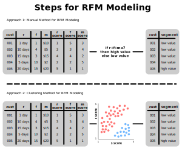

### Defining RFM Modeling
- Similar to the previous loyalty-monetary segmentation process, an RFM is another multi-dimensional tiered model
- Specifically, recency–frequency–monetary (or RFM) uses three metrics:
    - Recency
    - Frequency
    - Monetary
- Here, recency represents the time that has passed since a customer's previous engagement
    - E.g. days since last purchase
    - E.g. hours since last email open
- And, frequency represents the number of interactions made by a customers
    - E.g. average number of email clicks per month
    - E.g. number of purchases in May
    - E.g. average number of purchases per week
- Lastly, monetary represents the spend made by a customer
    - E.g. average sales per month
    - E.g. sales in March
- Each of these three metrics can be mapped to a scored quantile in a tiered model
- Visually, an RFM model can be thought of as a cube, since there are $3$ dimensions

### Illustrating Manual Steps for RFM Modeling
1. Assign quantile scores to each customer
    - These scores represent quantiles (e.g. $1-5$) based on some metric (e.g. recency, frequency, monetary)
2. *Optional:* Aggregate quantile scores
3. Analytically assign scores to segments
4. Profile segments

### Illustrating Clustering Steps for RFM Modeling
1. Assign quantile scores to each customer
    - These scores represent quantiles (e.g. $1-5$) based on some metric (e.g. recency, frequency, monetary)
2. *Optional:* Aggregate quantile scores
3. Cluster scores to retrieve segments
4. Profile segments

### References
- [Textbook about Algorithmic Marketing](https://algorithmicweb.files.wordpress.com/2018/07/algorithmic-marketing-ai-for-marketing-operations-r1-7g.pdf)
- [Example of Tiered Modeling](https://medium.com/swlh/exploring-customers-segmentation-with-rfm-analysis-and-k-means-clustering-93aa4c79f7a7)
- [Course about Customer Segmentation](https://www.datacamp.com/courses/customer-segmentation-in-python)
- [Course about Segmentation Analysis](https://www.datacamp.com/courses/machine-learning-for-marketing-in-python)