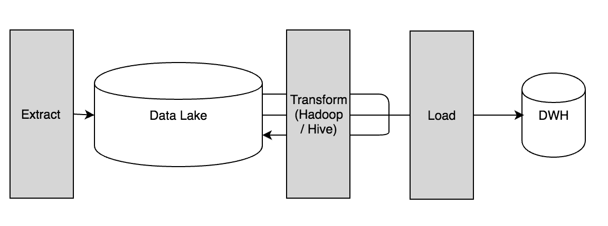
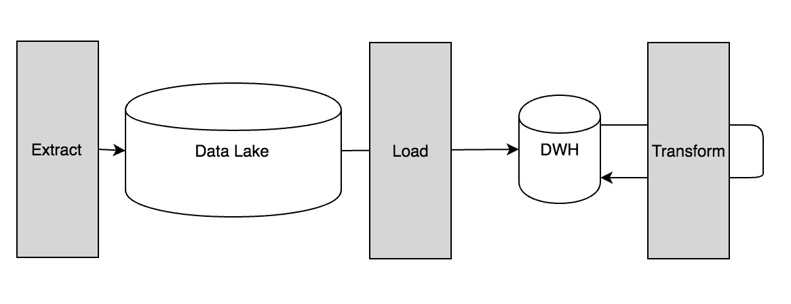

### Defining the ETL Process
1. **Extract** data from an external source into a data lake
	- These external sources could include:
		- Operational systems
		- Third party APIs
		- RDBMS
		- etc.
2. Next, **transform** that data from the data lake
	- Transformation tools include:
		- Sqoop
		- HQL
		- etc.
3. Then, **load** the transformed data either:
	- Back into the data lake
	- Or into a data warehouse

### Defining the ELT Process
1. **Extract** data from an external source into a data lake
	- These external sources could include:
		- Operational systems
		- Third party APIs
		- RDBMS
		- etc.
2. Next, **load** the data from the data lake into a data warehouse
3. Then, **transform** the data in the data warehouse
	- Afterwards, we can load it back into the data warehouse

### References
- [Defining ETL Transformations](https://www.stitchdata.com/etldatabase/etl-transform/)
- [Comparing ETL and ELT Tools](http://slawomirtulski.com/hive_redshift_test)
