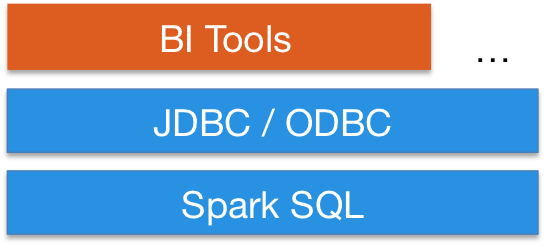

### Describing Apache Spark
- Spark is a distributed computing engine
- Its performance boost mostly comes from Spark storing data in memory
- Spark is run on server-side clusters
- It provides high-level APIs in:
	- Java
	- Scala
	- Python
	- R
- We are able to run Spark on server-side clusters

### Describing Higher-Level APIs in Spark
- Spark also supports higher-level APIs:
	- Spark SQL
	- MLlib
	- GraphX
	- Spark Streaming
- Spark SQL is used for SQL and structured data processing
- MLlib is used for machine learning
- GraphX is used for graph processing
- Spark Streaming is used for streaming data

### Describing Features of Spark SQL
- Integrates querying inside Spark programs

```python
>>> # Mix SQL queries with DataFrame API
>>> results = spark.sql('SELECT * FROM people')
>>> names = results.map(lambda p: p.name)
```

- Connects to any data source the same way

```python
>>> # Uniform data access with DataFrame API
>>> spark.read.json('s3n://...').registerTempTable('json')
>>> results = spark.sql('SELECT * FROM people JOIN json')
```

- Integrates with Hive


- Connects through JDBC or ODBC



### Motivating the Comparison between Hive and Spark
- Consider two types of tools used in Hadoop:
	- Execution engines
	- Query optimizers
- These are both individual software frameworks
- An execution engine is required in Hadoop
- A query optimizer is optional
- An execution engine processes jobs related to the data
- A query optimizer optimizes queries before they are processed
	- Sometimes, they optimize queries during processing too

### Comparing Apache Hive and Spark
- Hive is mostly referred to as a query optimizer
	- This is because Hive is essentially a metastore
- Spark is mostly referred to as an execution engine
- Hive uses MapReduce as its execution engine by default
- Spark uses its own execution engine
	- It is an alternative of MapReduce
- Spark offers query optimizers as well
	- It uses catalyst optimizers
	- This uses rule-based and cost-based optimization
- Spark and Hive can be used together
- Specifically, we can include:
	- HDFS as our storage layer
	- Hive's metastore for query optimization
	- Spark's query optimization
	- Either Spark or MapReduce as an execution engine

### Describing Features of MLlib
- Again, MLlib is the machine learning API in Spark
- It supports Java, Scala, Python, and R
- MLlib provides functions for:
	- Kmeans
	- LogisticRegression
	- etc.
- This allows data scientists to:
	- Perform clustering
	- Perform classification
	- Transform data
	- Process data
	- Run algorithms
- Specifically, these algorithms are run nearly $100$ times faster than MapReduce jobs
- MLlib supports Java, Scala, Python, and R APIs

### Describing Features of Spark Streaming
- MLlib is used for writing streamed jobs the same way as writing batch jobs
- Streamed jobs are processed in real-time
- Spark Streaming can read data from:
	- HDFS
	- Flume
	- Kafka
	- Twitter
	- Custom data sources
- It uses ZooKeeper and HDFS for deploying streaming applications
- Spark Streaming supports Java, Scala, Python, and R APIs

### Describing Features of GraphX
- GraphX is used for performing graph-parallel computation to display and work with graphics
- It unifies the following within a single API:
	- ETL
	- Exploratory analysis
	- Iterative graph computations
- It allows data to be viewed as graphs and collections
- Collections are transformed and joined graphs
- It offers integration with the Pregal API
- It offers comparable performance to the fastest specialized graph processing systems
- These include GraphLab and Giraph

### Defining Resilient Distributed Datasets
- Spark revolves around resilient distributed datasets (RDD)
- These are a fault-tolerant collection of elements that can be operated in parallel
- There are two ways of creating RDDs:
	1. Parallelizing an existing collection in the driver program
	2. Referencing a dataset in an external storage system
- External storage systems include:
	- HDFS
	- HBase
	- Other data sources offering a Hadoop InputFormat

### Benefits of Spark over MapReduce
- Spark executes much faster by saving data in memory
- This happens across multiple parallel operations
- On the other hand, MapReduce reads and writes from disk
- Spark runs multi-threaded tasks inside of JVM processes
- MapReduce runs heavy-weight tasks inside of JVM processes
- As a result, this gives Spark the following boost:
	- Faster startup
	- Efficient parallelism
	- Better CPI utilization
- Spark provides a richer functional programming model
- MapReduce doesn't do this
- Spark is especially useful for parallel processing of distributed data with iterative algorithms

### References
- [Defining the Architecture of Apache Spark](https://mapr.com/blog/spark-101-what-it-what-it-does-and-why-it-matters/)
- [Documentation for Apache Spark](https://spark.apache.org/docs/latest/)
- [Documentation for Spark SQL](https://spark.apache.org/sql/)
- [Documentation for Spark Streaming](https://spark.apache.org/streaming/)
- [Documentation for Spark MLlib](https://spark.apache.org/mllib/)
- [Documentation for Spark GraphX](https://spark.apache.org/graphx/)
