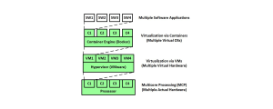

### Describing Docker Containers
- A **container** is an emulation of an operating system
- A **container engine** is an environment for deploying containerized applications
	- Docker is an example of a container engine
	- The container engine allocates cores and memory to containers
- An **image** is a snapshot of a container
	- A container is an instance of an image
	- Specifically, a container is a running instance of an image
- A **Dockerfile** is a file containing image-instructions
	- Docker builds an image by reading the instructions from a Dockerfile
	- These instructions provide the container engine information to create an image
- The following analogy can be used to describe each component:
	- A Dockerfile is the shopping list
	- An image is the recipe
	- A container is the cake
- Containers and virtual machines can be used together:



### Use Cases of Docker Containers
1. Containers can perform a task **independent of the host's OS**
	- Containers break down configuration into code
	- Containers do this without the overhead of VMs
	- This allows containers to be deployed quicker while consuming fewer resources
2. Containers can run many apps on a **single server in isolation**
	- Specifically, containers perform isolation at the OS level
	- Therefore, a single OS can run multiple containers
	- This decreases overhead by providing additional processing power to applications
3. Containers create **well-managed production environments**
	- Actually, they can enforce other environments as well (e.g. development environment)
	- Code changes must travel through several different environments to reach deployment
	- Each environment is different in comparison
	- Containers provide a constant, isolated environment
	- Meaning, code quickly travels down a pipeline from the development environment to the production environment 
4. Containers can **consolidate more servers**
	- Containers use less memory compared to VMs
	- Therefore, they can consolidate more servers
	- They decrease the number of required servers
	- This decreases the hardware costs and server management time
5. Containers are **portable environments**
	- Containers are a form of lightweight virtualization
	- This makes them extremely portable
	- Cloud service providers (e.g. AWS) champion containers due to their portability
	- They can be run within cloud environments easily

### Differentiating between Containers and VMs 
- Containers emulate an OS, whereas VMs emulate hardware
- Containers are more lightweight compared to VMs
- Containers share a host OS in contrast to VMs
- Containers start up in milliseconds, whereas VMs start up in minutes
- Containers require less memory space compared to VMs
- Containers are slightly less secure compared to VMs
- Containers maintain process-level isolation, whereas VMs are fully isolated

### Advantages of Virtualization via Containers
- Cheaper hardware costs
	- Due to server consolidation
	- Enables concurrent software to take advantage of true concurrency in a multicore architecture
- Reliability and robustness
	- Enables software failover and recovery
	- The modularity and isolation improves reliability
	- If a container breaks, the entire machine doesn't break as well
- Scalability
	- A single container engine can manage very many containers
	- This enables additional containers to be created as needed
- Spatial isolation
	- Support lightweight spatial isolation
	- This is because containers are given their own resources
- More Storage
	- Containers do not emulate hardware
	- This makes them so lightweight in terms of storage size
- Increased performance
	- Containers increase performance compared to VMs
	- This is because containers do not emulate hardware
- Real-time applications
	- Containers provide more consistent timing than VMs
- Continuous integration
	- Containers support Agile and continuous development processes
- Portability
	- Containers support portability from development to production environments
	- This is especially beneficial for cloud-based applications
- Safety
	- There are some safety benefits by localizing the impact of faults and failures to individual containers
- Security
	- The modular architecture increases the difficulty of attacks
	- A container that is compromised can be terminated and replaced

### Disadvantages of Virtualization via Containers
- Shared resources
	- Single points of failure exist
	- Two applications running in the same container can interfere with each other
	- Sofware running in different containers can interfere with each other
- Interference Analysis
	- Shared resources imply interference
	- The number of interference paths increases rapidly as the number of containers increases
	- This makes the exhaustive analysis of all such paths nearly impossible
- Safety
	- Spatial interference can cause memory clashes
- Security
	- Data stored in containers is insecure
	- Container processes are insecure
	- Privileges of container services are minimized
- Container sprawl
	- Excessive containerization is relatively common
	- This can increase the amount of time and effort spent on container management

### Caching Images in Docker
- Docker images are cached on a machine once the image is built
	- The image will be cached in `/var/lib/docker`
- The image won't be rebuilt, unless changes are made to the image
- If changes are made to the image, then Docker will rebuild it
- If only a few changes are made to the image, the rebuilding process won't take very long
- This is because Docker only needs to process those new instructions in the Dockerfile
- In other words, Docker will not process the unchanged instructions in the Dockerfile
- This is because those components are cached already

### Mounting Host Directories to Containers
- Host directories can be copied to containers
- Changes to a copied host directory on a container will not carry over to the host machine
- Host directories can be mounted to containers using:
	- Bind Mounts
	- Volumes
- With bind mounts, a file or directory on the host machine is mounted into a container
- With volumes, a new directory is created within Docker's storage directory on the host machine
- Therefore, Docker manages the content of that directory
- In other words, volumes are the preferred mechanism for persisting data on the host machine after the container is gone
- Host directories are copied when building an image
- Whereas, host directories are mounted when running a container
- Mounting a host directory as a data volume:
```text
-v [host_dir:container_dir]	
```
- Copying a host directory to an image:
```dockerfile
COPY [host_dir]
```

### Advantages of Volumes over Bind Mounts
- Volumes are easier to back up
- Volumes are easier to migrate
- Volumes can be managed using Docker CLI
- Volumes work on both Linux and Windows containers
- Volumes can be more safely shared among multiple containers
- Volume drivers allow storage of volumes on remote hosts or cloud providers
- Volume drivers allow encryption of volume contents

---

### tldr
- A virtual machine emulates underlying hardware
- A container emulates an operating system
- A container has the following use cases:
	1. Performing a task independent of the host's OS
	2. Running many apps on a single server in isolation
	3. Creating well-managed production environments
	4. Consolidating more servers
	5. Creating portable environments
- A container engine is an environment for deploying containerized applications
- An image is a snapshot of a container
- A Dockerfile is a file containing image instructions

---

### References
- [Details about Virtualization via Containers](https://insights.sei.cmu.edu/sei_blog/2017/09/virtualization-via-containers.html)
- [Details about Virtualization via Virtual Machines](https://insights.sei.cmu.edu/sei_blog/2017/09/virtualization-via-virtual-machines.html)
- [Difference between Docker Containers and Virtual Machines](https://stackoverflow.com/a/16048358/12777044)
- [Difference between Docker Containers and Images](https://stackoverflow.com/a/23736802/12777044)
- [Difference between Docker Volumes and Bind Directories](https://stackoverflow.com/a/49173474/12777044)
- [Five Functions for Docker Containers](https://www.rcrwireless.com/20170822/five-container-use-cases-tag27-tag99)
- [Docker Volumes](https://docs.docker.com/storage/volumes/)
- [Details about the Dockerfile](https://docs.microsoft.com/en-us/virtualization/windowscontainers/manage-docker/manage-windows-dockerfile)
