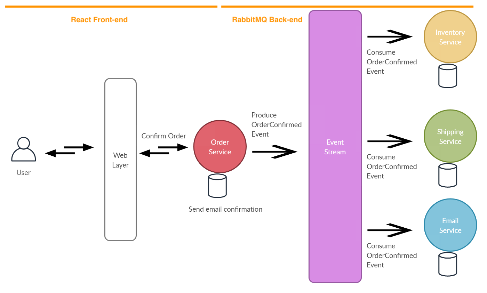

### Defining Terminology for Pub/Sub Systems
- A *producer* is a user application that sends messages to some user application
- A *consumer* is a user application that receives messages from some user application
- A *queue* is an application that receives messages from a producer and decides which consumers should receive those messages
    - A message is known as a *task*
    - A queue can also be referred to as a *broker*
    - Producers send messages that are immediately added to a queue
    - Consumers wait for messages to be sent from a queue
- Using an analogy, an email group is similar to a queue
    - Email accounts (i.e. consumers) may subscribe to an email group (i.e. a queue)
    - Other email accounts (i.e. producers) may send emails to this email group, which will be received by those subscribed email accounts (i.e. consumers)

### Comparing a Task Queue and a Pub/Sub
- A *task queue* model delivers a single message to a single consumer
    - In other words, a task queue receives a message from a producer and sends the message to an individual consumer
    - A work queue can have many different consumers available for receiving a single task, but only one consumer must receive each task (not multiple)
    - For example, a task queue may be used to distribute a large number of messages to any available consumers (or workers in this case)
- A *publisher/subscriber* model delivers a single message to multiple consumers
    - For example, a pub/sub model may be used to send messages to multiple consumers that require the publisher's message for their application

### Defining Components of a Publisher/Subscriber Model
- An *exchange* receives messages from a producer and sends those messages to a specified queue
    - An exhange can append the message to one or many different queues
    - An exchange can also discard the message, but this rarely happens
    - A few exchange types include *fanout*, *direct*, *topic*, etc.
    - For example, a *fanout* exchange broadcasts the message to all of the queues it knows about
    - A *direct* exchange broadcasts a message to queues matching the name given by the binding key
- A *binding* must be created between the exchange and the queue, so the exchange knows which queues to append its messages to
    - A binding is created using the `queue_bind` function
    - There can be multiple bindings with the same name and different queue names
    - Binding names are specified using the `routing_key` in the `queue_bind` function


### Illustrating a Basic Producer
1. Connect to a queue on a machine
    - The `host` parameter defines where the queue lives
    - The queue should usually live on its own machine
2. Create a queue called *hello*
    - Only one queue can exist for each unique name
    - A best-practice is to always call it, even if a queue has already been created
    - The `queue_declare` function can be called as many times, but only one queue will ever be created
3. Send a message to a queue that eventually can be received by consumers
    - Initialize a message using the `body` parameter
    - The `routing_key` should match the name given to the queue
    - The `exchange` refers to an exchange sending a publisher's message to a queue

```python
# producer.py
import pika

# Connect to a queue on our local machine
connection = pika.BlockingConnection(
    pika.ConnectionParameters(host='localhost')
    )

# Create a 'hello' queue
# Declaring another queue will be ignored
# if a 'hello' queue exists already
channel = connection.channel()
channel.queue_declare(queue='hello')

# Create an exchange that receives producer's messages
channel.exchange_declare(exchange='greeting')

# Send a 'Hello World!' message to any subscribed consumers
channel.basic_publish(exchange='greeting', routing_key='hello', body='Hello World!')
connection.close()
```

### Illustrating a Basic Consumer
1. Connect to a queue on a machine
    - The `host` parameter defines where the queue lives
    - The queue should usually live on its own machine
2. Create a queue called *hello*
    - Only one queue can exist for each unique name
    - A best-practice is to always call it, even if a queue has already been created
    - The `queue_declare` function can be called as many times, but only one queue will ever be created
3. Consume a producer's message from a queue
    - Initialize a `callback` function that will be executed once the message has been received
    - The `auto_ack` parameter refers to an acknowledgement that is sent back to the queue stating the consumer has received the queue's message, so next the message can be deleted from the queue


```python
# consumer.py
import pika, sys, os

# Connect to a queue on our local machine
connection = pika.BlockingConnection(
    pika.ConnectionParameters(host='localhost')
    )

# Create a 'hello' queue
# Declaring another queue will be ignored
# if a 'hello' queue exists already
channel = connection.channel()
channel.queue_declare(queue='hello')

# Print the producer's message once we receive it from the queue
def callback(ch, method, properties, body):
    print(" [x] Received %r" % body)

# Receive messages from the 'hello' queue
channel.basic_consume(queue='hello', on_message_callback=callback, auto_ack=True)
channel.start_consuming()
```

### Comparing Exchanges and Queues
- A producer must sends its message to an exchange
    - A producer must do at least one of the following:
        - Declare an exchange
        - Declare a queue
        - Declare an exchange and a queue
    - A producer can declare a binding as well
    - A producer always publishes its messages to an exchange
    - A producer never publishes its messages to a queue directly
    - Publishing messages using `exchange=''` (in the `basic_publish` function) will publish messages to a default exchange
        - This default exchange is a pre-declared, unnamed exchange
        - By default, this exchange creates bindings behind-the-scenes with the same name as the queue names
        - As a result, the `routing_key` can be the queue name for a default exchange in the `basic_publish` function
    - For all non-default exchanges, a binding must be manually created between an exchange and a queue
        - This can be done using the `queue_bind` function
        - By default, an exchange will *fanout* to all bounded queues by specifying `routing_key=''` in the `basic_publish` function
        - Each queue name must be unique, each exchange name must be unique, but there can be multiple binding names (i.e. `routing_key`) between queues and exchanges
        - For example, an exchange could be bounded between two different queues, and a queue could be bounded between two different exchanges
- A consumer must receive any messages from a queue
    - A consumer can do any of the following:
        - Declare an exchange
        - Declare a queue
        - Declare an exchange and a queue
        - Declare a binding between an exchange and a queue
    - If a queue has not already been declared, then a consumer must declare that queue before consuming/listening to a queue for any messages
    - A consumer always receives messages from a queue
    - A consumer never receives its messages from an exchange directly

### Illustrating a Request/Response Pattern
- Task Queues can be used to distribute time-consuming tasks among multiple workers/consumers
- A request/response pattern (or RPC) involves sending a task and waiting for the task to complete before sending any response
- In this example, the web layer could be a react frontend writing an order to a database
    - From there, the customer will receive a response using async javascript (or react)
    - Behind-the-scenes, a RabbitMQ/Kafka producer will publish orders to the event stream, where multiple RabbitMQ/Kafka consumers are listening



### References
- [Creating a Pub-Sub System for a Request-Response Pattern](https://www.rabbitmq.com/tutorials/tutorial-six-python.html)
- [RabbitMQ Tutorials and Documentation](https://www.rabbitmq.com/tutorials/tutorial-three-python.html)
- [Article comparing Request-Driven and Event-Driven Microservices](https://supunbhagya.medium.com/request-driven-vs-event-driven-microservices-7b1fe40dccde)
- [Video about Publish-Subsribe and Request-Response Patterns](https://www.youtube.com/watch?v=DXTHb9TqJOs&ab_channel=HusseinNasser)
- [Video defining the Publisher-Subscriber Model](https://www.youtube.com/watch?v=FMhbR_kQeHw&ab_channel=GauravSen)
- [Video defining Event-Driven Systems](https://www.youtube.com/watch?v=rJHTK2TfZ1I&ab_channel=GauravSen)