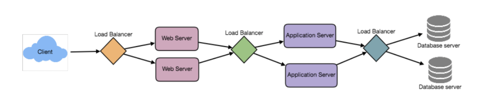

### Defining Load Balancers
- A load balancer is a server that distributes incoming network requests across a group of backend servers 
    - It is sometimes referred to as a reverse proxy
    - If a server within the pool of servers is slow or unresponsive, then the load balancer will stop sending traffic to that server in the pool
- A load balancer is used for horizontally scaling a system across a large number of servers
- A load balancer improves scalability, efficiency, and availability of systems (applications and databases)

### Types of Load Balancer Architectures
- A load balancer typically sits between a client and backend servers
- To utilize full scalability, we can place a load balancer in three different places:
    1. Between the clients and our web servers
    2. Between our web servers and application servers
    3. Between our application servers and database
- The load balancer in scenario $1$ will be useful if our site receives heavy load from our users
- The load balancer in scenario $2$ will be useful if a particular application (used on our site) receives heavy load from our users
- The load balancer in scenario $3$ will be useful if our database receives heavy load from an application

### Benefits of Load Balancing
- **Higher availability** with less downtime and higher throughput, since a load balancer will reroute requests to healthy servers
- **Higher efficiency** with users experiencing faster, uninterrupted services with less wait times
- **Higher serviceability** with load balancers supporting analytics and statistics on bottlenecks
- **Higher reliability** with fewer failures and stressed components

### Defining Load Balancing Algorithms
- First, a load balancer will send health checks to its pool of servers
    - This will monitor the health of its pool of servers
    - If a server fails a check, it is automatically removed and can be replaced
- Then, a load balancer will use a pre-configured algorithm to select one of the healthy servers in its pool
- These pre-configured algorithms include the following:
    - `Least Connection Method:` Directs traffic to the server with fewest active connections
    - `Least Response Time Method:` Directs traffic to the server with fewest active connections and fastest average response time
    - `Least Bandwidth Method:` Directs traffic to the server with least amount of of bandwidth being consumed at a given moment
    - `Round Robin Method:` Loops through the pool of servers and directs traffic iteratively
    - `Weighted Round Robin Method:` Loops through the pool of servers and directs traffic iteratively, but directs more traffic to servers with higher capacities
    - `IP Hash:` Directs traffic to the server after hashing its IP address

### Load Balancing with High Availability
- The load balancer becomes a single point of failure without a second load balancer
- Using a service like Heartbeat, a second load balancer can be connected to the cluster and used as a failover
- In this case, the main load balancer would be considered the *active* load balancer, and the second load balancer would be the *passive* load balancer

### References
- [Load Balancers with Failovers using Heartbeat](https://www.digitalocean.com/community/tutorials/how-to-create-a-high-availability-setup-with-heartbeat-and-reserved-ips-on-ubuntu-14-04)
- [Grokking the System Design Interview](https://www.educative.io/courses/grokking-the-system-design-interview/B8nMkqBWONo)
- [Wiki for System Design](https://github.com/Jeevan-kumar-Raj/Grokking-System-Design)
- [Another Wiki for System Design](https://github.com/sharanyaa/grok_sdi_educative)