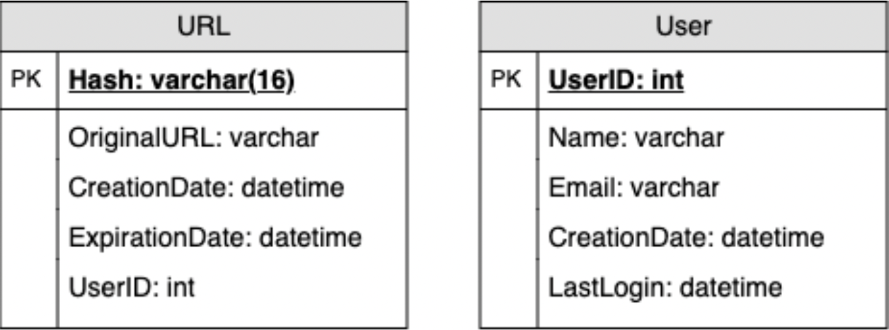
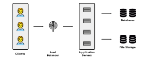

### Introducing Guidelines for System Design Interviews

- System design interviews (SDIs) can be hard for $3$ reasons:
    1. SDIs are **unstructured**, open-ended, and have multiple solutions
    2. Candidates lack experience in developing complex systems
    3. Candidates did not spend enough time preparing for SDIs
- In FAANG companies, candidates must perform above average in coding interviews to receive an offer
- A good performance always results in a better offer, since it proves the candidate’s ability to handle a complex system
- Most design problems can be solved using $7$ general steps:
    1. Clarifying requirements
    2. Roughly estimating scale   
    3. Defining the system interface
    4. Defining the data model
    5. Drawing a high-level design
    6. Describing major components in detail
    7. Identifying any bottlenecks
- The above steps can be translated to the following higher level objectives:
    1. Clarifying requirements
    2. Estimating scale
    3. Defining basic functionality
    4. Defining basic data flow
    5. Drawing the high-level design
    6. Detailing key components
    7. Identifying alternative solutions

### Step 1: Requirement Clarification
- Ask questions about system requirements
    - Ask for functional requirements, non-functional requirements, and any extended requirements
    - Functional requirements refer to user expectations directly related to the primary function of the system
    - Non-functional requirements refer to user expectations indirectly related to the system (e.g. consistency, availability, security, etc.)
    - Extended requirements refer to *nice-to-haves*
- Ask questions about parts of the overall system
- Ask questions about the goal of the system
- Try forming questions around the following:
    - What are the components of the system (i.e. classes)?
    - What are the properties and behaviors of each component (i.e. attributes and methods)?
    - How do our components interact with each other?
- The following are examples of good questions:
    - Will our service have users?
    - Will our service have tweets?
    - Are tweets created by users?
    - Can users follow other users?
    - Will tweets contain photos and videos?
    - Are we developing for the back-end and front-end?
    - Can users search for tweets?
    - Will users receive push notifications?
    - Should we display trending topics?

### Step 2: Back-of-the-Envelope Estimation
- **Traffic Estimations:**
    1. Estimate expected traffic variables:
        - Expected reads per month $rpm$
        - Expected writes per month $wpm$
    2. Do the following conversions:
        - Reads per second by $rps = \frac{rpm}{30 \text{ days} \times 24 \text{ hours} \times 3600 \text{ seconds}}$
        - Writes per second by $wps = \frac{wpm}{30 \text{ days} \times 24 \text{ hours} \times 3600 \text{ seconds}}$
- **Storage Estimations:**
    1. Estimate expected storage variables:
        - Expected number of years until writes are purged $ny$
        - Expected data size of one packet/write $sw$
        - Are storage requirements different for images and video?
    2. Do the following conversions:
        - Total writes stored by $tws = wpm \times ny \times 12 \text{ months}$ 
        - Total storage size by $tss = tws \times sw$
- **Network Estimations:**
    1. Do the following conversions:
        - Expected read bandwidth by $rb = rps \times sw \text{ bytes}$
        - Expected write bandwidth by $wb = wps \times sw \text{ bytes}$
- **Memory Estimations:**
    1. Estimate expected storage variables:
        - Expected percentage of data that is cached $c$
            - 80-20 rule says $c=20\%$
        - How long should data be cached?
            - Usually, it's a day
        - Is less cache needed if there is redundant read requests?
    2. Do the following conversions:
        - Reads per day by $rpd = rps \times 3600 \text{ seconds} \times 24 \text{ hours}$
        - Total cache size by $tcs = c \times rpd \times sw$
- **High-level Estimations:**
    - Number of new tweets per second?
    - Number of tweet views per second?
    - Number of timeline generations per second?

### Step 3: System Interface Definition
- Define the required API calls expected from our system
- Typically, a REST API will be used for exposing the functionality of our service
- The following are examples of API calls:

```python
# Users must be able to post a tweet
postTweet(user_id, tweet_data, tweet_location, user_location, timestamp)

# Timelines must be generated
generateTimeline(user_id, current_time, user_location)

# Users must be able to be favorited
markTweetFavorite(user_id, tweet_id, timestamp)
```

### Step 4: Defining a Data Model
- Defining a data model or database schema will help guide any conversation about partitioning or data management
- First, describe high-level observations about the nature of the data we're storing
    - E.g. how large is each record
    - E.g. what is the relationship like between records
    - E.g. will we need to handle more reads than writes
- Then, identify various key system entities or tables
- Lastly, define what type of database we'll want to use:
    - E.g. should we use NoSQL or RDBMS?
    - E.g. what kind of block storage should we use to store photos and videos?
- Throughout the process, we must define different aspects of data management, like storage, transportation, and encryption
- The following is an example of a data model:



### Step 5: Drawing a High-Level Design
- Draw a block diagram with at least $5$ boxes representing core components of the system
- Identify enough components that are necessary to solve the problem from end to end
- As an example, for a system at Twitter we would need to think about the following for the front end:
    - Using a load balancer to distribute read/write requests from users to multiple application servers
    - Using a separate application server for receiving read requests and a separate server for write requests from the load balancer
- Furthermore, for a system at Twitter we'd also need to think about the following for the back end:
    - Using an efficient database that can handle a large number of writes (tweet posts)
    - Using an efficient database that can handle a large number of reads (view others' tweets)
    - Using a distributed file storage system for storing photos and videos
- The following is an example of a corresponding diagram:



### Step 6: Describing Design in Detail
- Dig deeper into 2-3 major components
- The interviewer’s feedback should guide us to what parts of the system need further discussion
- We should discuss the following for each component:
    - Alternative approaches
    - Tradeoffs for each approach
    - Why we chose our final approach over others
- The following are questions we could explore in this step:
    - Should we distribute our data to multiple databases or use one database?
    - What are ways we can partition our data if we're using multiple databases?
    - What issues could be introduced by certain partitioning methods?
    - How will we highly active users and less active users differently?
    - When should we cache users' data?
    - How much cache should we use for certain users?
    - What components need better load balancing?

### Step 7: Identifying and Resolving Bottlenecks
- Continue to think about alternatives to the major components
- Continue to identify tradeoffs and bottlenecks to each approach
- The follow are examples of questions that should be addressed:
    - Is there any single point of failure in our system?
    - How are we mitigating any potential single point of failure?
    - Do we have enough replicas of our distributed data in case we lose servers?
    - Do we have enough copies of different services running so a few failures will not cause a total system shutdown?
    - How are we monitoring the performance of our service?
    - Do we get alerts whenever critical components fail or degrades?

### References
- [Grokking the System Design Interview](https://www.educative.io/courses/grokking-the-system-design-interview/B892KY261z2)
- [Wiki for System Design](https://github.com/Jeevan-kumar-Raj/Grokking-System-Design)
- [Another Wiki for System Design](https://github.com/sharanyaa/grok_sdi_educative)
- [Microsoft Guide of Common Data Models](https://docs.microsoft.com/en-us/common-data-model/)