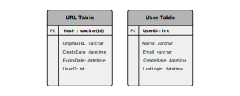
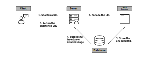

### Step 1: Requirement Clarification
- Why are we creating a URL shortener?
    - URL shortening is used to create aliases that are shorter represetnations of longer, actual links
    - URL shortening is used to minimize the length of links, analyze audiences by tracking links, and measure performance of ad campaigns
- What are the functional requirements?
    - Our service should generate a shorter and unique alias for any given URL
    - Our service should have the shortened URL redirect users to the original link
    - Our service should allow users to customize their shortened link
    - Our service should enforce shortened links to expire after a given timespan
- What are the non-functional requirements?
    - Our service should be highly available
    - Our service should ensure URL redirection happens in real-time
    - Our service should not be guessable
- What are the extended requirements?
    - Our service should provide analytics about usage of link redirects
    - Our service should have a REST API granting access to third-party services or users

### Step 2: Capacity Estimation and Constraints
- **Traffic Estimations:**
    1. Estimate expected traffic variables:
        - Expected reads per month is $50$ billion
        - Expected writes per month is $500$ million
    2. Do the following conversions:
        - Reads per second is $\frac{50B}{30 \times 24 \times 3600} = 20K$
        - Writes per second is $\frac{500M}{30 \times 24 \times 3600} = 200$
- **Storage Estimations:**
    1. Estimate expected storage variables:
        - Expected number of years until writes are purged is $5$ years
        - Expected data size of one packet/write is $500$ bytes
        - URLs can be stored in a RDBMS or MySQL database
    2. Do the following conversions:
        - Total writes stored is $500M \times 5 \times 12 = 30B$ 
        - Total storage size is $30B \times 500 = 15TB$
- **Network Estimations:**
    1. Do the following conversions:
        - Expected read bandwidth is $20K \times 500 = 10MB/s$
        - Expected write bandwidth is $200 \times 500 = 100KB/s$
- **Memory Estimations:**
    1. Estimate expected storage variables:
        - Assume $20 \%$ of URLs generate $80 \%$ of traffic
        - As a result, cache $20 \%$ of data
        - Assume data should be cached for a day
        - Most redirections use the same URL, so cache will be overestimated likely
    2. Do the following conversions:
        - Reads per day is $20K \times 3600 \times 24 = 1.7B$
        - Total cache size is $0.2 \times 1.7B \times 500 = 170GB$
- **High-Level Summary:**
    - We'll assume there are $500$ million new URLs per month
    - We'll assume there are $50$ billion URL redirections per month

| Category              | Time Estimate                 |
| --------------------- | ----------------------------- |
| New URL               | $200$ URLS per second         |
| URL redirection       | $20$K redirections per second |
| Incoming data         | $100$ KB/s                    |
| Outgoing data         | $10$ MB/s                     |
| Storage for $5$ years | $15$ TB                       |
| Memory of cache       | $170$ GB                      |

### Step 3: System API Design
- Note, a malicious user may want to consume all the URL keys in the current design
    - To prevent abuse, we can limit users via their api_key
    - Specifically, certain users would be limited to a certain number of URL creations and redirections
- The following are a few, potential API calls:

```python
"""
Description
----
This API call is used for creating a shortened URL.


Parameters
----
api_key : string
    The API developer key for a registered account.
original_url : string
    The original URL that will be shortened.
custom_alias : string
    (Optional) Any pre-determined shortened URL.
user_name : string
    (Optional) Any user name used in the encoding.
expire_date : string
    (Optional) Any desired data for the URL to expire on.


Returns
---
A successful request returns a shortened URL;
otherwise, an error code will be returned
"""
createURL(
    api_key,
    original_url,
    custom_alias=None,
    user_name=None,
    expire_date=None
    )


"""
Description
----
This API call is used for deleting a preexisting
shortened URL that has already been created using
this service.


Parameters
----
api_key : string
    The API developer key for a registered account.
original_url : string
    The key of a preexisting shortened URL.


Returns
---
A successful request deletes a preexisting shortened URL;
otherwise, an error code will be returned
"""
deleteURL(
    api_key,
    url_key
    )
```

### Step 4: Database Design
1. Observations about the data:
    - Billions of records must be stored
    - Each object will be small in terms of storage
    - Records (i.e. shortened URLs) don't have have any relationship with each other
    - Our service will handle more reads than writes
2. Key entities of the system:
    - Two tables will be needed
    - One table will store information about each URL
    - Another table will store information about each user
3. Type of database:
    - Billions of rows must be stored
    - No relationships between the objects
    - For the above reasons, a NoSQL database like DynamoDB or Cassandra would be a good choice



### Step 5a: Summarizing the Basic System Designs
- The goal of our system is to generate a unique and shortened key for a given URL
- An example of a TinyURL shortened URL is *https://tinyurl.com/rxcsyr3r*
    - The last $8$ characters of this URL represents the shortened key
    - This shortened key is what our system will generate
- There are two options:
    - Encoding a shortened URL in real-time
    - Generating a shortened URL offline

### Step 5b: Summarizing a Basic Real-Time Design
- This approach involves passing the original URL through a hash function first, then passing that hash value through an encoding function
    - Potential hash functions include MD5, SHA256, and others
    - Potential encoding functions include Base36, Base64, and others
- The SHA256 hash function will convert the original URL to a series of 256 bits
- The Base64 encoding function will convert the hash value to a string of characters
- The reason for passing the original URL through a hash function is to produce a unique representation of the original URL
- The reason for passing the hash value through an encoding function is to represent the binary hash value as a string and in fewer characters
- **Potential Problems:**
    - If different users try to shorten the same URL, then they'd receive the same hash value outputting the same shortened URL, which is unacceptable
- **Potential Workarounds:**
    - An incramenting URL ID can be appended to each original URL
    - Then, the hash value will be unique once the original URL + URL ID is inputted into the hash function
    - We don't need to store this sequence number in the database
    - However, if this ID incraments to a huge number, there could be overload and impact the performance of the service



### Step 5c: Summarizing a Basic Offline Design
- This approach involves using a **key generation service** that generates random six-letter strings beforehand
- Once these keys are generated, they are stored in a database so they can be requested later on
- **Pro:** this approach is much simpler since:
    - Encoding original URLs isn't necessary
    - Creating duplicate keys won't happen, since the KGS will ensure keys aren't added to the database unless they're unique
- **Pro:** this approach is much faster since:
    - URLs don't need to be encoded
    - Keys are already generated
- **Caveat:** keys must be marked in the database after requested and used to ensure they're not used again
- **Caveat:** the key DB must be about $412$ GB assuming 68.7B six-character keys are generated and stored
- **Potential Problems:**
    - Keys that have been used should be differentiated from keys that haven't been used
    - Two of the same keys may be retrieved by different users for concurrent requests, which is unacceptable
    - The KGS could be a single point of failure if running on a standalone server
- **Potential Workarounds:**
    - Keys that have been used should be removed and moved to a separate table, or a flag should be added to differentiate keys that have been used from those that haven't been used
    - To ensure two of the same keys aren't retrieved by different users in concurrent requests, then the KGS could use a [Lock](https://web.mit.edu/6.005/www/fa15/classes/23-locks/) data structure to make sure key retrievals are synchronized before sending a key to concurrent application servers
    - To prevent the KGS from being a single point of failure, we can run multiple replica KGS on different servers using ZooKeeper


### Step 6a: Implementing Data Partitioning Methods
- To handle the storage of $15$ TB of data in our NoSQL database, we'll need to think about partitioning our data across multiple DB servers
- There are a few applicable partitioning options:
    - Range-based partitioning
    - Hash-based partitioning
- **Range-based partitioning** involves partitioning data based on a particular trait related to the input
    - For example, we could partition URLs starting with the letter *A* on one server, partition URLs starting with the letter *B* on another server, etc.
    - Alternatively, we could parition URLs accessed more frequently on one server and partition URLs accessed less frequently on another server
    - The disadvantage of this approach is there is a higher chance of producing unbalanced DB servers
        - Meaning, we may realize not many URLs start with the letter *Q* but more URLs start with the letter *A*
- **Hash-based partitioning** involves partitioning data based on an input's hash value
    - For example, we could input any shortened URL into a hash function mapping it to a value between $1-256$
        - Here, we could have $256$ different partitions or DB servers
    - Then, we could partition the shortened URL based on its hash value
    - There's a chance this approach can still lead to overloaded partitioning, which can be alleviated using [consistent hashing](https://www.dkharazi.github.io/blog/hash)

### Step 6b: Implementing Caching Methods
- Caching is used for quickly retrieving more frequently (or recently) requested data
- There are many off-the-shelf cacheing solutions that can be used, like Memcached
- By storing original URLs with their respective hash values in a cache, our application servers can quickly query the cache to see if the URL exists before querying the larger partitioned storage
- When creating a cache store, we should think about the following questions:
    - **How much cache memory should be reserved?**
        - Assuming the $80-20$ rule, cacheing $20 \%$ should be a reasonable start
        - Based on our estimates above, cacheing $20 \%$ of daily traffic will require $170$GB of memory
        - Since most modern-day servers support $256$GB or memory, we could easily fit our cache on a single machine
        - Alternatively, we could use more smaller machines to cache more traffic
    - **Which cache eviction policy should be enforced?**
        - Eviction policies refer to how we decide to replace URLs in our cache once it's full
        - For example, we may want to replace a URL that hasn't been accessed in our cache recently with a more recent URL
            - This policy is known as the *Least Recenctly Used (LRU)* policy
        - To enforce this policy, we could create a *linked hash map* tracking recent nodes containing their original URL and their hash value (or shortened URL hash value)
    - **How can each cache replica be updated?**
        - Replicating cached data servers to other server can distribute the overall load
        - Whenever there is a cache miss and the user must request for the URL in the larger backend database, then the URL will be added to the cache and its replicas
        - **TODO -- FINISH BY ADDING IMAGE**

### Step 6c: Implementing Load Balancing Methods
- There are $3$ places we can add a load balancer in our system:
    1. Between clients and the application servers
        - Handles too many users accessing system
    2. Between application servers and database servers
        - Handles too many requests to a concentrated database servers
    3. Between application servers and cache servers
        - Handles too many requests to a concentrated cache servers
- Generally, a simple Round Robin approach works well for load balancing
    - This approach distributes requests equally across DB servers
    - This approach is simple to implement and doesn't introduce any overhead
    - If a server goes down, it will be removed from the round robin process automatically
- Alternatively, we can intelligently query which DB servers are experiencing more load occasionally and direct traffic to DB servers in light use
    - This approach controls for DB load, whereas the round robin approach doesn't
    - As a result, the round robin approach can slow down DB servers even more if they're experiencing heavy loads at any given moment
- **TODO -- ILLUSTRATE ROUND ROBIN LB TECHNIQUE**

### Step 6d: Implementing Cleanup Services
- There are still two functions required related to data purges:
    - Purging URLs after a certain time of inactivity
    - Purging URLs where user has specified an expiration time
- Constantly searching for expired links would put too much pressure on the database
- Instead, we should implement a lazy cleanup
    - For example, expired links can be deleted from the DB after a user tries accessing it
    - Alternatively, cleanup services can run occasionally to remove expired URLs from the database and cache
        - This service should be very lightweight
        - E.g. it can run only when user traffic is expected to be low
    - Alternatively, there can be default expiration times for each link (e.g. two years)
    - Since storage is very cheap, we could arguably keep URLs forever
- **TODO -- ILLUSTRATE DIAGRAM OF FINAL SYSTEM**

### Step 6d: Storing Telemetry Data
- User and usage statistics should be saved at different points in our system
- The following are examples of data that could be stores:
    - Number of times a URL is used
    - Location of user that accesses a URL
    - Timestamp for when URL is accessed
    - Web page that refers the click 
- These statistics could be stored in the same row as the URL data
- Alternatively, these statistics could be stored in their own separate fact tables
    - This could help alleviate load on popular URLs

### Step 6e: Enforcing Security and Permissions
- The following are example of security questions we'd like to answer:
    - Can users create private URLs?
    - Can users allow a set of users to access a URL?
- We can store these permissions in a separate table or with the other URL data
- For example, a separate table can store the URL ID, user IDs, and any permission data
- If a user doesn't have permission and tries to access a URL, we can return an HTTP 401 error
- Given that we are storing our data in a NoSQL columnar database like Cassandra
    - The primary key for the table storing permissions would be the hash value (or the KGS generated key)
    - The columns will store the user IDs of those users with permission to see the URL

### References
- [Video illustrating TinyURL System Design](https://www.youtube.com/watch?v=JQDHz72OA3c&ab_channel=TechDummiesNarendraL)
- [Grokking the System Design Interview](https://www.educative.io/courses/grokking-the-system-design-interview/B892KY261z2)
- [Wiki for System Design](https://github.com/Jeevan-kumar-Raj/Grokking-System-Design)
- [Another Wiki for System Design](https://github.com/sharanyaa/grok_sdi_educative)
- [Microsoft Guide of Common Data Models](https://docs.microsoft.com/en-us/common-data-model/)
- [Wiki on Importance of Encoding and Hashing](https://crypto.stackexchange.com/a/76910)
- [Wiki on Encoding Hashed Values](https://stackoverflow.com/a/9660100/12777044)