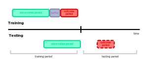
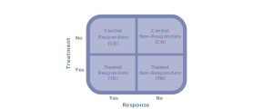

### Defining Targeting Models
- Customer targeting typically involves three models:
    - Propensity model
    - Time-to-event model
    - Lifetime value model
- These models can be used individually or together
- A propensity model estimates the probability of a customer doing some event
- A time-to-event model estimates the number of days until a customer does some event
- A lifetime value model estimates the value of a customer
- The events in a propensity or time-to-event model include:
    - A candidate responding to an email campaign
    - A customer puchasing a specific product
    - A customer expanding to a new product
    - A customer purchasing additional units of a prduct
    - A customer changing shopping habits
    - A customer churning
- All three of these models can help determine the impact of this event

### Defining Look-Alike Modeling
- A look-alike model is one of the main components of a propensity model
- A look-alike model assumes propensity is only the probability of a customer moving from one point on the life-cycle curve to another
- A look-alike model consists of the following components:
    - A response variable
        - E.g. did the customer purchase this product for the first time
        - E.g. did the customer churn
        - etc.
    - Customer profile predictors
        - E.g. income
        - E.g. gender
        - etc.

### Describing a Look-Alike Model
- As a result, a look-alike model estimates the propensity of a customer using profiles of consumers who exhibited similar behavior in the past
- For example, let's say we're training a model to predict the propensity of buying a product for the first time
- Then, we can also train the model using profiles of customers who stopped buying a product for a while and then started buying it again
- The following are examples of predictors within a customer profile:
    - Household income
    - Household size
    - Behaviorial attributes
    - Email opens
    - Clicks
    - Gender
    - etc.

### Preparing a Look-Alike Model
1. Ensure each row represents a single customer consisting of:
    - Some customer profile features
    - A timestamp
2. Organize each row into one of three sequential time frames:
    - An observational period
    - An optional buffer
    - An outcome period
3. Generate a response variable representing the desired event: 
    - The observation period is used to generate features
    - The outcome period is used to generate the response variable
    - These two intervals may or may not be separated by a buffer

### Describing an Optional Buffer
- The observational and outcome periods may or may not be separated by a buffer
- The buffer can be used to predict events in the relatively distant future
- It is not used for predicting immediate events
- For example, a model that predicts customer churn should probably be trained with the outcome intervals shifted into the future
- In other words, there should be a buffer included
- Since, it would be impractical to predict customers who are likely to churn immediately
- Because, it gives no time to perform any mitigating marketing action

### Illustrating a Look-Alike Model
- As an example, suppose we're modeling a propensity to try a new product
- The training set only should include customers who did not buy the product during the observation period
- The same rule is applied for model evaluation
- Implying, a customer who already buys a promoted product is immediately excluded as a non-fit
- Now, suppose our targeting goal is to identify customers with a high propensity to try a dessert
- Let's assume that a targeting system generated a training data set with:
    - $12$ historical customers profiles
    - $5$ features
    - $1$ response representing whether the customer started buying a dessert
- Specifically, the features represent:
    - `Bakery Total:` The total spending in the bakery during the observation period
    - `Dairy Total:` The total spending on dairy during the observation period
    - `Bakery Weekend:` The total spending in the bakery on the weekends during the observation period
    - `Dairy Weekend:` The total spending on dairy on the weekends during the observation period
    - `Credit:` Represents either credit or cash
- The following table includes sample data trained on our model:

| ID | Bakery Total | Bakery Weekend | Dairy Total | Dairy Weekend | Credit | Response |
| -- | ------------ | -------------- | ----------- | ------------- | ------ | -------- |
| 1  | 150          | 10             | 150         | 140           | 1      | 1        |
| 2  | 210          | 20             | 120         | 110           | 1      | 0        |
| 3  | 190          | 190            | 210         | 20            | 1      | 1        |
| 4  | 270          | 250            | 190         | 0             | 1      | 1        |
| 5  | 180          | 180            | 190         | 10            | 1      | 1        |
| 6  | 260          | 250            | 230         | 20            | 0      | 1        |
| 7  | 270          | 30             | 210         | 210           | 1      | 0        |
| 8  | 150          | 40             | 150         | 50            | 1      | 0        |
| 9  | 90           | 70             | 120         | 100           | 0      | 0        |
| 10 | 30           | 0              | 200         | 200           | 1      | 0        |
| 11 | 190          | 190            | 250         | 10            | 1      | 1        |
| 12 | 10           | 0              | 30          | 0             | 1      | 0        |

- For this example, we'll build our model using logistic regression
- The following table includes sample parameters for our model:

| Parameters     | Estimate |
| -------------- | -------- |
| Bakery Total   | 0.0012   |
| Bakery Weekend | 0.0199   |
| Dairy Total    | -0.0043  |
| Dairy Weekend  | –0.0089  |
| Credit         | –0.4015  |

- The following table includes the final propensity scores for $5$ customers in our test set:

| Bakery Total | Bakery Weekend | Dairy Total | Dairy Weekend | Credit | Propensity |
| ------------ | -------------- | ----------- | ------------- | ------ | ---------- |
| 10           | 0              | 50          | 50            | 1      | 0.26       |
| 20           | 20             | 200         | 200           | 1      | 0.07       |
| 150          | 20             | 100         | 30            | 1      | 0.37       |
| 250          | 20             | 190         | 30            | 1      | 0.31       |
| 250          | 200            | 190         | 30            | 1      | 0.94       |
| 250          | 200            | 190         | 30            | 0      | 0.96       |

### Motivating Response Modeling
- A response model is a slight variation of the look-alike model
- Specifically, a response model is a propensity model measuring the impact of a campagin
- Creating a basic look-alike model will give us a basic propensity model
    - On its own, this model estimates the unconditional probability of a certain response $P(\text{R})$
- Including a treatment feature provides a more well-defined propensity model focused on measuring the effects of campaigns
    - Then, this model estimates the conditional probability of the response (or action) given a pilot campaign $P(\text{R} | \text{T})$
- The following are some examples of treatments:
    - Running a campaign
    - Sending targeted emails
    - Etc.
- Meaning, we can measure the propensity of an event (e.g. churn) after some campaign or marketing action
- This is done to measure the impact of a campaign before execution

### Describing Response Modeling
- Response modeling usually conducts a pilot campaign
    - A pilot campaign tends to split the campaign group into treated responders and treated non-responders
- Specifically, response modeling includes the following steps:
    - Distributing a promotion initially to a small group of recipients
    - Collecting the responses
    - Creating a classification model that maximizes the difference between treated responders and treated non-responder
    - Calculate the difference between the control group and test group (i.e. uplift)
- This corresponds to a look-alike model trained on a population of treated profiles by using
the response indicator as a training label
- This model can be used to execute a full-blown campaign
- Specificially, it can target customers with a high propensity to respond when given the treatment
- In certain cases, the model can be created by using historical data for similar campaigns
without running a pilot

### Defining a Disadvantage of Response Modeling
- So far, response modeling can target customers who are likely to take an action anyway, even without the treatment
- For example, suppose some customers in the control group were planning on purchasing a product, even before the campaign was run
    - Then, the campaign would look more effective than it actually is
    - And, the control group could likely outperform the test group
- Thus, basic propensity modeling only accounts for treated customers
    - It discards the information about the non-treated ones

### Solving the Problem with Response Modeling
- A control group will solve the uplift issue in the pilot campaign
- This group includes randomly selected profiles of targeted and non-targeted customers
- As a result, we should observe four distinguishable groups:
    - `Treatment responder:` a participant who receives the experimental treatment, whose effect is being studied
    - `Treatment non-responder:` a participant who receives the experimental treatment, whose effect isn't being studied
    - `Control responder:` a participant who didn't receive the experimental treatment, whose effect is being studied
    - `Control non-responder:` a participant who didn't receive the experimental treatment, whose effect isn't being studied
- Now, we can accurately measure the uplift by finding the difference between the response rates in the test and control groups
- Specifically, the uplift becomes $\text{TR} - \text{CR}$
- These two probabilities $P(TR)$ and $P(CR)$ can be estimated either:
    - Using one classification model trained on a union of test and control profiles with a treatment indicated included as a feature
    - Using two separate classification models trained on the test and control groups
- For more information about model design, refer to pages $106 and $107$ of *Introduction to Algorithmic Marketing*

### Describing Notation for Experiments
- As a reminder, a *target group* refers to the type of people targeted for an experiment
- Our experiment will only capture a sample of the entire target group
    - Here, our target group represents a population
- Any experiment includes a control group and a treatment group
    - Sometimes, a control group is called a placebo group
    - Sometimes, a treatment group is called an experimental group
- A *control group* refers to the people in an experiment who don't receive a treatment
- A *treatment group* refers to the people in an experiment who do receive a treatment

### References
- [Textbook about Algorithmic Marketing](https://algorithmicweb.files.wordpress.com/2018/07/algorithmic-marketing-ai-for-marketing-operations-r1-7g.pdf)