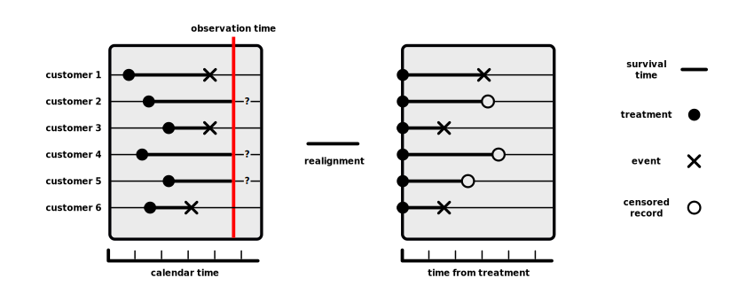
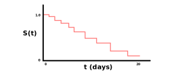

### Defining Targeting Models
- Customer targeting typically involves three models:
    - Propensity model
    - Time-to-event model
    - Lifetime value model
- These models can be used individually or together
- A propensity model estimates the probability of a customer doing some event
- A time-to-event model estimates the number of days until a customer does some event
- A lifetime value model estimates the value of a customer
- The events in a propensity or time-to-event model include:
    - A candidate responding to an email campaign
    - A customer puchasing a specific product
    - A customer expanding to a new product
    - A customer purchasing additional units of a prduct
    - A customer changing shopping habits
    - A customer churning
- All three of these models can help determine the impact of this event

### Motivating Time-to-Event Analysis 
- Propensity models estimate the probability of outcomes of marketing actions
- The shortcomings of propensity models include:
    1. Can't translate to time-until-event
        - This is known as *survival time*
        - This is usually more convenient and efficient for interpretation
    2. Sometimes difficult to create response labels in the training set
        - This is known as *censored data*
        - E.g. easy to mislabel labels for churn
- Specifically, time-to-event can produce more actionable insights
- For example, a propensity model can estimate the conditional probability of a purchase by a customer given a discount is $0.8$
- Whereas, a time-to-event model can estimate:
    - A customer is likely to make a purchase in $10$ days
    - This time can be reduced by $5$ days by offering a discount of $0.8$
- In this example, the time-to-event model may be more useful to us

### Describing the Problems of Censored Data
- Censored data refers to data that is defined by a lack of an event, causing it to have an unknown event time
- For example, suppose we're interested in modeling churn propensity
- We're able to determine customers who have purchased
- However, censored data occurs for data when it is difficult to distinguish between:
    - Customers who haven't purchased
    - Customers who haven't purchased *yet*
- Consequently, one can argue that labeling customers as *churned* or *not-churned* is not really valid
- Suggesting, it isn't accurate to use classification models with a binary outcome determined on the basis of currently observed outcomes
- As a result, we can use a different framework like survival models

### Defining Terminology for Time-to-Event Models
- The above limitations of propensity modeling can be addressed by using survival analysis
- Survival models can properly handle:
    - Censored data (i.e records with potentially unknown outcomes)
    - Predicting the expected time-to-event (or survival time)
    - Specifying how marketing actions and customer properties can accelerate or decelerate an event
- The main goal of survival analysis is to do the following:
    - Predict the time to an event of interest
    - Quantitatively explain how this time depends on the properties of the treatment, individuals, and other independent variables
- A treatment (i.e. business decision) is typically an incentive or trigger
    - E.g. a promotion
- An event (i.e. customer action) is typically one of the following:
    - A purchase
    - A promotion redemption
    - A subscription cancellation
    - Or any other customer action
- Survival time is the time between a treatment and event
- Censored data refers to data that is defined by a lack of an event, causing it to have an unknown event time
- Most survival models consist of two key components:
    - A *survival function*
    - A *hazard function*

### Defining the Survival Function
- A survival function outputs the probability that an event hasn't occurred in a time period
    - This is also referred to as the probability *to survive*
- The survival function $S$ is defined as the following:

$$
S(t) = \text{Pr}(T > t) = 1 - \int_{0}^{t} f(\tau)d \tau
$$

- Where, $t$ is a given point in time
- Where, $T$ is the survival time of a customer
- Where, $S(t)$ outputs the fraction of customers who have not yet experienced the event by time point $t$ 
- Where, $\text{Pr}(T \le t) = \int_{0}^{t} f(\tau)d \tau$ is the probability of a customer experiencing an event by a time point $t$

### Describing the Survival Function
- Typically, the survival function $S$ is estimated
- To estimate the survival function, we must assume independence
- Then, the estimated survival function can be obtained by multiplying the probabilities for survival from one interval to the next
- Formally, the probability to survive to time $t$ can be estimated as:

$$
S_{t} = \frac{n_{t} - d_{t}}{n_{t}} = 1 - \frac{d_{t}}{n_{t}}
$$

- Where, $n_{t}$ is the number of individuals who haven't yet experienced the event at time $t$
- Where, $d_{t}$ is the number of individuals who have experienced the event at time $t$
- This is only an estimate of a single probability
- The estimate of the (cumulative) survival function is obtained by multiplying the probabilities from the origin time until time $t$
- The estimated survival function is defined as the following formula:

$$
\hat{S(t)} = \prod_{i \le t} (1 - \frac{d_{t}}{n_{t}})
$$

- This formula is known as the *Kaplan-Meier estimator*
    - This has been proven to be the MLE
    - This is a non-parametric formula
- It can also be estimated using an exponential curve
    - This is a parametric formula
- The following table compares their pros and cons:

|      | K-M Model | Exponential Model | Cox Model |
| ---- | --------- | ----------------- | --------- |
| Pros | Simple to interpret and can estimate the survival function | Can estimate the survival function and hazard ratio | Hazards can fluctuate with time and can estimate the hazard ratio |
| Cons | No functional form and can't estimate hazard ratio and can only include a few categorical variables | Not always realistic and assumes constant hazards | Can't estimate survival function |

### Illustrating the Survival Function
- Suppose we're analyzing a group of $14$ customers who have all received a promotional email
- All emails were sent at different times
- The observed data looks like the following:

$$
t = \{ 2, 3, 3, 3, 4, 6, 7, 8, 12, 12, 14, 15, 20, 23 \}
$$

$$
\delta = \{ 1, 1, 0, 1, 1, 1, 1, 0, 1, 1, 0, 1, 1, 1 \}
$$

- The dataset $t$ represents the time of event for each $i^{th}$ customer
    - Each $t_{i}$ is measured in days since the email was sent
- The dataset $\delta$ contains indicators for whether each observation is:
    - Censored ($0$)
    - Or not censored ($1$)
- For example, the first customer made a purchase on the second day after the email was sent to them
    - Therefore, he's labeled as non-censored
- Whereas, the third customer did not make a purchase by the time of the analysis
    - She got the email three days before the analysis cutoff date
    - Therefore, she's labeled as censored
- In this context, the probability to survive refers to the probability of not having made a purchase at a given time
- The following illustrate a series of cumulative probabilities:

$$
S(0) = 1
$$

$$
S(2) = 1 - \frac{1}{14} = 0.93
$$

$$
S(3) = S(2) \times (1 - \frac{2}{13}) = 0.79
$$

- Notice, $S(0)$ will always equal $1$
    - This is because all customers are considered to be alive

### Visualizing the Survival Function
- The result from our example correspond to the stepwise *survival curve* plotted below
- The survival curve summarizes the dynamics of a customer group
- Typically, we'll compares curves for different groups
- For example, a survival curve for customers who were treated with a promotion
can be plotted together with a curve for those who were not
- Thus, the efficiency of the promotion can be graphically assessed

### Defining a Hazard Function
- Whereas, a survival function outputs the probability that an event hasn't occurred in a time period 
- A hazard function outputs the probability that an event has occurred in a time period 
- Typically, hazard functions are used for analyzing how different factors (i.e. treatment parameters) influence the survival time
- Specifically, the hazard function $h$ is defined as the instantaneous hazard rate
- Meaning, it's the probability of an event in an infinitesimally small time period between $t$ and $t + dt$, given that the individual has survived up until time $t$

$$
h(t) = \lim_{dt \to 0} \frac{\text{Pr}(t < t \le t + dt | T > t)}{dt}
$$

- The hazard function can be reformulated in terms of the survival function
- As a result, we can switch between the hazard and survival functions in
the analysis
- A hazard function can be used to calculate *hazard ratios*
    - A hazard ratio is the the ratio of the hazard for someone who has received the treatment relative to someone who hasn't received the treatment
    $$
    \text{hazard ratio} = \frac{\text{haz}, x=1}{\text{haz}, x=0}
    $$
    - As a result, we can interpret this output as the multiplicative risk of someone who has received the treatment observing an event, compared to someone who hasn't observed the event

### Defining Survival Analysis Regression
- The basic survival and hazard functions can be used for:
    - Describing the performance of a customer group
    - Comparing different groups to each other
- This is not enough for predicting how survival and hazard are influenced by factors like marketing actions and customer properties
- Let's assume that each $k^{th}$ individual is represented by three values:

$$
(t_{1}, \delta_{1}, \bold{x_{1}}), ..., (t_{k}, \delta_{k}, \bold{x_{k}})
$$

- Where, $\bold{x}$ is a vector of $p$ independent variables
    - This vector can contain:
        - Customer demographic indpendent variables
        - Customer behavioral independent variables
        - Indicators of marketing communication to that customer
        - Etc.
- Where, $t$ is a survival time or censoring time
- Where, $\delta$ is a censoring indicator
    - Observed events are labeled $1$
    - Censored cases are labeled $0$
- As both $S(t)$ and $h(t)$ are probabilities, we can construct different survival regression models by assuming:
    - Different probability distributions
    - Different dependencies between $\bold{x}$ and the parameters of the distribution

### Defining Proportional Hazard Models
- The most common type of survival regression model is the *proportional hazard model*
- This model family makes the following assumptions:
    - A unit increase in an observed covariate has a multiplicative effect on the hazard function
    - This hazard function is constant over time
- Thus, the proportional hazard model is defined as the following:

$$
h(t | \bold{w}, \bold{x}) = h_{0}(t) \times r(\bold{w}, \bold{x})
$$

- Where, $t$ is a survival time or censoring time
- Where, $\bold{w}$ is a vector of model parameters
- Where, $\bold{x}$ is a vector of $p$ independent variables
- Where, $h_{0}(t)$ is the baseline hazard
- Where, $r$ is the *risk ratio*
    - This increases or decreases the baseline hazard depending on the independent variables
- Thus, the baseline hazard $h_{0}(t)$ does not depend on the individual
- Whereas, the risk ratio $r$ does depend on the individual
- Since the hazard rate is never negative, the risk ratio $r$ is typically modeled as an exponential function to ensure it isn't ever negative

$$
h(t | \bold{w}, \bold{x}) = h_{0}(t) \times \exp(\bold{w^{T}} \bold{x})
$$

- By rearranging this formula, the model can be interpreted as a linear model
- Specifically, it can be intepreted using the log of the risk ratio for an individual to the baseline

$$
\bold{w^{T}} \bold{x} = \log (\frac{h(t | \bold{x})}{h_{0}(t)})
$$

### Introducing the Cox Proportional Hazard Model
- Regarding the baseline hazard $h_{0}(t)$ we have two choices:
    - Nonparametric
    - Parametric
- The parametric approach assumes that the hazard function follows a certain probability distribution
- In this case, we must fit the parametric model by finding the optimal values of parameters $w$ and the parameters of the distribution
- The disadvantage of this approach is that it assumes a fixed probabilitiy distribution over time
    - However, this doesn't always reflect reality
    - Since, the baseline hazard typically varies in an unpredictable manner with time
    - Since the parametric approach smooths noisy data, it can be useful for providing a simple model for the baseline hazard
- A nonparametric baseline hazard model can be estimated from the data by using the Kaplan–Meier estimator (or other methods)
    - This leads to a semiparametric model for the overall hazard
    - Where, the parametric part is defined by $\exp(\bold{w^{T}} \bold{x})$
    - Where, the baseline hazard $h_{0}(t)$ part is nonparametric
    - This semi-parametric model is known as the *Cox proportional hazard model*

### Describing the Cox Model
- To summarize the above points, the Cox model refers to:

$$
\underbrace{h(t | \bold{w}, \bold{x})}_{semiparametric} = \underbrace{h_{0}(t)}_{\text{nonparametric}} \times \underbrace{r(\bold{w^{T}} \bold{x})}_{\text{parametric}}
$$

- The Cox model has the following benefits:
    - We can estimate the hazard ratios $r$ without having to estimate the baseline hazard function $h_{0}$
    - We don't need to make any assumptions about the structure of the baseline hazard $h_{0}$
        - It is convenient to only estimate the risk factors
        - It is convenient to not estimate the absolute hazard values
- The Cox model has the following disadvantages:
    - The baseline hazard must be estimated by using parametric methods
    - The Cox model makes the same assumptions as any proportional hazard model, which may not be true for our data

---

### tldr
- A propensity model estimates the probability of outcomes of marketing actions
- The shortcomings of propensity models include:
    1. Can't translate from probabilities to survival times
    2. Difficult to handle censored data
- A time-to-event model can estimate:
    - A customer is likely to make a purchase in $10$ days
    - This time can be reduced by $5$ days by offering a discount of $0.8$
- A survival function outputs the probability that an event hasn't occurred in a time period
    - For example, it can measure the probability that a customer won't purchase in the next $t$ years
- A hazard functions outputs the probability that an event has occurred in the next few seconds
    - For example, it can measure the probability that a customer will purchase after the $t^{th}$ year mark 
        - Given the customer hasn't purchased yet (before the $t^{th}$ year mark)
- A hazard function can be used for:
    - Evaluating the performance of a customer group
    - Comparing different groups to each other
- Survival analysis regression is used for predicting how survival and hazard are influenced by factors like marketing actions and customer properties
- The most popular type of survival analysis regression model is the (semiparametric) Cox model

---

### References
- [Video about Survival Analysis](https://www.youtube.com/watch?v=vX3l36ptrTU&list=PLqzoL9-eJTNDdnKvep_YHIwk2AMqHhuJ0)
- [Video about Survival and Hazard Functions](https://www.youtube.com/watch?v=MdmWdIV5k-I&list=PLqzoL9-eJTNDdnKvep_YHIwk2AMqHhuJ0&index=3)
- [Video about Pros and Cons of Cox Model](https://www.youtube.com/watch?v=K7bmmbD7KIg&list=PLqzoL9-eJTNDdnKvep_YHIwk2AMqHhuJ0&index=4)
- [Video about Modeling Survival Function Curve](https://www.youtube.com/watch?v=VJPPeUpyC6c&list=PLqzoL9-eJTNDdnKvep_YHIwk2AMqHhuJ0&index=5)
- [Video about Cox Proportional Hazards Model](https://www.youtube.com/watch?v=aETMUW_TWV0&list=PLqzoL9-eJTNDdnKvep_YHIwk2AMqHhuJ0&index=9)
- [Video about Cox Model Assumptions](https://www.youtube.com/watch?v=QAgtZKpKj9M&list=PLqzoL9-eJTNDdnKvep_YHIwk2AMqHhuJ0&index=10)
- [Textbook about Algorithmic Marketing](https://algorithmicweb.files.wordpress.com/2018/07/algorithmic-marketing-ai-for-marketing-operations-r1-7g.pdf)
- [Paper about Proportional Haard Model](https://bmcmedresmethodol.biomedcentral.com/articles/10.1186/1471-2288-13-88)