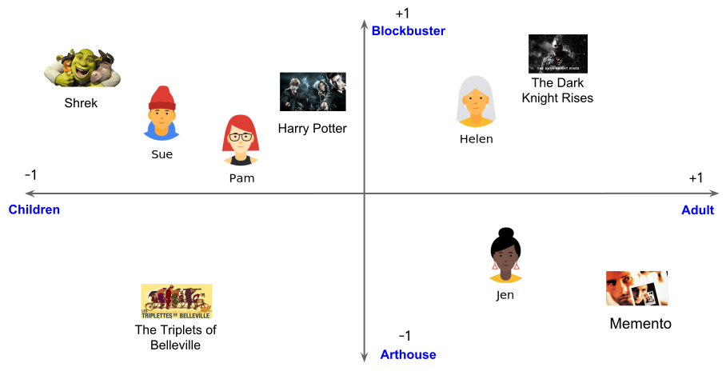

### Introducing Recommendation Systems
- The goal of any recommender system is to do the following:
    - Predict the ratings that a certain user would give to different catalog items
    - Create a list of recommendations by selecting
    - Rank those items with the highest predicted ratings
- Collaborative filtering is used for creating recommendation systems

### Introducing Collaborative Filtering
- Under the hood, collaborative filtering uses a predictive model to predict a rating for a given pair of user and item
- These predictions are based on how similar users rate similar items
- Specifically, the model captures interactions between known users and items from the rating matrix
- The benefit of collaborative filtering is that they're capable of making recommendations based only on the patterns and similarities available in the rating matrix
- It has the following disadvantages:
    - Difficult to build reliable rating predictions if matrix is too sparse
    - Difficult to handle new users or items (cold start problem)
    - Somewhat biased towards popular items (difficult to pick up on unusual tastes)

### Defining Types of Collaborative Filtering
- Collaborative filtering algorithms are usually categorized into two subgroups:
    - Neighborhood-based methods
    - Model-based methods
- Neighborhood-based methods predict unknown ratings for a given user or item by doing the following:
    - Finding the most similar known users or items
    - Averaging ratings from their records
- Model-based methods go beyond the nearest neighbor approach
    - Specifically, they use more sophisticated, predictive models

### Introducing Neighborhood-Based Collab Filtering
- Neighborhood-based collaborative filtering relies on a similarity measure between users or items
- Neighborhood-based collaborative filtering include the following steps:
    - Optionally predicting missing ratings in the ratings matrix
    - Creating a similarity matrix
    - Selecting $k$ similar users or items that should be included in the neighborhood
    - Predicting ratings by averaging neighbors' ratings
        - This average is based on the values of the $k$ nearest neighbors
- Collaborative filtering can be mixed with neighborhood-based, content-based, and model-based recommendation methods
    - For example, one can perform a model-based method for initializing missing ratings (e.g. naive bayes model)
    - Or, one can perform a neighborhood-based method for initializing missing ratings (e.g. $k$ nearest neighbors)
    - Then, compute Pearson similarities between users or items based on this complete rating matrix
    - Lastly, make actual recommendations using neighborhood-based or model-based algorithms

### Describing Neighborhood-Based Collaborative Filtering
- The following are some popular similarity measures:
    - Pearson's correlation coefficient
    - Euclidean distance
    - Cosine similarity value
    - Discounted similarity value
    - Inverse user frequency
- The following are some popular mean-centering formulas:
    - Baseline-centering
    - Amplification
    - Neighborhood selection
- Specifically, these similarity values measures the similarity of ratings between two users or two items
- These two cases are known as the following:
    - User-based similarity
    - Item-based similarity

### Disadvantages of Neighborhood-Based Filtering
- Has a narrow view of the problem
    - Focuses only on the $k$ nearest neighbors
- Sometimes performance decreases on sparse data
    - Where, items/users have few common ratings
- Relies on pairwise instance comparison and defers the computation of the
recommendations until it is requested
    - This makes it challenging to split the computation between offline and online phases

### Introducing Used-Based and Item-Based Filtering
- The goal of user-based similarity is to find similar users:
    - Then, we can recommend items with similar ratings from these similar users
    - For example, a user-based approach can recommend items that have not been rated by the given user, but have been positively rated by at least some neighborhood users
- The goal of item-based similarity is to find similar items:
    - Then, we can recommend items with similar ratings for the given user
    - For example, a user who positively rated a few items in the past will probably like items that are rated similarly to these past choices by many other users
- The user-based and item-based approaches are structurally similar
    - They can use different measures
    - There are many different variants of similarity and rating averaging formulas for each approach

### Illustrating User-Based Collaborative Filtering
- Used-based collaborative filtering uses two key functions:
    - A similarity measure for users
    - A rating averaging formula
- Suppose we had $4$ customers interested in product discovery
- Our first step would include computing a similarity matrix

|        | User 1 | User 2 | User 3 | User 4 |
| ------ | ------ | ------ | ------ | ------ |
| User 1 | 1.00   | 0.87   | 0.94   | -0.79  |
| User 2 | 0.87   | 1.00   | 0.87   | -0.84  |
| User 3 | 0.94   | 0.87   | 1.00   | -0.93  |
| User 4 | -0.79  | -0.84  | -0.93  | 1.00   |

- Notice, the first three users are positively correlated with each other
- This similarity matrix allows us to look up a neighborhood of the top $k$ most similar
users for a given target user
    - Then, mix their ratings to make a prediction
- Thus, we'll perform a rating averaging formula over the users
- Lastly, we'll predict the missing ratings for products of a user using KNN regression

### Describing Challenges of User-Based Filtering
- In practice, user-based recommendation methods can face scalability challenges
    - Especially, as the number of system users approaches tens and hundreds of millions
    - If the neighborhoods are computed in advance, the amount of computations will be large
- In addition, the target user profile might not be available in advance
    - E.g. the browsing history within the current web session
    - One possible way to work around this limitation is to switch from user similarities to item similarities

### Illustrating Item-Based Collaborative Filtering
- Our first step would include computing a similarity matrix

|         | Movie 1 | Movie 2 | Movie 3 | Movie 4 |
| ------- | ------- | ------- | ------- | ------- |
| Movie 1 | 1.00    | 0.87    | 0.94    | -0.79   |
| Movie 2 | 0.87    | 1.00    | 0.87    | -0.84   |
| Movie 3 | 0.94    | 0.87    | 1.00    | -0.93   |
| Movie 4 | -0.79   | -0.84   | -0.93   | 1.00    |

- Notice, the first three movies are positively correlated with each other
- This similarity matrix allows us to look up a neighborhood of the top $k$ most similar
movies for a given target movie
    - Then, mix their ratings to make a prediction
- Thus, we'll perform a rating averaging formula over the movies
- Lastly, we'll predict the missing ratings for movies of a user using KNN regression

### Comparing User-Based and Item-Based Filtering
- Since the item-based similarity matrix is comparatively much smaller, item-based approaches are typially more scalable
- User-based approaches capture certain relationships that might not be recognized by
item-based methods
- The ratio between the number of users and items is useful if we're wanting to use one over the other
- However, some advanced recommendation methods combine item-based and user-based models to take advantage of both methods

### Introducing Model-Based Collaborative Filtering
- Often, a neighborhood-based algorithm does the following:
    - Optionally, impute missing data (using neighborhood or model based methods)
    - Computes the similarity between each user and item
    - Optionally, group similar users beforehand using locality-sensitive hashing
    - Predict the rating of a user and item by calculating the weighted average of the $k$ nearest neighbors
- Often, a model-based algorithm does the following instead:
    - Optionally, impute missing data (using neighborhood or model based methods)
    - Compute latent factors by performing matrix factorization (using SVD or PCA)
        - Naturally, this will act as a form of dimensionality reduction
    - Predict the rating of a user and item wtih matrix multiplication of latent factors

### Introducing Matrix Factorization
- Matrix factorization (or latent factor models) are the most popular model-based method
- The following are popular forms of matrix factorization:
    - Unconstrained matrix factorization (or funk MF)
        - Optimization using stochastic gradient descent (SGD)
        - Optimization using alternating least squares (ALS)
    - Singular value decomposition (SVD)
    - Non-negative matrix factorization
- Most matrix factorization methods follow these steps:
    - Receive defined model of matrices
    - Define the objective function
    - Optimize with gradient descent

### Advantages of Model-Based Collaborative Filtering
- This approach offers the following advantages over neighborhood-based methods:
    - **Accuracy**
        - There are more accurate models compared to kNN
    - **Stability**
        - Offers dimensionality reduction methods
        - Thus, sparse matrices can be transformed into more condensed representations
        - This improves the stability of predictions
    - **Scalability**
        - Models can be trained offline
        - Then, these models can be evaluated for online requests
- Some model-based methods can provide all of these improvements
    - Others can only provide some of them

### Defining Singular Value Decomposition
- Again, the rating matrix $R$ consists of:
    - A $u$ number of rows representing individual users
    - A $i$ number of columns representing individual items
    - Each entry represents a rating
- Latent factor models decompose the ratings matrix into:
    - A $u \times k$ user matrix $U$
    - A $k \times i$ item matrix $I$
    - A $k \times k$ weight matrix $\Sigma$
        - Essentially, this represents a matrix denoting which $k^{th}$ latent factor carriest most of the information
        - Or, each value located in the diagonal of the matrix represents the strength of the $k^{th}$ latent factor
- Here, $u$ is the number of users in our rating matrix
- Here, $i$ is the number of items in our rating matrix
- Here, $k$ is the number of latent factors
    - Each latent factor represents some learned context
    - Increasing the number of latent factors improves personalization
    - Increasing the number of latent factors by too much harms performance and leads to overfitting
    - Typically, a regularization term is introduced to avoid overfitting

### Illustrating Latent Factor Models
- Suppose we have a ratings matrix $R$ consisting of customers and movies
- For this example, we'll assign the number of latent factors $k$ to equal $2$
- Thus, we'll learn two different types of *context* from our customers $U$ and movies $I$
- Notice, our optimization algorithm will learn $2$ different contexts:
    - The degree to which a movie is meant for children or a customer is a child
    - The degree to which a movie is a blockbuster of a customer enjoys blockbuster movies
- The following image illustrates the learned latent factors:

### References
- [Slides for Latent Factor Models](https://www.cs.cmu.edu/~mgormley/courses/10601-s17/slides/lecture25-mf.pdf)
- [Alternating Least Squares with Spark](https://spark.apache.org/docs/2.2.0/ml-collaborative-filtering.html)
- [Collaborative Filtering with Implicit Feedback](https://towardsdatascience.com/building-a-collaborative-filtering-recommender-system-with-clickstream-data-dffc86c8c65)
- [Textbook about Algorithmic Marketing](https://algorithmicweb.files.wordpress.com/2018/07/algorithmic-marketing-ai-for-marketing-operations-r1-7g.pdf)
- [Personalizing Experience with Callaborative Filtering](https://databricks.com/blog/2020/12/18/personalizing-the-customer-experience-with-recommendations.html)
- [Building Recommendation Systems in Python](https://realpython.com/build-recommendation-engine-collaborative-filtering/)
- [Paper about Collaborative Filtering Methods](http://cs229.stanford.edu/proj2007/Dommeti-NeighborhoodBasedMethodsForCollaborativeFiltering.pdf)
- [Google Course about Basics of Collaborative Fitlering](https://developers.google.com/machine-learning/recommendation/collaborative/basics)