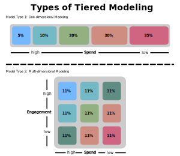
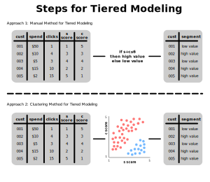

### Defining Tiered Modeling for Segmentation
- Typically, a targeting model scores the relevance of a customer in terms of a business objective based on their customer profile
- One of the most basic approaches is to score customers based on one metric alone
    - E.g. average spend of a customer
- This feature can then be used to sort customers by a metric into tiers to identify the most valuable and least valuable customers
- However, it's common to create tiers based on multiple metrics as well
    - E.g. loyalty-monetary segmentation
- A standard example is to assign each customer to one of 5 tiers:
    - The top 5% of customers to tier 1
    - The next top 10% to tier 2
    - The next top 20% to tier 3
    - The next top 30% to tier 4
    - The bottom 35% to tier 5
- Then, we can profile each tier to understand customers' average monetary and behavioral attributes

### Illustrating Manual Steps for Tiered Modeling
1. Assign quantile scores to each customer
    - These scores represent quantiles (e.g. $1-5$) based on some metric (e.g. spend)
2. *Optional:* Aggregate quantile scores
3. Analytically assign scores to segments
4. Profile segments

### Illustrating Clustering Steps for Tiered Modeling
1. Assign quantile scores to each customer
    - These scores represent quantiles (e.g. $1-5$) based on some metric (e.g. spend)
2. *Optional:* Aggregate quantile scores
3. Cluster scores to retrieve segments
4. Profile segments

### References
- [Textbook about Algorithmic Marketing](https://algorithmicweb.files.wordpress.com/2018/07/algorithmic-marketing-ai-for-marketing-operations-r1-7g.pdf)
- [Example of Tiered Modeling](https://medium.com/swlh/exploring-customers-segmentation-with-rfm-analysis-and-k-means-clustering-93aa4c79f7a7)
- [Course about Customer Segmentation](https://www.datacamp.com/courses/customer-segmentation-in-python)
- [Course about Segmentation Analysis](https://www.datacamp.com/courses/machine-learning-for-marketing-in-python)