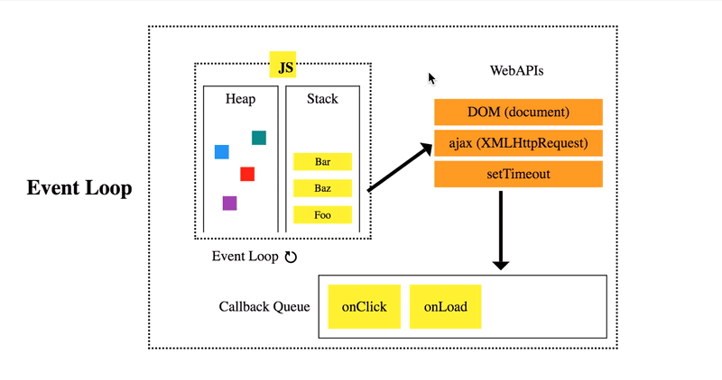

### Motivating the Event Loop in JavaScript
- There are many differences between how Python and JavaScript handle events
- However, there are many similar components that are roughly comparable
- Personally, it helps knowing both models in order to build a broader understanding of the general architecture of event loops
- The following is the general interaction between:
	- The JavaScript engine
	- The event loop
	- Any WebAPIs

### Describing the Heap
- The heap is memory set aside for dynamic allocation
	- The stack is memory set aside for static allocation
	- The stack stores primitives, like ints and strings
	- The heap stores objects
	- Primitives usually involve stack memory allocation, since we usually know how large they will be
	- Objects usually involve dynamic memory allocation, since they usually change in size throughout the code
- There's no enforced pattern to the allocation and deallocation of blocks from the heap
	- This is different from the call stack
- We can allocate a block at any time and free it at any time
- Each thread gets a call stack
- On the other hand, there's typically only one heap for the application

### Describing the Call Stack
- The call stack is a LIFO queue (Last In, First Out)
- JavaScript has a single call stack that does the following:
	- Keeps track of what function we're currently executing
	- Keeps track of what function is to be executed after
- When a function is about to be executed, it is added to the call stack
- Next, if a function calls another function, then the called function will be on the top of the call stack

### Describing the Event Table
- Every time an async function gets called, it is added to the event table
- For example, calling `setTimeout()` will get added to the event table immediately
- The event table is a data structure that tracks what functions should be called after a function finishes executing
- In other words, it knows that a certain function should be triggered after an event
- The following are examples of events:
	- Timeout
	- Click
	- Mouse movement
- Once that event occurs, the event is added to the event queue
- Note, the event table doesn't do the following:
	- Executes functions
	- Adds them to the call stack
- It's only purpose is to do the following:
	- Tracks events
	- Sends events to the event queue

### Describing the Event Queue
- The event queue is a data structure similar to the call stack
- However, the event queue is more designated for asynchronous functions (i.e. events)
- The event queue is a FIFO queue (First in, First out)
- By doing this, the event queue stores the order in which functions should be executed
- As stated previously, the event queue receives function calls from the event table
- It is responsible for the following:
	- Storing functions for the event loop to monitor
	- Informing the event loop when there are events available

### Describing the Event Loop
- The event loop is a constantly running process that checks if the call stack is empty
- Imagine the event loop is a clock
- Every time the clock ticks, it looks at the call stack
- And, if it is empty, it looks into the event queue
- If there is an event in the event queue, then the event loop sends the event to the call stack to be executed
- Otherwise, nothing happens

### Blocking the Event Loop
- The even loop will be blocked if code takes too long to be executed in the call stack
- This is because events will build up in the event queue, but the event loop will never move them to the call stack (since it's full)
- Specifically, this is because JavaScript is single-threaded
- However, nearly all of the I/O primitives in JavaScript are non-blocking
- Meaning, JavaScript code with primitives won't face the problem mentioned above
- The following are examples of I/O primitives:
	- Network requests
	- Node.js filesystem operations
- This is why JavaScript is based so much on callbacks (i.e. code has a small chance of being blocked)

---

### tldr
- The call stack is responsible for the following
	- Tracking what function are currently being executed
	- Tracking what function is to be executed afterwards
- The event table is responsible for the following:
	- Tracking events
	- Sending events to the event queue
- The event queue is responsible for the following:
	- Storing functions for the event loop to monitor
	- Informing the event loop when there are events available
- The event loop is a constantly running process that checks if the call stack is empty
- The event loop does the following:
	1. Checks to see if there is space to push to the call stack
	2. If there is space, it looks if there is an event in the event queue
	3. If there is an event, then it sends the event to the call stack

---

### References
- [Understanding the Event Loop](https://hackernoon.com/understanding-js-the-event-loop-959beae3ac40)
- [Defining the Event Loop in JavaScript](https://flaviocopes.com/javascript-event-loop/)
- [Difference between the Stack and Heap](https://stackoverflow.com/a/80113/12777044)
- [Defining the Event Loop in JavaScript](https://developer.mozilla.org/en-US/docs/Web/JavaScript/EventLoop)
