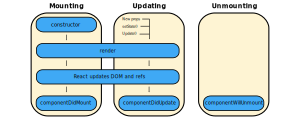

### Introducing Lifecycle Methods
- A React component goes through several stages in its lifecycle
- React provides built-in methods for overriding particular stages in a component's lifecycle
- These lifecycle methods are only available to class components
- Lifecycle-like behavior can be implemented in functional components using hooks
- Lifecycle methods can be classified into into four categories:
	- Mounting methods
	- Updating methods
	- Unmounting methods
	- Error handling methods



### Introducing Mounting Lifecycle Methods
- Mounting lifecycle methods are called when an instance of a component is created
- Thus, they're created when a component is inserted into the DOM
- There are four mounting methods:
	- `constructor`
	- `getDerivedStateFromProps`
	- `render`
	- `componentDidMount`

### Defining the `constructor(props)` Method
- The constructor is a mounting method
- It is a function that gets invoked when a new component is created
- It is used for:
	- Initializing state
	- Binding the event handlers to components
- Constructors should not cause side effects
- For example, HTTP requests shouldn't be made within a constructor method
- Constructors require the `super(props)` function to be called
- The constructor is the only place where we can directly overwrite `this.state` with fields
- In all other scenarios, we must use `this.setState`

### Defining `getDerivedStateFromProps(props, state)`
- This method is rarely used compared to other mounting methods
- It is invoked when the state of a component depends on changes in props over time
- For example, we could use this method when the inital state of a component depends on the props passed to the component
- It is used for setting the state to some value based on the props
- This method is static, meaning it doesn't have access to `this`

### Defining the `render()` Method
- It is the only required mounting method in a class component
- It is used for:
	- Reading props and state
	- Returning JSX
- It shouldn't do any of the following:
	- Change the state of a component
	- Interact with DOM
	- Make AJAX calls
- When a component a executes a lifecycle method, any lifecycle methods belonging to its children components are executed too

### Defining the `componentDidMount()` Method
- This method is invoked once during the lifecycle of a component
- It is invoked immediately after the component and its children component all have been rendered to the DOM
- It is used for:
	- Causing side effects
	- Like interacting with the DOM
	- Or performing any AJAX calls to load data

### Order of Execution for Two Mounting Components
```
ParentComponent: constructor
ParentComponent: getDerivedStateFromProps
ParentComponent: render
ChildComponent:  constructor
ChildComponent:  getDerivedStateFromProps
ChildComponent:  render
ChildComponent:  componentDidMount
ParentComponent: componentDidMount
```

### References
- [Video about Lifecycle Methods in React](youtube.com/watch?v=qnN_FuFNq2g&list=PLC3y8-rFHvwgg3vaYJgHGnModB54rxOk3&index=22)
- [Video about Component Mounting in React](https://www.youtube.com/watch?v=KDXZibVdiEI&list=PLC3y8-rFHvwgg3vaYJgHGnModB54rxOk3&index=23)
- [Lifecycle Methods in React Docs](https://reactjs.org/docs/state-and-lifecycle.html)
- [Current State of Lifecycle Methods and Hooks](https://stackoverflow.com/a/44506265/12777044)
- [Illustrating Lifecycle Methods](https://programmingwithmosh.com/javascript/react-lifecycle-methods/)
- [Diagram of React Lifecycle Methods](https://projects.wojtekmaj.pl/react-lifecycle-methods-diagram/)
