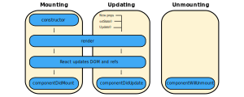

### Introducing Lifecycle Methods
- A React component goes through several stages in its lifecycle
- React provides built-in methods for overriding particular stages in a component's lifecycle
- These lifecycle methods are only available to class components
- Lifecycle-like behavior can be implemented in functional components using hooks
- Lifecycle methods can be classified into into four categories:
	- Mounting methods
	- Updating methods
	- Unmounting methods
	- Error handling methods



### Introducing Updating Lifecycle Methods
- Updating lifecycle methods are called when an instance of a component is rerendered
- Components are rerendered when there are changes to either its props or state
- There are five updating methods:
	- `getDerivedStateFromProps`
	- `shouldComponentUpdate`
	- `render`
	- `getSnapshotBeforeUpdate`
	- `componentDidUpdate`

### Defining `shouldComponentUpdate(nextProps, nextState)`
- This method is used for dictating if a component should be rerendered or not
- By default, components rerender when their props/state change
- This method can override this behavior
- In general, this method is used for performance optimization
- This method shouldn't cause side effects
- For example, it shouldn't include any HTTP requests
- Also, it shouldn't call any setState methods
- This method is rarely used in React

### Defining `getSnapshotBeforeUpdate(prevProps, prevState)`
- This method is rarely used in React
- This method is invoked before the changes from the virtual DOM are to be reflected in the DOM
- It captures some information from the DOM
- For example, it can be used to read the user's scrolling location
- This method will either return a value or null
- The returned value will be passed as the third parameter to the `componentDidUpdate` method

### Defining `componentDidUpdate(prevProps, prevState, snapshot)`
- This method receives a snapshot value from the previous method
- This method is invoked once after the rerendering cycle is finished
- This method allows for side effects
- For example, we can make AJAX calls in this method
- However, we first should compare the previous props and current props to decide whether to make the AJAX call or not

### Order of Execution for Two Updating Components
```text
ParentComponent: getDerivedStateFromProps
ParentComponent: shouldComponentUpdate
ParentComponent: render
ChildComponent:  getDerivedStateFromProps
ChildComponent:  shouldComponentUpdate
ChildComponent:  render
ChildComponent:  getSnapshotBeforeUpdate
ParentComponent: getSnapshotBeforeUpdate
ChildComponent:  componentDidUpdate
ParentComponent: componentDidUpdate
```

### References
- [Video about Lifecycle Methods in React](youtube.com/watch?v=qnN_FuFNq2g&list=PLC3y8-rFHvwgg3vaYJgHGnModB54rxOk3&index=22)
- [Video about Component Updating in React](https://www.youtube.com/watch?v=DyPkojd1fas&list=PLC3y8-rFHvwgg3vaYJgHGnModB54rxOk3&index=24)
- [Lifecycle Methods in React Docs](https://reactjs.org/docs/state-and-lifecycle.html)
- [Current State of Lifecycle Methods and Hooks](https://stackoverflow.com/a/44506265/12777044)
- [Illustrating Lifecycle Methods](https://programmingwithmosh.com/javascript/react-lifecycle-methods/)
- [Diagram of React Lifecycle Methods](https://projects.wojtekmaj.pl/react-lifecycle-methods-diagram/)
