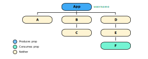

### Defining the Goal of Contexts
- Typically, we'll want to pass down a global prop to a child that is many layers deep
- For example, we may define a `username` prop in the App component
- Then, let's say we only use this prop in the `F` component
- Without using contexts, we must manually pass the prop down to the `D` and `E` components
- This seems unnecessary, since they don't actually use `username`
- Contexts avoid sending the prop to children that don't use it
- Instead, a context can make `username` accessible to any children of a component
- Meaning, a context will provide the `username` prop to component `C` and all of its children
- A context provides a way to pass data through the component tree without passing props down manually at every level
- The following is an example of this described component hierarchy:



### Illustrating Contexts using Class Components
- This example uses contexts with class components
- This method of using contexts is fine for a single context
- However, as we use additional contexts, our code requires nesting of contexts which adds complexity
- Although this example doesn't demonstrate this complex nesting, we can see how contexts are used with class components:

```js
// App.js
export const UserContext = React.createContext();
function App() {
  return (
    <div className="App">
      <UserContext.Provider value={"Mike"}>
        <C />
      </UserContext.Provider>
    </div>
  )
}
```

```js
// F.js
function F() {
  return (
    <div>
      <UserContext.Consumer>
        {
          (username) => {
            return <div>Username {username}</div>
          }
        }
      </UserContext.Consumer>
    </div>
  )
}
```

### Illustrating Contexts using Hooks
- With `useContext`, notice we don't need to change `App.js`
- Also, notice how much simpler the code becomes:

```js
// App.js
export const UserContext = React.createContext();
// We can see nothing changes here!
function App() {
  return (
    <div className="App">
      <UserContext.Provider value={"Mike"}>
        <C />
      </UserContext.Provider>
    </div>
  )
}
```

```js
// F.js
function F() {
  const username = useContext(UserContext);
  return (
    <div>
      Username {username}
    </div>
  )
}
```

### References
- [Video about Context in React](https://www.youtube.com/watch?v=CI7EYWmRDJE&list=PLC3y8-rFHvwgg3vaYJgHGnModB54rxOk3&index=58)
- [Video about Context with Class Components](https://www.youtube.com/watch?v=tEqNSOhCHLU&list=PLC3y8-rFHvwgg3vaYJgHGnModB54rxOk3&index=59)
- [Video about Context with Hooks](https://www.youtube.com/watch?v=UjjtvroahBU&list=PLC3y8-rFHvwgg3vaYJgHGnModB54rxOk3&index=60)
- [The useContext Hook in React Docs](https://reactjs.org/docs/hooks-reference.html#usecontext)
