### Defining Probability
- An event is an outcome or a set of outcomes
- The number of occurrences of an event is a frequency
- In English, a probability is a number that tell us how often an event happens
- Mathematically, a probability is a real number between 0 and 1
- The space of occurrences representing the real numbers between 0 and 1 is known as the probability space
- A function that maps an event to a probability is called a probability distribution

### Probability Properties
A number is considered a probability if it satisfies all of the following properties:

1. Events range from never happening to always happening

$$
0 \le P(A) \le 1
$$

2. Something must happen

$$
P(\Omega) = 1
$$

3. Nothing never happpens

$$
P(\emptyset) = 0
$$

4. An event either happens or doesn't happen

$$
P(A) + P(\bar{A}) = 1
$$

5. A less interpretable property involving addition

$$
P(A+B) = P(A) + P(B) - P(AB)
$$

6. A less interpretable property involving multiplication

$$
P(AB) = P(A|B) \times P(B)
$$

### Types of Probabilities
Essentially, there are three types of probabilities:
1. Marginal probability
2. Conditional probability
3. Joint probability

- Marginal probability is the probability of observing an event irrespective of the outcome of another event
- Conditional probability is the probability of observing an event with respect to the outcome of another event
- Joint probability is the probability of observing two events

### Conditional Probabilities
- We're interested in knowing the conditional probability $P(A|B)$ if we want to know the probability of observing event $A$ out of all of the times event $B$ has occurred
- We can also express the conditional probability of observing event $A$ given event $B$ by taking the probability of observing the joint probability of observing the two events together (out of observing all possible events) and dividing that by the probability of only observing event $A$
- In other words, we can express the conditional probability as the joint probability divided by the marginal probability

$$
P(A|B) = \frac{P(AB)}{P(B)}
$$

### Conditional Probabilities and Independence

- If knowing $A$ doesn't tell us anything about the probability of $B$, then events $A$ and $B$ are said to be independent from each other
- In other words, if $P(B|A)=P(B)$, then whether or not $A$ happens makes no difference to whether $B$ happens
- In other words, events $A$ and $B$ are said to be independent if:

$$
P(B|A) = P(B)
$$

### Bayes Rule
- As previously stated, the conditional probability equals the joint probability divided by the marginal probability
- We can further simplify the formula for the conditional probability by deriving the formula for the joint probability
- Since the joint probability equals the conditional probability multiplied by the marginal probability, then we can also express the conditional probability as a conditional probability as well
- This derived formula is known as Bayes Rule (or Bayes Theorem)

$$
P(A|B) = \frac{P(AB)}{P(B)} = \frac{P(B|A)P(A)}{P(B)}
$$

### References
- [Probability, Statistics and Stochastic Processes](http://bactra.org/prob-notes/srl.pdf)
