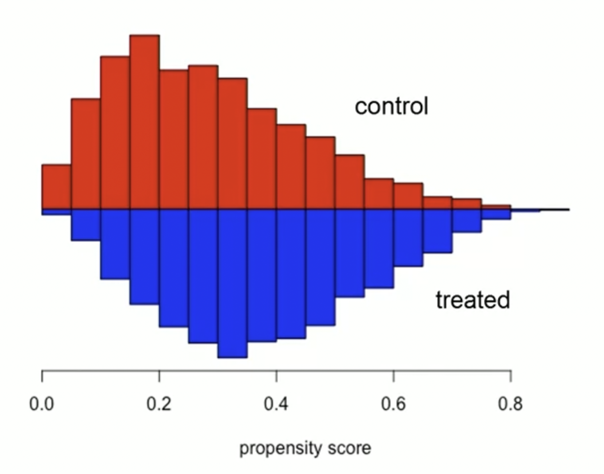

### Motivating Matching for Causality
- The goal of any causal analysis is to isolate some causal effect
- To do this, we must satisfy the *backdoor criterion* in our study
    - Meaning, we must close all open backdoor paths
- Closing backdoor paths can be achieved through carefully performing conditioning strategies in our study
- Roughly, there are three different types of conditioning strategies:
    - Subclassification
    - Exact matching
    - Approximate matching

### Motivating the Conditional Independence Assumption
- Conditional independence assumption (or CIA) states that a treatment assignment is independent of potential outcomes after conditioning on observed covariates
- Sometimes we know that randomization occurred only conditional on some observable characteristics
    - This would violate the backdoor path criterion
- In order to estimate a causal effect when there is a confounder, we must satisfy CIA
    - In DAGs notation, this refers to enforcing closed paths everywhere for confounders
    - Meaning, CIA implies there isn't any confounding bias

$$
(Y^{1}, Y^{0}) \perp T | X
$$

### Introducing Matching for Estimating $ATE$
- Matching is one of three conditioning method used for satisfying the backdoor criterion
- Matching estimates $ATE$ by imputing missing potential outcomes by conditioning on the confounding
- Specifically, we could fill in missing potential outcomes for each treatment unit using a control group unit that was *closest* to the treatment group unit for some $X$ confounder
- This would give us estimates of all the counterfactuals from which we could simply take the average over the differences
- Specifically, matching ensures that CIA isn't violated

### Using Matching instead of Subclassification
- Subclassification uses the difference between treatment and control group units and achieves covariate balance by using the $K$ probability weights to weight the averages
- As long as there is enough data for stratifying our covariates, subclassification can be a viable option
- However, if subclassification suffers from the curse of dimensionality, then we must use other methods (like matching)
- Typically, curse of dimensionality exists, so we'll prefer other methods like matching
- Specifically, subclassification is a weighting method used on all individuals, regardless of the overlap of distributions
- Whereas, matching is a form of stratification (or sampling method) that attempts the match distributions

### Illustrating Approximate Nearest Neighbor Matching
- Exact matching can break down when the number of covariates $K$ grows larger than $1$
- Thus, we must estimate the *closest* covariate using distance measurements
- Sometimes, we have several covariates needed for matching
- However, a $1$ point change in *age* is very different from a $1$ point change in *income*
- Thus, we must do the calculate the *normalized* euclidean distances in order to measure closeness of observations with multiple covariates:

$$
\lVert X_{i} - X_{j} \rVert = \sqrt{\sum_{n=1}^{k} \frac{(X_{ni}-X_{nj})}{\hat{\sigma}_{n}^{2}}}
$$

### Discripancies of Approximate Matching
- Sometimes, $X_{i} \not = X_{j}$, meaning some unit $i$ matched with some unit $j$ of a similar covariate value
- For example, maybe unit $i$ has an age of $25$, and unit $j$ has an age of $26$
    - Then, their difference would be $1$
    - In this case, their discrepancies are small (sometimes zero)
    - Other times, it can be large, and this becomes problematic for our estimation and introduces bias
- This bias is severe with a lack of data
    - Meaning, the matching discrepancies converge to $0$ as the sample size increases

### Introducing Approximate Propensity Score Matching
- Propensity score matching hasn't had a wide adoption
    - Compared to other non-experimental methods like regression discontinuity or difference-in-difference
    - Since, some are skeptical CIA can be achieved in *any* dataset
- At a high level, propensity score matching includes:
    1. Run logistic regression
        - Where the dependent variable is a binary value
        - Representing, whether the observation is in the control group or treatment group
    2. Check that covariates are balanced
        - Usually, we use standardized differences or graphs to examine the distribution of differences
        
    3. Match each observation in the treatment group to one or more observations in the control group
        - This matching is based on their propensity score
        - Typically, this is done using methods like:
            - Exact matching
            - Caliper matching
            - Nearest neighbor matching
            - Stratification matching
            - Difference-in-differences matching
    4. Verify that covariates are balanced across treatment and control groups
    5. Conduct multivariate analysis based on the new sample

### Using Propensity Score Matching
- Typically, a propensity score is esimated by running a logistic regression model
    - Where, the dependent variable is $Z=1$ if the observation is in the treatment group
    - Or, the dependent variable is $Z=0$ if the observation is in the control group
- Specifically, a propensity score represents the propensity of an observation to be in the control group
- Each observations has exactly one propensity score
- Propensity score matching simplifies the matching problem because we only need to match on one variable (propensity score), rather than multiple covariates
- Essentially, the propensity score can be used to check for covariate balance between the treatment group and control group
    - Then, we can say the two groups become observationally equivalent

### References
- [Wiki about General Procedure of Propensity Score Matching](https://en.wikipedia.org/wiki/Propensity_score_matching#General_procedure)
- [Causal Inference Textbook](https://mixtape.scunning.com/matching-and-subclassification.html?panelset=stata-code&panelset1=python-code2#exact-matching)
- [Python Causality Handbook](https://matheusfacure.github.io/python-causality-handbook/10-Matching.html)
- [Comprehensive Causal Inference Textbook](https://cdn1.sph.harvard.edu/wp-content/uploads/sites/1268/2021/03/ciwhatif_hernanrobins_30mar21.pdf)
- [Paper about the Perils of Propensity Matching](https://gking.harvard.edu/files/gking/files/pan1900011_rev.pdf)