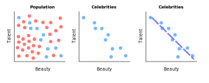

### Creating Bias with Open Backdoor Paths
- A backdoor path is open if the following are true:
    - There is a causal effect of $X$ on $Y$
    - There is a common ancestor of $X$ and $Y$
- An *open* backdoor path is the most common source of bias
    - Thus, our goal is to close backdoor paths
    - Every open backdoor path has a confounder, but not all confounders indicate a backdoor path is open
- There are three reasons a backdoor path can be open:
    1. We could be conditioning on a collider
    2. We could be conditioning on a mediator to a collider
    3. We may not be capturing or controlling for an unobserved confounder

### Closing Open Backdoor Paths
- There are two ways to *close* an open backdoor path:
    1. Conditioning on a confounder
        - Obviously, we can only do this if a confounder exists on an open backdoor path
        - *Conditioning* on a variable is equivalent to fixing (or including) a variable in our regression model
    2. Not conditioning on a collider
        - Not conditioning on a collider always closes a backdoor path
        - Not conditioning on a mediator to a collider always closes a backdoor path
        - *Not conditioning* on a variable is equivalent to excluding a variable from our regression model
- Both methods must be enforced in order to close all open backdoor paths

### Breaking Down Types of Biases
- There are two sources of bias:
    1. Confounding bias
    2. Selection bias
- Confounding bias happens when we aren't conditioning on a confounder
    - It arises when we control for fewer variables than we should
- Selection bias happens when we are conditioning on a collider
    - Selection bias is a type of collider bias
    - It arises when we control for more variables than we should
    - We observe this if the treatment and potential outcome are independent, but dependent once we condition on a collider

### Illustrating Confounding Bias
- Suppose we're interested in measuring the causal effect of education on wage
    - Here, *education* is our treatment
    - And, *wage* is our outcome
    - Most likely, *intelligence* is a confounder
- Since education and wage share the same cause, estimating the causal effect of education on wage becomes difficult
    - For example, someone could argue any causal effects are mostly contributed by intelligence rather than education
- We must close the backdoor path by controlling for intelligence
    - In other words, we can keep intelligence fixed when comparing different levels of education
    - Said another way, we can compare people with the same level of intelligence, but different levels of education

### Illustrating Collider Bias
- Suppose we're interested in measuring the causal effect of beauty on success
    - Here, *beauty* is our treatment
    - And, *talent* is some covariate
    - Then, *success* is our outcome and collider
- By conditioning on celebrity success, you are opening a second path between the treatment and the outcome
- Which, will make it harder to measure the direct effect
- One way to think about this is that by fixing success, you are looking at small groups of the population where success is the same
    - Then, finding the effect of beauty on those groups
    - But, by doing so, you are also indirectly and inadvertently not allowing success to change much
    - As a result, you won’t be able to see how beauty changes success effectively
    - Because, you are not allowing success to change as it should

### Examples of Opening and Closing Backdoors
- For the following examples, $\perp$ represents independence
    - And, $\not \perp$ represents dependence
    - Whereas, $|$ represents conditioning on a variable
- $\bold{X \perp T}$
    - Since $Y$ is a collider that hasn't been conditioned on 
- $\bold{X \not \perp T | Y}$
    - Since $Y$ is a collider that has been conditioned on
- $\bold{X \not \perp T | W}$
    - Since $Y$ is a collider with a descendent that has been conditioned on
- $\bold{Y \perp G}$
    - Since $U$ is a collider that hasn't been conditioned on
- $\bold{Y \not \perp G | U}$
    - Since $U$ is a collider that has been conditioned on
- $\bold{Y \perp G | U,T}$
    - Since $T$ is a confounder that has been conditioned on
    - Conditioning on $U$ opens the path, but conditioning on $T$ closes the path

### Describing Berkson's Paradox as Collider Bias
- Suppose that beauty and talent are uncorrelated in the population
- But, suppose that beauty and talent are correlated in a sample only containing celebrities
    - Sampling on celebrities could lead someone to wrongly infer that talent is correlated with beauty for the entire population 
- And, beauty and talent can both cause celebrity success
    - So, success clearly is a collider variable
- As a result, conditioning on the collider will only focus on the relationship between beauty and talent amongst celebrities
- Under this incorrect model of success:
    - Knowing that a talentless person is a successful actor would imply that the person must be beautiful
    - This is the source of collider bias

### References
- [Lecture about Causality and DAGs](https://www.youtube.com/watch?v=Q9CAtMpuWCA&list=PLoazKTcS0Rzb6bb9L508cyJ1z-U9iWkA0&index=23)
- [Lecture about Colliders](https://www.youtube.com/watch?v=5xIujBzwi7E&list=PLoazKTcS0Rzb6bb9L508cyJ1z-U9iWkA0&index=24)
- [Textbook about DAGs with Examples](https://lo.unisa.edu.au/mod/book/view.php?id=646429)
- [Causal Inference Textbook](https://mixtape.scunning.com/dag.html)
- [Python Causality Handbook](https://matheusfacure.github.io/python-causality-handbook/04-Graphical-Causal-Models.html)
- [Comprehensive Causal Inference Textbook](https://cdn1.sph.harvard.edu/wp-content/uploads/sites/1268/2021/03/ciwhatif_hernanrobins_30mar21.pdf)
- [Controlling for Variables in Regression](https://stats.stackexchange.com/a/17338/278990)
- [Wiki of Relation between Berkson's Paradox and Collider Bias](https://en.wikipedia.org/wiki/Berkson%27s_paradox)
- [Illustrating Collider Bias with Hollywood Actors](https://www.ncbi.nlm.nih.gov/pmc/articles/PMC6089543/)