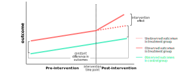

### Motivating Difference-in-Difference
- Difference-in-difference is also known as *diff-in-diff*
- Diff-in-diff is commonly used to assess the effect of macro interventions
    - E.g. effect of immigration on unemployment
- In these cases, we have a time period before and after the intervention
- And, we wish to untangle the impact of the intervention from a trend
- Here, any intervention can be considered our treatment
- Roughly, the diff-in-diff model is similar to a synthetic control model
    - But, a diff-in-diff model treats the time points (pre-intervention and post-intervention) as predictors
    - Whereas, a synthetic control model treats the time points as rows

### Describing the Diff-in-Diff Estimator
- Diff-in-diff mimics an experimental research design using observational study data
- It does this by studying the differential effect of a treatment on a *treatment group* versus a *control group* in a natural experiment
- Specifically, it calculates the effect of a treatment on an outcome by comparing the following two metrics:
    - Average change over time in the outcome for the treatment group
    - Average change over time in the outcome for the control group
- Essentially, diff-in-diff uses panel data to measure the differences of the changes in the outcome variable that occur over time
    - Again, these differences are computed as the difference between the treatment and control groups

### Defining the Diff-in-Diff Model
- Diff-in-diff requires data measured from a treatment group and a control group at two or more different time periods
    - Specifically, at least one pre-treatment time period and at least one post-treatment time period
- The diff-in-diff model is defined as the following:

$$
Y_{i} = \beta_{0} + \beta_{1} Treatment_{i} + \beta_{2} Post_{i} + \beta_{3} (Treatment_{i} \times Post_{i}) + \epsilon_{i}
$$

- The variables in the formula above refer to the following:
    - Here, $Y_{i}$ refers to the outcomes
    - $Treatment_{i}$ refers to the treatment group dummy variable
    - $Post_{i}$ refers to the post-intervention dummy variable 
    - $\beta_{0}$ is the baseline of the control group
        - On its own, it refers to the pre-intervention of the control group
    - $\beta_{1}$ is the treatment effect
        - So, $\beta_{0} + \beta_{1}$ is the baseline of the control before the intervention
        - Roughly, it refers to the pre-intervention of the treatment group
        - And, $\beta_{1}$ is the average difference in pre-intervention outcomes of the control group, from the pre-intervention outcomes of the treatment group
    - $\beta_{2}$ is the post-intervention effect
        - So, $\beta_{0} + \beta_{2}$ is the baseline of the control after the intervention
        - Essentially, it refers to post-intervention of the control group
        - And, $\beta_{2}$ is the trend of the control, or the average difference in pre-intervention outcomes of the control group, from the post-intervention outcomes of the control group
    - $\beta_{3}$ is the post-intervention effect of the treatment group
        - So, $\beta_{0} + \beta_{1} + \beta_{2} + \beta_{3}$ is the baseline of the treatment after the intervention
        - Essentially, it refers to post-intervention of the treatment group
        - And, $\beta_{3}$ becomes the trend of the treatment

### Defining the Parallel Trends Assumption
- There are many of assumptions made about the diff-in-diff model
- All the assumptions of the OLS model apply equally to diff-in-diff:
    - No autocorrelation (e.g. a sine wave)
    - No heterscedasticity (i.e. constant variance)
    - No collinearity (i.e. this is rarely true)
    - Data $Y$ is linearly related (i.e. sometimes true)
    - Conditional means of errors should be $0$ (i.e. rarely true)
    - Conditional variance of errors should be constant
    - Errors conditional on regressors should be normally distributed
    - Observations should be iid
- Additionally, diff-in-diff requires a *parallel trends assumption*
    - Essentially, it's saying there must be constant differences in outcomes between:
        - The difference between the pre-intervention control and pre-intervention treatment groups
        - The difference between the post-intervention control and post-intervention treatment groups

### References
- [Visualizing Difference-in-Differences](https://bookdown.org/paul/applied-causal-analysis/basics.html)
- [Popular Causal Inference Textbook](https://mixtape.scunning.com/difference-in-differences.html)
- [Python Causality Handbook](https://matheusfacure.github.io/python-causality-handbook/14-Difference-in-Difference.html)
- [Comprehensive Causal Inference Textbook](https://cdn1.sph.harvard.edu/wp-content/uploads/sites/1268/2021/03/ciwhatif_hernanrobins_30mar21.pdf)