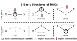

### Illustrating Causality using DAGs
- A DAG is a theoretical representation of the knowledge about a studied phenomena
- In reality, causality can run in multiple directions
- However, causality runs in one direction using DAG notation
    - Specifically, it only runs forward in time
    - Meaning, there are no cycles in a DAG
- DAGs are useful for explaining causality in terms of counterfactuals
    - A causal effect is defined as a comparison between two states:
        - One state that actually happened when some intervention took on some value
        - And another state that didn’t happen (i.e. the *counterfactual*) under some other intervention
- We can think of a DAG as a graphical representation of a chain of causal effects

### Defining Notation for DAGs
- DAGs consist of a combination of nodes and arrows
- Nodes represent random variables
    - These random variables are created by a data-generating process
- Arrows represent a causal effect between two random variables
    - The direction of the arrow captures the direction of causality
- Causal effects can happen in two related ways:
    1. Direct relationship: $T \to Y$
    2. Indirect relationship: $T \to X \to Y$

### Defining Bi-Directional and Circular Paths
- A circular path can't be represented using DAGs
- However, circular paths appear all the time in reality
- For example, there is a causal effect of learning resources on IQ
    - Also, there is a causal effect of IQ on income
    - And, there is a causal effect of income on learning resources
- Similarly, bi-directional paths can't be represented using DAGS
- Bi-directional paths are very similar to circular relationships
- For example, there is a causal effect of chances of getting an interview on amount of experience
    - Also, there is a causal effect of amount of experience on chances of getting an interview

### Illustrating a Simple DAG
- The below DAG has three random variables: $D$, $X$, and $Y$
- Here, there is a *direct path* $T \to Y$
    - This represents a causal effect
- Also, there is a *backdoor path* $T \gets X \to Y$ 
    - This isn't a causal effect
    - This path creates spurious correlations between $D$ and $Y$
    - Open backdoor paths are a common source of bias
- In this example, $X$ is known as a *confounder*
    - This is because $X$ jointly determines $T$ and $Y$
    - So, $X$ confounds our ability to determine the effect of $T$ and $Y$ in naive comparisons

### Defining a Causal Path
- The below DAG illustrates a causal path
- Here, we see a *treatment* $T$ linked to an *outcome* $Y$
- Notice, there is a mediating variable $X$ between them
- Mediating variables are those which form part of a causal pathway
- For example, sexual promiscuity is a risk factor for HPV
    - Also, HPV is a risk factor for cervical cancer
    - So in this case, HPV is a mediating variable

### Defining a Confounding Path
- The confounder is a parent of both treatment $T$ and outcome $Y$
- Here, $X$ is known as the confounder
- For example, there is a causal effect of weather on ice cream sales
    - Also, there is a causal effect of weather on sunburns
    - As a result, there are spurious correlations created between ice cream sales and sunburns
- Every open backdoor path has a confounder, but not all confounders indicate a backdoor path is open

### Defining a Colliding Path
- A collider is a child of both treatment $T$ and outcome $Y$
- Here, $X$ is known as the collider
- For example, there is a causal effect of pneumonia on hospital admittance
    - Also, there is a causal effect of a stroke on hospital admittance
- Colliders close a backdoor path when they're excluded from a model

### Defining a Backdoor Path
- A backdoor path is a non-causal path from a node $X$ to node $Y$ that would remain if any arrows pointing out of $X$ were removed
    - These removed arrows are potentially causal paths
- The most common example of a backdoor path is a confounding path
    - But, not all confounding paths are backdoor paths
- The following DAG is an example of an open backdoor path:
    - There is a causal effect of smoking on obesity
    - There is a causal effect of smoking on mortality
    - These is a causal effect of obesity on mortality

### Defining an Open Backdoor Path
- A backdoor path is open if the following are true:
    - There is a causal effect of $X$ on $Y$
    - There is a common ancestor of $X$ and $Y$
- An *open* backdoor path is the most common source of bias
    - Thus, our goal is to close backdoor paths
    - Every open backdoor path has a confounder, but not all confounders indicate a backdoor path is open

### Creating Bias with Open Backdoor Paths
- There are three reasons a backdoor path can be open:
    1. We could be conditioning on a collider
    2. We could be conditioning on a mediator to a collider
    3. We may not be capturing or controlling for an unobserved confounder
- In summary, there are three basic types of open backdoor paths
    1. Confounding bias
    2. Selection bias due to conditioning on a collider
    3. Selection bias due to conditioning on a mediator
        - A mediator is a variable between the treatment $T$ and outcome $Y$

### Closing Open Backdoor Paths
- There are two ways to *close* an open backdoor path:
    1. Conditioning on a confounder
        - Obviously, we can only do this if a confounder exists on an open backdoor path
        - *Conditioning* on a variable is equivalent to fixing (or including) a variable in our regression model
    2. Not conditioning on a collider or its mediators
        - Not conditioning on a collider always closes a backdoor path
        - Not conditioning on a mediator to a collider always closes a backdoor path
        - *Not conditioning* on a variable is equivalent to excluding a variable from our regression model
- Both methods must be enforced in order to close all open backdoor paths

### References
- [Lecture about Causality and DAGS](https://www.youtube.com/watch?v=Q9CAtMpuWCA&list=PLoazKTcS0Rzb6bb9L508cyJ1z-U9iWkA0&index=23)
- [Lecture about Colliders](https://www.youtube.com/watch?v=5xIujBzwi7E&list=PLoazKTcS0Rzb6bb9L508cyJ1z-U9iWkA0&index=24)
- [Textbook about DAGs with Examples](https://lo.unisa.edu.au/mod/book/view.php?id=646429)
- [Causal Inference Textbook](https://mixtape.scunning.com/dag.html)
- [Python Causality Handbook](https://matheusfacure.github.io/python-causality-handbook/04-Graphical-Causal-Models.html)
- [Comprehensive Causal Inference Textbook](https://cdn1.sph.harvard.edu/wp-content/uploads/sites/1268/2021/03/ciwhatif_hernanrobins_30mar21.pdf)
- [Controlling for Variables in Regression](https://stats.stackexchange.com/a/17338/278990)