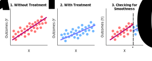
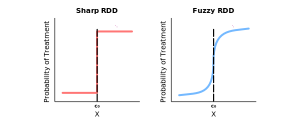

### Motivating Regression Discontinuity-Design
- In an experiment, we can determine causal effects accurately when our experiment is *randomized*
    - Specifically, a randomized experiment means treatment assignment is random
    - Roughly, this happens when there aren't any confounding variables (or colliders)
- Stratification (or matching) and regression can be used to randomize an experiment *with measured confounders*
    - Thus, bias is removed when an experiment is stratified
    - Stratification isn't very effective when a covariate $X$ is continuous
    - Since, it's almost impossible to stratify to each unique value of $X_{i}$
    - Thus, regression can be more appealing
- Regression discontinuity-design (or RDD) can also be used to eliminate selection bias
    - Specifically, we'll use RDD if our experiment is *without measured confounders*
- In other words, stratification can eliminate bias *with measured confounders*, whereas RDD can eliminate bias *without measured confounders*

### Motivating the Use of RDD in Natural Experiments
- Typically, RDD is used in *natural experiments*
    - A natural experiment refers to an experiment without a controlled treatment assignment
    - Rather, treatment is assigned by some random, external factor
- Whereas, a controlled experiment refers to an experiment where all factors are held constant except for one
- As a result, RDD uses a *running variable* $X$
    - Don't mistake this for an ordinary covariate
- Don't confuse this $X$ with observed or unobserved covariates
- Here, $X$ refers to a *running variable*, which represents a continuous variable that assigns units to a treatment $D$
    - We usually use a continuous $X$ instead of binary treatment variable $D$ in RDD, since RDDs are usually used in natural experiments
    - Remember, we don't usually have a treatment variable $D$ give to us in natural experiments

### Assuming Continuity for RDD
- Continuity assumes an absence of selection bias
    - Thus, we can remove any selection bias by verifying that the continuity assumption is satisfied
    - To do this, we can use RDD
- Suppose we model the following potential outcomes:
    - Our potential outcomes $Y^{0}$ against some covariate $X$
    - Out potential outcomes $Y^{1}$ against some covariate $X$
- The continuity assumption says that if we place any cutoff $c_{0}$ on the range of $X$ and assign $Y$ to be $Y^{0}$ when $X > c_{0}$ and $Y^{1}$ when $X < c_{0}$, then any discontinuity implies some causality

### Defining Requirements for RDD
- The requirement for RDD to estimate a causal effect are the continuity assumptions
- Meaning, the expected potential outcomes change smoothly as a function of the running variable through the cutoff
- This means that the only thing that causes the outcome to change abruptly at $c_{0}$ is the treatment (and not confounders)
    - Implying, we can only correctly intrepret causal effects about the treatment if there is a discontinuity between the control and treatment, but not at the cutoff for a confounder
- But, this can be violated in practice if any of the following is true:
    - The assignment rule is known in advance
    - Agents are interested in adjusting
    - Agents have time to adjust
    - The cutoff is endogenous to factors that independently cause potential outcomes to shift

### Introducing Two Types of RDD
- There are generally accepted two kinds of RDD studies
- A *sharp RDD* is a design where the probability of treatment goes from $0$ to $1$ at the cutoff
- A *fuzzy RDD* is a design where the probability of treatment discontinuously increases at the cutoff
- In both designs, there is always a *running variable* $X$ where the likelihood of receiving treatment flips when reaching some cutoff $c_{0}$

### Estimating Causal Effects using a Sharp RDD
- In sharp RDD, treatment is a deterministic function of the running variable $X$
    - Don't confuse this $X$ with observed or unobserved covariates
    - Here, $X$ refers to a *running variable*, which represents a continuous variable that assigns units to a treatment $D$
- An example of this might be Medicare enrollment
    - Which, happens sharply at age $65$
- The sharp RDD estimation is interpreted as an average causal effect of the treatment as the running variable $X$ approaches the cutoff $c_{0}$
- This average causal effect is the local average treatment effect (LATE)

### Estimating Causal Effects using a Fuzzy RDD
- A fuzzy RDD represents a discontinuous *jump* in the probability of treatment when $X > c_{0}$
- The identifying assumptions are the same under fuzzy designs as they are under sharp designs
    - Meaning, they satisfy the continuity assumptions

### References
- [Lecture Slides about Causality and RDD](https://scholar.princeton.edu/sites/default/files/bstewart/files/lecture11_slides2020.pdf)
- [Lecture Slides about Causality and Stratification](https://scholar.princeton.edu/sites/default/files/bstewart/files/lecture10slides.pdf)
- [Causal Inference Textbook](https://mixtape.scunning.com/regression-discontinuity.html)
- [Python Causality Handbook](https://matheusfacure.github.io/python-causality-handbook/16-Regression-Discontinuity-Design.html)
- [Comprehensive Causal Inference Textbook](https://cdn1.sph.harvard.edu/wp-content/uploads/sites/1268/2021/03/ciwhatif_hernanrobins_30mar21.pdf)
- [RDD Animation on Twitter](https://twitter.com/nickchk/status/1098460045958819840)