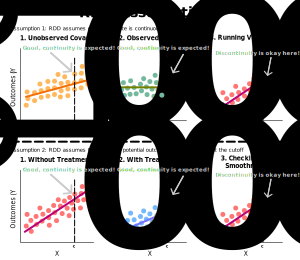

### Describing Matching
- The goal of matching is reduce selection bias (due to confounding) before *estimating* causal effects
    - Usually, for controlled experiments, but sometimes natural experiments
    - As an example, we first could use matching to reduce selection bias, then afterwards use regression or synthetic control modeling to estimate causal effects
- Matching is a form of stratification
- Matching methods match treated units to similar control units
    - This enables a more accurate comparison between treated units and non-treated units
    - Specifically, matching involves sampling, so each treatment observation corresponds to a control observation with identical covariate values

### Describing Regression Discontinuity Design
- The goal of RDD is to *identify* and *estimate* causal effects
    - Usually, for natural experiments
- RDD stitches the potential outcomes $Y^{0}$ that are actually observed (i.e. when $D=0$) with the potential outcomes $Y^{1}$ that are actually observed (i.e. when $D=1$)
    - Essentially, $Y^{0}$ is before the cutoff point $c_{0}$ and $Y^{1}$ is after the cutoff point
    - As a result, we can identify causal effects if there is significant discontinuity at the cutoff point $c_{0}$
- Typically, RDD is used in *natural experiments*
    - A natural experiment refers to an experiment without a controlled treatment assignment $D$ (not randomly assigned)
    - Rather, treatment is assigned by some random, external factor (e.g. $X$)
    - Whereas, a controlled experiment refers to an experiment where all factors are held constant except for one
    - As a result, RDD uses a *running variable* $X$ (don't mistake this for an ordinary covariate)
    - Thus, we usually use a continuous $X$ instead of binary treatment variable DD in RDD, since RDDs are usually used in natural experiments
- The following assumptions are made about RDD:
    - RDD requires that every variable (excluding the treatment and outcome variables) is *continuous* at the cutoff point $c_{0}$
        - This implies observed and unobserved predictors must be continuous at the cutoff point $c_{0}$
        - To be clear, the treatment and outcome variables can be discontinuous at the cutoff point $c_{0}$
    - RDD requires that all of the expected potential outcomes for $Y^{0}$ are continuous at the cutoff point
    - RDD requires that all of the expected potential outcomes for $Y^{1}$ are continuous at the cutoff point

### Describing Difference-in-Difference
- The goal of a synthetic control is to *identify* and *estimate* causal effects
    - Usually, for natural experiments
- Diff-in-diff is a comparison between the differential effect of a treatment on a *treatment group* versus a *control group* in a natural experiment
- There are many of assumptions made about the diff-in-diff model
- All the assumptions of the OLS model apply equally to diff-in-diff:
    - No autocorrelation (e.g. a sine wave)
    - No heterscedasticity (i.e. constant variance)
    - No collinearity (i.e. this is rarely true)
    - Data $Y$ is linearly related (i.e. sometimes true)
    - Conditional means of errors should be $0$ (i.e. rarely true)
    - Conditional variance of errors should be constant
    - Errors conditional on regressors should be normally distributed
    - Observations should be iid
- Additionally, diff-in-diff requires a *parallel trends assumption*
    - Essentially, it's saying there must be constant differences in outcomes between:
        - The difference between the pre-intervention control and pre-intervention treatment groups
        - The difference between the post-intervention control and post-intervention treatment groups
- Roughly, the diff-in-diff model is similar to a synthetic control model
    - But, a diff-in-diff model treats the time points (pre-intervention and post-intervention) as predictors
    - Whereas, a synthetic control model treats the time points as rows

### Describing Synthetic Control
- The goal of a synthetic control is to *identify* and *estimate* causal effects
    - Usually, for natural experiments
- A synthetic control involves weighting multiple sets of control groups and comparing it with a single treatment group
    - This comparison is used to estimate what would have happened to the treatment group if it had not received the treatment
- Unlike diff-in-diff, this method can account for the effects of confounders changing over time
    - It does this by weighting the control group to better match the treatment group before the intervention
- The following assumptions are made about synthetic controls:
    1. Existence of weights
        - Implying, there must be enough similarities with the control units to create a synthetic control
    2. Weakly stationary process
        - Implying, the mean and variance must be roughly fixed over time
    3. We must be aware beforehand that controls in synthetic control group don't receive treatment
        - Otherwise, this could open up backdoor path
        - Implying, we must have a good understanding of the natural experiment

### Refrences
- [Wiki about Regression Discontinuity Design](https://en.wikipedia.org/wiki/Regression_discontinuity_design)
- [Wiki about Difference-in-Difference](https://en.wikipedia.org/wiki/Difference_in_differences)
- [Wiki about Synthetic Controls](https://en.wikipedia.org/wiki/Synthetic_control_method)