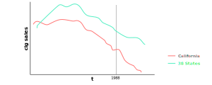
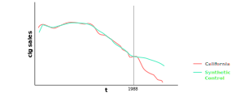

### Motivating Limitations of Diff-in-Diff
1. Diff-in-diff doesn't work well with small sample sizes
2. Diff-in-diff requires that differences between treated and control either:
    - Time-invarient for all units
    - Time-varying in the same way for all units

### Describing Advantages of the Synthetic Control Method
1. The synthetic control method is based on interpolation
    - Implying, it assigns weights between $0$ and $1$ to avoid extrapolation
    - Comparatively, this method is more interpretable
2. Weights explain the relative importance of each control unit
    - This makes the model more easily interpretable
3. It doesn't require access to post-treatment outcomes
    - This is unlike regression methods
4. It relaxes the parallel trends assumption from the difference-in-difference model

### Defining Synthetic Control Methods
- A synthetic control is a weighted combination of groups used as controls
- This weighted combination of groups is then treated as a *synthetic control group*
    - And, is compared to the treatment group
- This comparison is used to estimate what would have happened to the treatment group if it hadn't received the treatment
- The method can be summarized in the following steps using a dataset with a $J$ number of observations:
    1. Make sure unit $1$ refers to the treatment group
    2. Treat units $2$ though $J+1$ as control units
        - This group of control units is referred to as the *donor pool*
    3. Generate a *synethic control group*
        - This involves generating a weighted average of the control units
        - The weights are determined by minimizing the synthetic control loss function
    4. Build a regression model on this synthetic control group
        - Here, the weights $W$ represent $\beta$, and control units represent the covariates $X$
        - This is used to estimate post-treatment potential outcomes $Y^{0}_{post}$ of the synethic control group
        - These estimates are then compared to the post-treatment potential outcomes $Y^{1}_{post}$ of the treatment group
        - These post-treatment differences represent the causal effects

### Defining Assumptions about the Synthetic Controls
1. Existence of weights
    - Implying, there must be enough similarities with the control units to create a synthetic control
2. Weakly stationary process
    - Implying, the mean and variance must be roughly fixed over time
3. We must be aware beforehand that controls in synthetic control group don't receive treatment
    - Otherwise, this could open up backdoor path
    - Implying, we must have a good understanding of the natural experiment

### Picking and Verifying Synthetic Controls
- Find the exact p-values through placebo-based inference
    - This includes creating a histogram of post/pre RMSPE of all units and evaluating their p-values
- Check for the quality of the pre-treatment fit
    - This includes dropping control units (from the synthetic control group) with a pre-treatment very different from the pre-treatment of the treatment group
    - Specifically, this involves dropping control units with a pre-treatment RMSPE that is twice as large as the pre-treatment RMSPE of the treatment group
- Investigate the balance of the covariates used for matching
    - This includes veryifying covariate values are similar between the treatment and control groups
- Check for the validity of the model through placebo estimation
    - This includes rolling back the treatment date to a placebo date to ensure we don't see causal effects

### Verifying with $RMSPE$ and Test Statistics
- As stated already, it's recommended to calculate a set of root mean squared prediction errors (i.e. $RMSPE$) value for pre- and post-treatment period as the test statistic used for inference
- To do this, we can do the following:
    1. Iteratively apply the synthetic control method to each country/state in the donor pool and obtain a distribution of placebo effects
    2. Calculate the $RMSPE$ for each placebo for the pre-treatment period:
    $$
    RMSPE = (\frac{1}{T-T_{0}} \sum_{t=T_{0}+t}^{T} (Y_{1t} - \sum_{j=2}^{J+1} w_{j} \cdot Y_{jt})^{2})^{\frac{1}{2}}
    $$
    3. Calculate the RMSPE for each placebo for the post-treatment period
    4. Compute the ratio of the post- to pre-treatment RMSPE
    $$
    ratio = \frac{RMSPE_{post}}{RMSPE_{pre}}
    $$
    5. Sort this ratio in descending order from greatest to highest
    6. Calculate the treatment unit's ratio in the distribution:
    $$
    p = \frac{RANK}{TOTAL}
    $$

### Illustrating a Synthetic Control Model
- As an example, we'll use a synthetic control to measure the causal effects of California implementing a cigarette tax
    - This tax was called *Proposition 99*
- To do this, we treat cigarette sales as $Y$
    - Obviously, receiving the tax in 1988 is our treatment $D$
    - The control group contains states that didn't receive the tax
    - Some states receive a similar tax, so we make sure to exclude them from our control group
    - In the end, we have $38$ states in our control group that never received a similar tax
- Notice, cigarette sales were falling after Proposition 99
    - But, they were falling for both the treatment and control groups
    - Therefore, it's not clear if there were causal effects

- Next, we create a synthetic control group weighting each of the $38$ based on how similar they are to California
    - This weighting just looks at the covariates
    - Notice, the set of weights produces a nearly identical path between the pre-treatment of the real and synthetic California
    - But, this path diverges in the post-treatment
    - Indicating, the program has some effect on cigarette sales

### Verifying Balance of Covariates and Response
- The optimal weights were selected by minimizing a distance formula based on certian covariates
- It's recommended we include averages for each covariate and response in the pre-treatment
- This will give us a better idea of the balance of the variables in our treatment and control groups

| Variables | Real California | Synthetic California | 38 States |
| --- | --- | --- | --- |
| **GDP per Capita** | 10.08 | 9.86 | 9.86 |
| **Percent aged 15-24** | 17.40 | 17.40 | 17.29 |
| **Retail Price** | 89.42 | 89.41 | 87.27 |
| **Beer Consumption per capita** | 24.28 | 24.20 | 23.75 |
| **Cig Sales per capita 1988** | 19.10 | 91.62 | 114.20 |
| **Cig Sales per capita 1980** | 120.20 | 120.43 | 136.58 |
| **Cig Sales per capita 1975** | 127.10 | 126.99 | 132.81 |

### Verifying Causal Effects using Visuals
- So far, we've only covered estimation
- But, how do we determine whether the observed difference between the treatment and synthetic control is *statistically significant*?
    - Here, the treatment is real California, and synthetic control is synthetic California
- Maybe, the divergence between the two groups are just a symptom of prediction or sampling error
- Thus, we must verify the divergence is statistically significant by:
    - Plotting each individual state (of the 38 states) in the control group
    - Constructing Fisher p-values, where the null hypothesis is *no treatment whatsover*
- For now, let's focus on the first step by overlaying California with all of the placebos in the control group
- By doing this, we'll see that California is in the tails of the distribution of treatment effects
    - Here, each difference is calculated by subtracting its cigarette sales from the cigarette sales of the synethic control
    - In other words, the synthetic control is the baseline

### Verifying Causal Effects using Statistical Tests
- Ultimately, inference is based on p-values and not visuals
- To do this, we'll need to create a histogram of the ratios
- Then, mark the p-value associated with the treatment group
- As seen below, California is ranked $1^{st}$ out of $38$ state units
- Specifically, California has an exact p-value of $0.026$
    - This is statistically significant (i.e. $< 0.05$)

### Verifying Causal Effects using Falsification
- Lastly, we should test the validy of the estimator through a *falsification* exercise
    - This will help verify if the model we chose is a reasonable
- Specifically, we should test our model using an earlier, non-treatment date as our new treatment date
    - Then, we'd treat the actual treatment date as the end-of-sample date
    - We'd expect this placebo date to not have any effect on sales
- Here, we can see there isn't much deviation between the treatment sales and synthetic control sales after our placebo-treatment date
    - This is good, since we expect there to be no effect in this timeframe

### References
- [Slides about Advantages of Synthetic Control over Diff-in-Diff](http://www.leahbrooks.org/leahweb/teaching/pppa8022/2020/handouts/lecture10_matching_2of2_v02_slides.pdf)
- [Paper about Assumptions of Synthetic Control Method](http://economia.uc.cl/wp-content/uploads/2016/05/Ferman-and-Pinto-revisiting-the-SC.pdf)
- [Paper about Limitations of Synthetic Control Method](https://www.rand.org/content/dam/rand/pubs/working_papers/WR1200/WR1246/RAND_WR1246.pdf)
- [Wiki about Synthetic Control Methods](https://en.wikipedia.org/wiki/Synthetic_control_method)
- [Causal Inference Textbook](https://mixtape.scunning.com/synthetic-control.html)
- [Python Causality Handbook](https://matheusfacure.github.io/python-causality-handbook/15-Synthetic-Control.html)
- [Comprehensive Causal Inference Textbook](https://cdn1.sph.harvard.edu/wp-content/uploads/sites/1268/2021/03/ciwhatif_hernanrobins_30mar21.pdf)