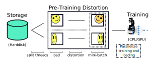

### Motivating Data Augmentation
- Training a model on more data can lead to more accurate $\hat{y}$
- This is especially true for convolutional networks
- We won't always have the opportunity to go and get more images
- Therefore, we can take our images, transform them, and add those new images to our set of images
- This process is referred to as *data augmentation*

### Introducing Basic Data Augmentation Methods
- Data augmentation can refer to many different types of image transformation techniques
- The following techniques are some popular ones:
	- **Mirroring**
		- This refers to flipping an image to create a new image
		- For most computer vision tasks, mirroring an image will still preserve the same class of image
		- For example, flipping a picture of a cat will still give us a picture of a cat
	- **Random cropping**
		- This refers to cropping certain areas of the image to create a new image
		- For most computer vision tasks, this will still preserve the same class of image as well
		- However, we need to be more careful with applying this method, compared to mirroring
- Other techniques include rotation, shearing, and local warping
- However, these augmentation techniques are less common, simply due to an additional level of complexity

### Augmenting Images by Color Shifting
- A third type of data augmentation that is commonly used is referred to as *color shifting*
- This refers to creating new images by adjusting the RGB channels
- Specifically, we distort the R, G, and B color channels by adding fixed values to each channel
- In practice, these fixed values are drawn from some probability distribution
- For example, we can decrease the red and green channels and increase the blue channel to make the image yellower
- We may want to do this to create an image with the effect of having more sunlight
- This image would have a new effect, but maintain the same identity
- By doing this, our learning algorithm becomes more robust to changes in colors of our images
- Typically, we implement distortions during training

### Using PCA Color Augmentation
- We can implement color shifting using principal component analysis
- Specifically, PCA color augmentation is designed to shift values that are more present in the image
- For example, images with heavy red values and minimal green values will have their red values altered the most
- The specific mechanism relies on the PCA algorithm to find the relative color balance of a given image
- The AlexNet paper goes into this subject in more detail

---

### tldr
- Data augmentation can refer to many different types of image transformation techniques
- The following techniques are some popular ones:
	- **Mirroring**
	- **Random cropping**
	- **Color shifting**
- Other techniques include rotation, shearing, and local warping
- However, these augmentation techniques are less common

---

### References
- [Data Augmentation](https://www.youtube.com/watch?v=JI8saFjK84o&list=PLkDaE6sCZn6Gl29AoE31iwdVwSG-KnDzF&index=21)
- [PCA Color Augmentation](https://machinelearning.wtf/terms/pca-color-augmentation/)
