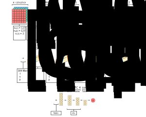
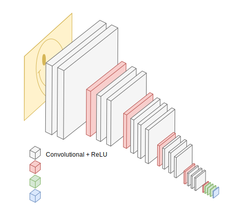

### Motivating CNN Case Studies
- To develop a deeper understanding of convolutional neural networks, we should evaluate some popular case studies
- The following classical networks are popular case studies:
	- LeNet-5
	- AlexNet
	- VGG-16
- More modern convolutional networks are ResNet and Inception
- We've already talked about LeNet-5, so now let's talk about AlexNet and VGG-16

### Illustrating AlexNet

### Footnotes about AlexNet
- Similar architecture to LeNet-5
- Bigger network compared to LeNet-5
	- However, AlexNet is much bigger
	- LeNet-5 has about $60$ thousand parameters
	- AlexNet has about $60$ million parameters
	- Meaning, AlexNet is more accurate, but slower to train
- Uses relu activation functions
	- Convolutional layers use relu functions in AlexNet
	- Fully-connected layers use relu functions too
- Trained on multiple GPUs
	- When AlexNet was initially created, GPUs were slower
	- As a result, AlexNet had a complicated way of training on multiple GPUs
	- Specifically, layers were split across separate GPUs
	- Then, results were joined back together afterwards

### Illustrating VGG-16

### Footnotes about VGG-16
- Simpler architecture compared to AlexNet
	- VGG-16 only uses convolutional layers with a $3 \times 3$ filter and a stride $s=1$
	- VGG-16 only uses max-pooling layers with a $2 \times 2$ filter and a stride $s=2$
	- Consequently, VGG-16 uses fewer hyperparameters compared to AlexNet
- Bigger network compared to AlexNet
	- VGG-16 has about $138$ million parameters
	- Meaning, VGG-16 is more accurate, but slower to train

---

### tldr
- The AlexNet has the following properties:
	- Similar architecture to LeNet-5
	- Bigger network compared to LeNet-5
	- Uses relu activation functions
	- Trained on multiple GPUs
- The VGG-16 has the following properties:
	- Bigger network compared to AlexNet
	- Simpler architecture compared to AlexNet
	- Uses fewer hyperparameters compared to AlexNet

---

### References
- [Classic Networks](https://www.youtube.com/watch?v=dZVkygnKh1M&list=PLkDaE6sCZn6Gl29AoE31iwdVwSG-KnDzF&index=13)
- [Convolutional Case Studies](https://www.youtube.com/watch?v=-bvTzZCEOdM&list=PLkDaE6sCZn6Gl29AoE31iwdVwSG-KnDzF&index=12)
- [AlexNet Paper](https://papers.nips.cc/paper/4824-imagenet-classification-with-deep-convolutional-neural-networks.pdf)
- [VGG-16 Paper](https://arxiv.org/abs/1409.1556)
- [VGG-16 Illustration](https://blog.mgechev.com/2018/10/20/transfer-learning-tensorflow-js-data-augmentation-mobile-net/)
