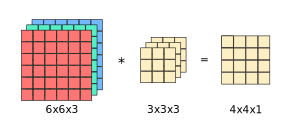
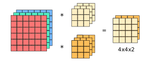
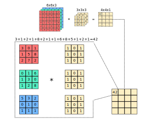

### Introducing Matrix Filters
- A matrix filter is just a matrix of numbers
- These numbers could be positive or negative numbers
- These numbers are usually small, whole numbers
- Some filters may use decimal fractions or much larger numbers
- New images are created by transforming some old image via a matrix filter
- Thus, a matrix filter represents a transformation of an old image
- A new image represents the output of that transformation
- The transformation takes the following into account:
	- What is a given pixel value from the old image?
	- What are the surrounding pixel values of that given pixel from the old image?
- We will denote a $3 \times 3$ matrix filter as the following:

$$
\def \arraystretch{1.5} \begin{array}{c|c|c} \textcolor{red}{1} & \textcolor{blue}{2} & \textcolor{green}{3} \cr \hline \textcolor{red}{4} & \textcolor{blue}{5} & \textcolor{green}{6} \cr \hline \textcolor{red}{7} & \textcolor{blue}{8} & \textcolor{green}{9} \end{array}
$$

### Introducing the Convolution Operation
- In order to perform the transformation represented by our matrix filter, we need to perform a special mathematical operation on the new image
- In machine learning, we refer to this operation as *convolution*
- Mathematicians refer to this operation as cross-correlation
- Roughly, we can think of convolution as a measure of similarity
- Specifically, it measures the similarity of groups of pixels
- The following is an example of convolution:

$$
\overbrace{\def \arraystretch{1.5} \begin{array}{c|c|c|c|c|c} \color{#cccccc}{20} & \color{#cccccc}{20} & \color{#cccccc}{20} & \color{#000000}{10} & \color{#000000}{10} & \color{#000000}{10} \cr \hline \color{#cccccc}{20} & \color{#cccccc}{20} & \color{#cccccc}{20} & \color{#000000}{10} & \color{#000000}{10} & \color{#000000}{10} \cr \hline \color{#cccccc}{20} & \color{#cccccc}{20} & \color{#cccccc}{20} & \color{#000000}{10} & \color{#000000}{10} & \color{#000000}{10} \cr \hline \color{#cccccc}{20} & \color{#cccccc}{20} & \color{#cccccc}{20} & \color{#000000}{10} & \color{#000000}{10} & \color{#000000}{10} \cr \hline \color{#cccccc}{20} & \color{#cccccc}{20} & \color{#cccccc}{20} & \color{#000000}{10} & \color{#000000}{10} & \color{#000000}{10} \cr \hline \color{#cccccc}{20} & \color{#cccccc}{20} & \color{#cccccc}{20} & \color{#000000}{10} & \color{#000000}{10} & \color{#000000}{10} \end{array}}^{\text{old image}} \space \underbrace{\otimes}_{\text{convolution}} \space \overbrace{\def \arraystretch{1.5} \begin{array}{c|c|c} \color{#cccccc}{1} & \color{#666666}{0} & \color{#000000}{-1} \cr \hline \color{#cccccc}{1} & \color{#666666}{0} & \color{#000000}{-1} \cr \hline \color{#cccccc}{1} & \color{#666666}{0} & \color{#000000}{-1} \end{array}}^{\text{filter}}
$$

$$
= \space \overbrace{\def \arraystretch{1.5} \begin{array}{c|c|c|c} \color{#666666}{0} & \color{#cccccc}{30} & \color{#cccccc}{30} & \color{#666666}{0} \cr \hline \color{#666666}{0} & \color{#cccccc}{30} & \color{#cccccc}{30} & \color{#666666}{0} \cr \hline \color{#666666}{0} & \color{#cccccc}{30} & \color{#cccccc}{30} & \color{#666666}{0} \cr \hline \color{#666666}{0} & \color{#cccccc}{30} & \color{#cccccc}{30} & \color{#666666}{0} \end{array}}^{\text{new image}}
$$

### Using Convolution in Edge Detection
- We can use the convolution operator and matrix filters for many different purposes
- For example, we can convolve an image with a filter to perform edge detection on that image
- Different filters will lead to different ways to detect edges
- Specifically, we can detect vertical edges in an image using the following filter:

$$
\def \arraystretch{1.5} \begin{array}{c|c|c} 1 & 0 & -1 \cr \hline 1 & 0 & -1 \cr \hline 1 & 0 & -1 \end{array}
$$

- We can detect horizontal edges in an image using the filter:

$$
\def \arraystretch{1.5} \begin{array}{c|c|c} 1 & 1 & 1 \cr \hline 0 & 0 & 0 \cr \hline -1 & -1 & -1 \end{array}
$$

- There are a few other filters that allow us to better detect vertical edges in more complicated images:

$$
\overbrace{\def \arraystretch{1.5} \begin{array}{c|c|c} 1 & 0 & -1 \cr \hline 2 & 0 & -2 \cr \hline 1 & 0 & -1 \end{array}}^{\text{Sobel filter}} \qquad \qquad \overbrace{\def \arraystretch{1.5} \begin{array}{c|c|c} 3 & 0 & -3 \cr \hline 10 & 0 & -10 \cr \hline 3 & 0 & -3 \end{array}}^{\text{Scharr filter}}
$$

### Convolution in Deep Learning
- With the rise of deep learning, we don't need to have computer vision researchers handpick the $9$ numbers within our matrix filter
- If we treat those $9$ numbers as parameters, then we can learn them using backward propagation
- Then, our filter can become the standard vertical, sobel, or scharr filter depending on which filter best detects edges in our image
- More importantly, our filter could become a different matrix that captures edges in our complicated image even better than any of those three hand-coded filters
- In this case, our filter could learn edges at $45\degree$, $70\degree$, $73\degree$, or any other orientation
- Fundamentaly, the convolution operation allows backward propagation to learn the best filter for our image and use-case

### Motivating Issues with our Example
- Let's return to the previous example involving convolution
- We essentially convolved the following matrices:

$$
image_{6 \times 6} \space \otimes \space filter_{3 \times 3} = image_{4 \times 4}
$$

- From this, we can gather two issues:
	1. Our resulting image shrinks
		- This is a bigger problem when we apply convolution on the convolved image many times
		- In this case, our image could shrink down to a single pixel
	2. There is less influence on pixels in the corners and edges
		- Our filter is applied to the pixels in the center of the image more often than the pixels along the edges
		- In other words, the information from pixels on the corners and edges of the image is thrown out, roughly speaking

### Introducing Padding
- Padding can solve these two issues
- Padding refers to adding a border around an input image so we can get the desired dimensions in our output image
- Specifically, the border has a width of $p$ number of pixels
- Typically, the values of the padded border are assigned to $0$
- Using the previous example from above, padding the input image and convolving the padded image with our filter would look like:

$$
image_{8 \times 8} \space \otimes \space filter_{3 \times 3} = image_{6 \times 6}
$$

- We can see the dimensions of this output image is $6 \times 6$
- Notice, these are the same dimension as our original input image
- Here, the padding $p=1$ so we can return a $6 \times 6$ image
- However, the amount of padding will need to change depending on the dimensions of our $f \times f$ filter matrix
- To return an image with the same dimensions as our input image, we should set $p$ to be the following:

$$
p = \frac{f-1}{2}
$$

- Note, the dimensions of our filter matrix are typically odd
- There are two reasons that $f$ is usually odd:
	1. $p$ is always symmetrical
		- In other words, we don't need to pad more on the left or pad more on the right when $f$ is odd
	2. The filter matrix has a central position
		- Then we can refer to a position of a filter
		- It's nice to have a central position or a central pixel that we can refer to

### Introducing Strides
- There is one more operation that is often used in convolutional neural networks
- That operation is called *stride*
- A stride refers to the number of pixels that is skipped between each step associated with convolution
- The dimensions of our output image is governed by the following:
	- $n$: the dimension of our input matrix
	- $f$: the dimension of our filter matrix
	- $p$: the amount of padding applied to the input matrix
	- $s$: the stride taken during our convolution

$$
d = \lfloor \frac{n+2p-f}{s} + 1 \rfloor
$$

- In other words, our output image has dimensions $d \times d$
- The symbols $\lfloor$ and $\rfloor$ refer to the *floor* operation
- In other words, $d$ is always rounded down if it isn't an integer

### Motivating Convolutions over Volumes
- We can convolve over a stack of images known as a *volume*
- For example, we can convolve over a $6 \times 6$ RGB image
- In this case, we would create a $6 \times 6 \times 3$ volume, where each of the $3$ layers represents a red, green, or blue channel

- Notice, the number of channels in our image must match the number of channels in our filter
- We can apply multiple filters to a single volume
- This will lead to our output image having multiple channels:

- In theory, we can have a filter that only looks at certain channels
- In other words, we can have a filter that only looks at the red channel, blue channel, or green channel
- For example, a filter only looking for vertical edges in the red channel could look like the following:

$$
\overbrace{\def \arraystretch{1.5} \begin{array}{c|c|c} 1 & 0 & -1 \cr \hline 1 & 0 & -1 \cr \hline 1 & 0 & -1 \end{array}}^{\text{Red filter}} \qquad \overbrace{\def \arraystretch{1.5} \begin{array}{c|c|c} 0 & 0 & 0 \cr \hline 0 & 0 & 0 \cr \hline 0 & 0 & 0 \end{array}}^{\text{Green filter}} \qquad \overbrace{\def \arraystretch{1.5} \begin{array}{c|c|c} 0 & 0 & 0 \cr \hline 0 & 0 & 0 \cr \hline 0 & 0 & 0 \end{array}}^{\text{Blue filter}}
$$

- On the other hand, a filter that looks at vertical edges in each channel could look like the following:

$$
\overbrace{\def \arraystretch{1.5} \begin{array}{c|c|c} 1 & 0 & -1 \cr \hline 1 & 0 & -1 \cr \hline 1 & 0 & -1 \end{array}}^{\text{Red filter}} \qquad \overbrace{\def \arraystretch{1.5} \begin{array}{c|c|c} 1 & 0 & -1 \cr \hline 1 & 0 & -1 \cr \hline 1 & 0 & -1 \end{array}}^{\text{Green filter}} \qquad \overbrace{\def \arraystretch{1.5} \begin{array}{c|c|c} 1 & 0 & -1 \cr \hline 1 & 0 & -1 \cr \hline 1 & 0 & -1 \end{array}}^{\text{Blue filter}}
$$

### Example of Convolution over Volumes

### Alternative Visualization of Volumes
- We can also visualize images and filters as cubes
- Each pixel can be represented as a small block
- The following is an example of our stack represented using cubes:

---

### tldr
- A matrix filter is just a matrix of numbers
- These numbers could be positive or negative numbers
- These numbers are usually small, whole numbers
- Some filters may use decimal fractions or much larger numbers
- New images are created by transforming some old image via a matrix filter
- Thus, a matrix filter represents a transformation of an old image
- A new image represents the output of that transformation
- Fundamentaly, the convolution operation allows backward propagation to learn the best filter for our image and use-case

---

### References
- [Convolutional Animations](https://github.com/vdumoulin/conv_arithmetic)
- [Edge Detection Examples](https://www.youtube.com/watch?v=XuD4C8vJzEQ&list=PLkDaE6sCZn6Gl29AoE31iwdVwSG-KnDzF&index=2)
- [Edge Detection using Deep Learning](https://www.youtube.com/watch?v=am36dePheDc&list=PLkDaE6sCZn6Gl29AoE31iwdVwSG-KnDzF&index=3)
- [Strided Convolutions](https://www.youtube.com/watch?v=tQYZaDn_kSg&list=PLkDaE6sCZn6Gl29AoE31iwdVwSG-KnDzF&index=5)
- [Convolutions over Volumes](https://www.youtube.com/watch?v=KTB_OFoAQcc&list=PLkDaE6sCZn6Gl29AoE31iwdVwSG-KnDzF&index=6)
- [CS231n: Convolutional Networks](https://cs231n.github.io/convolutional-networks/)
- [Convolutional Networks](http://www.deeplearningbook.org/contents/convnets.html)
