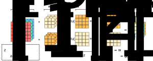
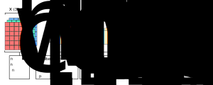

### Motivating Convolutional Networks
- Up until now, we've convolved an image with two different filters to get a new image
- Specifically, our convolution process has the following properties:
	- An image and filter are visually represented as a 3D volume
	- Each channel in the new image corresponds to a filter output
- Now, we'll see how convolution can relate to neural networks

### A Single Layer of a Convolutional Network

### Benefit of Convolutional Networks
- The number of learnable parameters depends on the following:
	- The number of filters in our network
	- The dimensions of each filter
- Therefore, the size of an input image could grow extremely large, but the number of parameters will remain fixed
- Meaning, convolutional networks are less prone to overfitting
- For example, if we have $10$ filters that are $3 \times 3 \times 3$ in one layer, then we'll have the following number of parameters:

$$
270 \text{ weights } + 10 \text{ biases } = 280 \text{ total parameters}
$$

- In this case, we could have a $1000 \times 1000$ or $5000 \times 5000$ image, but the number of parameters remains fixed at $280$
- We just need to learn the weights and biases of these $10$ filters to detect vertical edges, horizontal edges, and other features
- Then, we can apply these filters to very large images, while the number of parameters will always remain fixed and relatively small

### Summarizing Notation
- General notation:
	- $l$: The $l^{th}$ convolution layer in a network
	- $n_{h}^{[l]}$: The height of the input image in the $l^{th}$ layer
	$$
	n_{h}^{[l]} = \lfloor \frac{n_{h}^{[l-1]}+2p^{[l]}-f^{[l]}}{s^{[l]}} + 1 \rfloor
	$$
	- $n_{w}^{[l]}$: The width of the input image in the $l^{th}$ layer
	$$
	n_{w}^{[l]} = \lfloor \frac{n_{w}^{[l-1]}+2p^{[l]}-f^{[l]}}{s^{[l]}} + 1 \rfloor
	$$
- Hyperparameters:
	- $f^{[l]}$: The size of the filter in the $l^{th}$ layer
	- $p^{[l]}$: The amount of padding in the $l^{th}$ layer
	- $s^{[l]}$: The stride in the $l^{th}$ layer
	- $n_{c}^{[l]}$: The number of filters in the $l^{th}$ layer
- Dimensions:
	- $\text{input}$: $\space \space \space n_{h}^{[l-1]} \times n_{w}^{[l-1]} \times n_{c}^{[l-1]}$
	- $\text{filter}$: $\quad f^{[l]} \times f^{[l]} \times n_{c}^{[l-1]}$
	- $\text{output}$: $\space n_{h}^{[l]} \times n_{w}^{[l]} \times n_{c}^{[l]}$
	- $a^{[l]}$: $\qquad n_{h}^{[l]} \times n_{w}^{[l]} \times n_{c}^{[l]}$
	- $w^{[l]}$: $\qquad f^{[l]} \times f^{[l]} \times n_{c}^{[l-1]} \times n_{c}^{[l]}$
	- $b^{[l]}$: $\qquad \space 1 \times 1 \times 1 \times n_{c}^{[l]}$

### Implementing Layers in a Convolutional Network
- An output image is used as the input image in the next layer
- Typically, the dimensions of an output image shrinks as we go deeper within our network
- On the other hand, the number of channels tends to increase as we go deeper within our network
- In other words, we tend to add more channels to filters that are deeper within our network
- Also, there are three types of layers in a convolutional network:
	- Convolutional layers
	- Pooling layers
	- Fully connected layers
- So far, we've only used convolutional layers in our examples

### Example of Network using Convolutional Layers

---

### tldr
- In convolutional networks, we can relate our input image to $a^{[l-1]}$
- We can also relate the filters to $w^{[l]}$
- Then, the convolved image relates to $w^{[l]}a^{[l-1]}$
- The output of applying an activation function and bias term to the convolved image related to the activations $a^{[l]}$
- This output can also be used to feed forward into other convolutional layers
- Typically, the dimensions of an output image shrinks as we go deeper and deeper within our network
- On the other hand, the number of channels tends to increase as we go deeper and deeper within our network
- In other words, we tend to add more channels to filters that are deeper within our network

---

### References
- [One Layer of a Convolutional Network](https://www.youtube.com/watch?v=jPOAS7uCODQ&list=PLkDaE6sCZn6Gl29AoE31iwdVwSG-KnDzF&index=7)
- [Simple Convolutional Network Example](https://www.youtube.com/watch?v=3PyJA9AfwSk&list=PLkDaE6sCZn6Gl29AoE31iwdVwSG-KnDzF&index=8)
