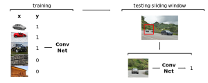
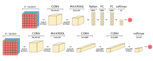
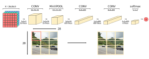

### Introducing Object Detection
- Suppose we want to detect cars in images and videos
- This process involves object detection
- Object detection is a type of supervised classification
- Therefore, we need to train a network on a large number of input images of cars
- Having more images will lead to more accurate predictions of whether an image has a car or not
- This network would return a binary output of whether there is a car or not
- This network would also return the coordinates representing a bounding box around the car
- The following are the general steps for object detection:
	1. Train a convolutional network on images of cars
	2. Perform sliding windows detection on live video or new images
	3. Output a list of bounding boxes around any cars if they exist

### Algorithm for Sliding Windows Detection
1. Initialize a window size
	- The window size represents the size on an image that will be trained on our convolution
al network
2. Select a region of our image
	- This region is based on the window size
3. Input this image region into our convolutional network
	- This convolutional network should be already trained on many images
4. Receive output from the convolutional network
	- The output is our prediction of whether the image is a car or not
5. Repeat steps 2-4
	- In other words, iterate through the image, shift the window to a slightly different region, and input that new region into our convolutional network
	- Continue to do this until we have iterated through the entire image
6. Repeat steps 2-5
	- After returning to step 2, we should increase the window size
	- In other words, increase the window size after iterating through the entire image
	- Then, input the image region into the convolutional network while shifting the window to a slightly different region of the image afterwards
	- We should keep increasing the window size 2-3 times

### Describing Sliding Window Detection
- Sliding window detection involves sliding a window across an entire image
- Then, each square region within the window is classified
- A stride hyperparameter determines how much the window slides across the image
- In other words, a stride hyperparameter determines the step size
- Therefore, there becomes a trade-off between accuracy and performance:
	- A larger stride can lead to decreased accuracy and increased performance
	- A smaller stride can lead to decreased performance and increased accuracy
- The computational cost grows quickly because:
	- We're cropping out so many square regions in the image
	- Running each of these regions independently in a convolutional network
- Implementing sliding window detection within our convolutional network can help increase performance

### Converting FC Layers into Convolutional Layers
- As we've hinted at already, a $1 \times 1 \times n$ convolutional layer can be thought of as a fully-connected layer with $n$ nuerons
- Mathematically, these layers are the same
- Specifically, an image convolved with each of the $n$ number of filters leads to the $1 \times 1 \times n$ image
- Therefore, each of the $n$ number of filters is a linear function of the activations made up by the previous image
- For example, a $5 \times 5 \times 16$ image convolved with $400 \qquad \qquad$ $5 \times 5 \times 16$ filters becomes a $1 \times 1 \times 400$ convolutional layer
- Each of the $400$ filters is made up of weights $w$
- So, convolving the filters with the image is essentially performing $g(wa^{[l-1]})$ where $g$ is a linear activation function

### Implementing Sliding Window Convolutionally
- Let's return to our sliding window problem
- Rather than iteratively inputting each sliding window region into our network, we can convolutionally perform the predictions all at once
- We can do this by using $1 \times 1$ convolutional layers in place of fully-connected layer

---

### tldr
- Sliding window detection involves sliding a window across an entire image
- Then, each square region within the window is classified
- A stride hyperparameter determines how much the window slides across the image
- In other words, a stride hyperparameter determines the step size

---

### References
- [Object Detection](https://www.youtube.com/watch?v=5e5pjeojznk&list=PLkDaE6sCZn6Gl29AoE31iwdVwSG-KnDzF&index=25)
- [Convolutional Implementation Sliding Windows](https://www.youtube.com/watch?v=XdsmlBGOK-k&list=PLkDaE6sCZn6Gl29AoE31iwdVwSG-KnDzF&index=26)
