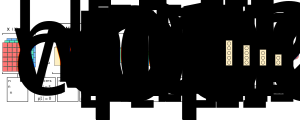

### Briefly Introducing Fully-Connected Layers
- As seen in regular neural networks, neurons in a fully connected layer have full connections to all activations in the previous layer
- This layer takes an input volume and outputs an $n$ dimensional vector, where $n$ is the number of classes we are considering
- For example, if we wanted to classify input images as a number between $0-9$, then $n=10$

### Illustrating LeNet-5 Implementation

| Layer   | Activation Shape         | Activation Size | # Parameters |
| ------- | ------------------------ | --------------- | ------------ |
| x       | $32 \times 32 \times 3$  | $3072$          | $0$          |
| CONV1   | $28 \times 28 \times 8$  | $6272$          | $208$        |
| POOL1   | $14 \times 14 \times 8$  | $1568$          | $0$          |
| CONV2   | $10 \times 10 \times 16$ | $1600$          | $416$        |
| POOL2   | $5 \times 5 \times 16$   | $400$           | $0$          |
| FC3     | $120 \times 1$           | $120$           | $48001$      |
| FC4     | $84 \times 1$            | $84$            | $10081$      |
| Softmax | $10 \times 1$            | $10$            | $841$        |

### Observations from LeNet-5 Cast Study
- There are a few common patterns found throughout convolutional neural networks, which can be observed in the lenet-5 network
- As we go deeper in our network:
	- $n_{h}^{[l]}$ and $n_{w}^{[l]}$ tend to decrease
	- $n_{c}^{[l]}$ tends to increase
- Convolutional layers have very few parameters
- Pooling layers don't have any parameters
- Fully-connected layers have the most parameters in our network
- The size of our activations gradually decrease as we go deeper
- There will be a negative impact on performance if the size of activations decreases too quickly or too slowly as we travel deeper in our network
- Typically, a convolutional network will follow this pattern:

$$
CONV \to POOL \to \dots_{cp} \to FC \to \dots_{fc} \to SOFTMAX
$$

- Here, the $..._{cp}$ denotes repeating $CONV$ and $POOL$ layers
- And, the $..._{fc}$ denotes repeating $FC$ layers

---

### tldr
- As seen in regular neural networks, neurons in a fully connected layer have full connections to all activations in the previous layer
- This layer takes an input volume and outputs an $n$ dimensional vector, where $n$ is the number of classes we are considering
- For example, if we wanted to classify input images as a number between $0-9$, then $n=10$

---

### References
- [LeNet-5 Convolutional Network Implementation](https://www.youtube.com/watch?v=bXJx7y51cl0&list=PLkDaE6sCZn6Gl29AoE31iwdVwSG-KnDzF&index=10)
- [Fully-Connected Layers](https://cs231n.github.io/convolutional-networks/#fc)
- [Understanding Fully-Connected Layers](https://adeshpande3.github.io/A-Beginner%27s-Guide-To-Understanding-Convolutional-Neural-Networks/)
