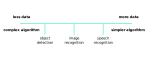
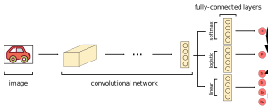

### The State of Computer Vision
- Generally, we need more data for more complex problems
- For example, speech recognition has:
	- A large amount of data available
	- Simpler algorithms
- However, image recognition is a more complicated problem compared to speech recognition
- Therefore, we need even more data for image recognition compared to speech recognition
- More complex problems involve carefully designing features requiring large amounts of data
- Simpler problems can use simpler network architectures with smaller amounts of data

### Introducing Image Classification and Detection
- Localization refers to determining where in the picture is the object we've detected
- There are three general types of image classification:
	1. Image classification without localization
	2. Image classification with localization
	3. Object Detection
- Image classification without localization refers to labeling an image with a broad category
- For example, running image classification without localization on a picture of a car would hopefully output a *car* label
- Image classification with localization includes the following:
	- Labeling an image with a broad category
	- Providing a bounding box around the classified object
- For example, running image classification with localization on a picture of a car would hopefully output a *car* label and a box around the car in the image
- Object detection refers to finding multiple objects in a picture and localizing them
- For example, running object detection on an image with multiple cars and people would hopefully detect each object (i.e. humans, cars, etc.) in the image

### Describing Object Localization
- Most object localization problems will return:
	- A classification label
	- A probability tied to the label
	- A bounding box 
- We denote the above outputs as the following:
	- A label $c$
	- A probability $p_{c}$
	- A bounding box
		- A center of the bounding box $(b_{x}, b_{y})$
		- A height of the bounding box $b_{h}$
		- A width of the bounding box $b_{w}$
- The output is given by the following output layers:
	- A fully-connected layer outputting $c$
	- A fully-connected layer outputting $p_{c}$
	- A fully-connected layer outputting $(b_{h}, b_{w}, b_{x}, b_{y})$
- The three fully-connected layers are specifically:
	- The layer outputting $c$ is a softmax layer
	- The layer outputting $p_{c}$ is a logistic layer
	- The layer outputting $(b_{h}, b_{w}, b_{x}, b_{y})$ is a linear layer
- As a reminder, a linear neuron uses a quadratic loss function
- Softmax and logistic neurons uses a cross-entropy loss function

$$
c_{i} = \begin{cases} 1 &\text{if pedestrian} \cr 2 &\text{if car} \cr 3 &\text{if motorcycle} \cr 4 &\text{if background} \end{cases}
$$

$$
\hat{y} = \begin{bmatrix} p_{c} \cr b_{x} \cr b_{y} \cr b_{h} \cr b_{w} \cr c_{1} \cr c_{2} \cr c_{3} \end{bmatrix} = \begin{bmatrix} 1 \cr 0.5 \cr 0.6 \cr 0.2 \cr 0.1 \cr 0 \cr 1 \cr 0 \end{bmatrix}
$$

### Introducing Landmark Detection
- Previously, our network specified the bounding box of an object
- Our network can also output the $x$ and $y$ coordinates of the most important points in an image
- These points are called *landmarks*
- Essentially, these landmarks represent locations, rather than a bounding box
- For example, let's say we have a bunch of images of faces
- We may want to output the $x$ and $y$ coordinates of the corner of someone's eye
- Specifically, the following landmarks could represent the four corners of someone's eyes:

$$
l_{1x}, l_{1y}, l_{2x}, l_{2y}, l_{3x}, l_{3y}, l_{4x}, l_{4y}
$$

- Being able to detect these landmarks is crucial for creating computer graphics effects
- For example, snapchat uses landmark detection for its filters
- Landmark detection is a type of supervised learning
- Therefore, we typically need to manually label the $x$ and $y$ coordinates of the object in each image for our network to learn on
- In this case, we need to refer to each landmark as the same identity
- For example, the coordinates of the left corner of the leftward eye needs to always be $l_{1x}$ nad $l_{1y}$
- And, the coordinates of the right corner of the rightward eyes needs to always be $l_{4x}$ and $l_{4y}$

---

### tldr
- Localization refers to determining where in the picture is the object we've detected
- There are three general types of image classification:
	1. Image classification without localization
	2. Image classification with localization
	3. Object Detection
- Image classification without localization refers to labeling an image with a broad category
- Image classification with localization includes the following:
	- Labeling an image with a broad category
	- Providing a bounding box around the classified object
- Our network can also output the $x$ and $y$ coordinates of the most important points in an image
- These points are called *landmarks*
- Essentially, these landmarks represent locations, rather than a bounding box

---

### References
- [Landmark Detection](https://www.youtube.com/watch?v=rRB9iymNy1w&list=PLkDaE6sCZn6Gl29AoE31iwdVwSG-KnDzF&index=24)
- [Object Localization](https://www.youtube.com/watch?v=GSwYGkTfOKk&list=PLkDaE6sCZn6Gl29AoE31iwdVwSG-KnDzF&index=23)
- [State of Computer Vision](https://www.youtube.com/watch?v=c3zw6KI6dLc&list=PLkDaE6sCZn6Gl29AoE31iwdVwSG-KnDzF&index=22)
