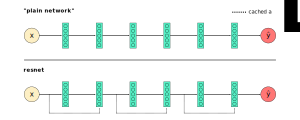
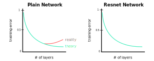

### Defining a Residual Block
- The classical block in resnet is a residual block
- Resnet introduces a so-called *identity shortcut connection*
- This connection attempts to skip one or more layers
- We can define a residual block as the following:

$$
a^{[l+2]} = relu(W^{[l+2]}relu(W^{[l+1]}a^{[l]} + b^{[l+1]}) + b^{[l+2]} + a^{[l]})
$$

- We can simplify the above to look like the following:

$$
a^{[l+2]} = relu(W^{[l+2]}a^{[l+1]} + b^{[l+2]} + a^{[l]})
$$

$$
\text{where } z^{[l+1]} = W^{[l+1]}a^{[l]} + b^{[l+1]}
$$

$$
\text{where } a^{[l+1]} = relu(z^{[l+1]})
$$

$$
\text{where } z^{[l+2]} = W^{[l+2]}a^{[l+1]} + b^{[l+2]}
$$

$$
\text{where } a^{[l+2]} = relu(z^{[l+2]} + a^{[l]})
$$

- We can visualize the chain of operations as the following:

$$
a^{[l]} \to \overbrace{z^{[l+1]}}^{W^{[l+1]}a^{[l]} + b^{[l+1]}} \to \overbrace{a^{[l+1]}}^{relu(z^{[l+1]})} \to \overbrace{z^{[l+2]}}^{W^{[l+2]}a^{[l+1]} + b^{[l+2]}} \to \overbrace{a^{[l+2]}}^{relu(z^{[l+2]}+a^{[l]})}
$$

### Benefit of ResNet
- Theoretically, the training error should continue to decrease as we increase the number of layers to a plain network
- Realistically, the training error begins to increase as the number of layers reaches a certain point
- This is an issue caused by the vanishing gradient problem
- Resnet is able avoid this problem
- Specifically, resnet is able to increase accuracy as the number of layers increases

### Why ResNets Work?
- Suppose we begin to observe the vanishing gradient problem during training
- In this case, $z^{[l]} \to 0$ since the parameters $W$ and $b \to 0$
- Therefore, the resnet will observe the following:

$$
a^{[l+2]} = relu(\xcancel{W^{[l+2]}a^{[l+1]} + b^{[l+2]}} + a^{[l]})
$$

- Each $a^{[l+2]}$ solution will still learn something from $a^{[l]}$ even in worst case scenario
- In other words, $\hat{y}$ will generally improve even if $z^{[l+2]}=0$
- This helps prevent the vanishing gradient problem to some degree

---

### tldr
- The classical block in resnet is a residual block
- Resnet introduces a so-called *identity shortcut connection*
- This connection attempts to skip one or more layers
- Theoretically, the training error should continue to decrease as we increase the number of layers to a plain network
- Realistically, the training error begins to increase as the number of layers reaches a certain point
- This is an issue caused by the vanishing gradient problem
- Resnet is able avoid this problem
- Specifically, resnet is able to increase accuracy as the number of layers increases

---

### References
- [General Description of ResNets](https://www.youtube.com/watch?v=ZILIbUvp5lk&list=PLkDaE6sCZn6Gl29AoE31iwdVwSG-KnDzF&index=14)
- [Why do ResNets Work?](https://www.youtube.com/watch?v=RYth6EbBUqM&list=PLkDaE6sCZn6Gl29AoE31iwdVwSG-KnDzF&index=15)
- [Definition of a Residual Block](https://stats.stackexchange.com/questions/246928/what-exactly-is-a-residual-learning-block-in-the-context-of-deep-residual-networ)
- [ResNet Paper](https://arxiv.org/pdf/1512.03385.pdf)
