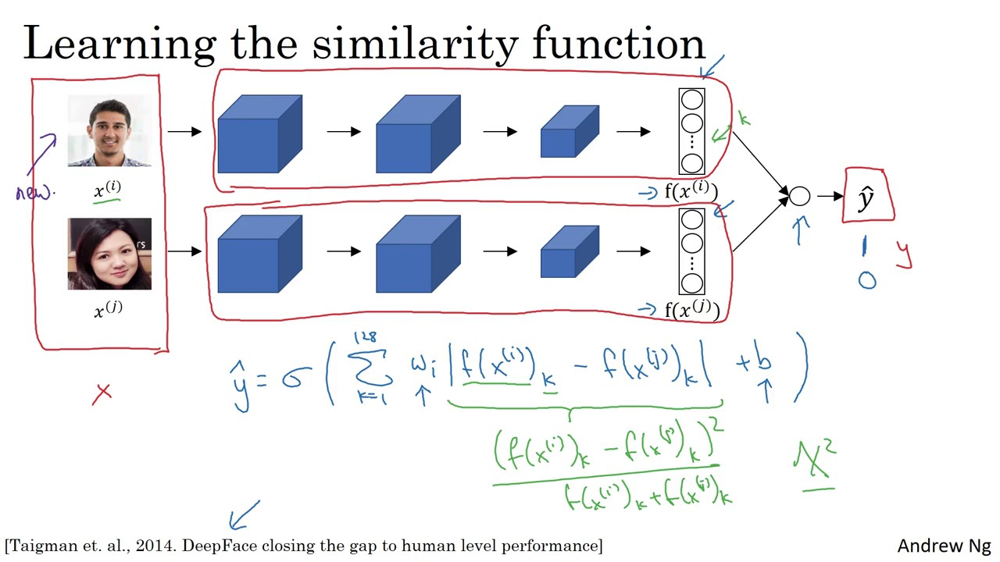

### Differentiating between Face Verification and Recognition
- Face verification
	- We input an image and a name ID
	- A face verification method outputs if the image belongs to that claimed name ID
	- Face verification is typically easier than face recognition
	- This is because we only need to verify a single face to one ID
	- Specifically, the accuracy needs to be around $99%$
- Face recognition
	- We input an image
	- A face recognition method outputs if the image belongs to any name IDs
	- Face recognition is typically harder than face verification
	- This is because we need to verify a single face to many IDs
	- Specifically, the accuracy needs to be around $99.99%$

### Describing Face Verification
- The training process of a face verification network is very similar to the training process of a face recognition network
- Specifically, we would still train a siamese network
- However, we add an extra layer after the $f(x)$ embeddings

- This extra layer contains a single sigmoid neuron
- Specifically, this output layer outputs:
	- A $1$ if the two images are the same
	- A $0$ if the two images are different
- Therefore, we are not using a triplet loss anymore
- Instead, we are using a cross-entropy loss function

### Defining the Network
- The output of our network becomes a sigmoid function applied to the features
- These features aren't only the embeddings
- Instead, the activations $a^{[l-1]}$ become the following:

$$ \vert f_{k}(x^{(i)}) - f_{k}(x^{(j)}) \vert $$

- Here, $k$ represents the $k^{th}$ component of the $128$-digit vector
- Then, the output of our network becomes the following:

$$ \hat{y} = \sigma(\sum_{k=1}^{128} w_{i}^{[l]} a^{[l-1]} + b^{[l]}) $$
$$ \hat{y} = \sigma(\sum_{k=1}^{128} w_{i} \vert f_{k}(x^{(i)}) - f_{k}(x^{(j)}) \vert + b) $$

- We can use other variations of the $a^{[l-1]}$ term
- For example, we could use the $\chi^{2}$ similarity:

$$ \chi^{2} = \frac{(f_{k}(x^{(i)}) - f_{k}(x^{(j)}))^{2}}{f_{k}(x^{(i)}) - f_{k}(x^{(j)})} $$

- There are many other variations of possible similarity functions
- Instead of training triplets, we are only training pairs of images

---

### tldr
- The training process of a face verification network is very similar to the training process of a face recognition network
- Specifically, we would still train a siamese network
- However, we add an extra layer after the $f(x)$ embeddings
- This extra layer contains a single sigmoid neuron
- The output of our network becomes a sigmoid function applied to the features
- These features aren't only the embeddings
- Instead, the activations $a^{[l-1]}$ become the following:

$$ \vert f_{k}(x^{(i)}) - f_{k}(x^{(j)}) \vert $$

- Instead of training triplets, we are only training pairs of images

---

### References
- [Face Verification](https://www.youtube.com/watch?v=0NSLgoEtdnw&list=PLkDaE6sCZn6Gl29AoE31iwdVwSG-KnDzF&index=36)
