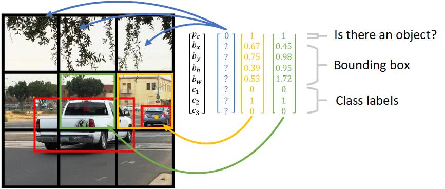

### Improving Accuracy using the YOLO Algorithm
- Now, we have fixed the problem with computational inefficiency
- We still have one problem with our method of object detection
- Specifically, the position of the bounding boxes aren't accurate
- In other words, the position of the bounding boxes are shifted somewhat randomly
- And, the most ideal bounding boxes don't always follow a perfectly squared shape
- We can fix this using the yolo algorithm

### Describing the YOLO Algorithm
- The concept of breaking down the images to grid cells is unique in YOLO
- Let's say we have $3 \times 3$ grid


- In the image above we have two cars
- We marked their bounding boxes in red
- For each grid cell, we have the following labels for training:

$$
y = \begin{bmatrix} p_{c} \cr b_{x} \cr b_{y} \cr b_{h} \cr b_{w} \cr c_{1} \cr c_{2} \cr c_{3} \end{bmatrix}
$$

- This is similar to our $1 \times 1$ activations from our convolutional implementation of the sliding window
- Now, we need to associate objects to individual cells
- The rightmost car seems to be obviously associated with the middle-right cell
- The truck seems to be less obviously associated with the center cell
- This is because the yolo algorithm associates an object to a cell based on the object's midpoint



### Defining the YOLO Algorithm
- Notice $p_{c}=0$ for cells without objects detected
- We use $?$ because we don't care about its remaining values
- The definition of the bounding box parameters are defined as:
	- $b_{x}:$ The x coordinate corresponding to the center of the bounding box
	- $b_{y}:$ The y coordinate corresponding to the center of the bounding box
	- $b_{h}:$ The height of the bounding box
	- $b_{w}:$ The width of the bounding box
	- $c_{i}:$ The $i^{th}$ class (e.g. pedestrian, car, etc.)
	- $p_{c}:$ The probability of whether there is an object or not
- The yolo loss function is defined as the following:

$$
\lambda_{coord} \sum_{i=0}^{S^{3}} \sum_{j=0}^{B} 1^{obj}_{ij}[(x_{i}-\hat{x}_{i})^{2} + (y_{i}-\hat{y}_{i})^{2}]
$$

$$
+ \lambda_{coord} \sum_{i=0}^{S^{2}} \sum_{j=0}^{B} 1^{obj}_{ij}[(\sqrt{w_{i}}-\sqrt{\hat{x}_{i}})^{2} + (\sqrt{h_{i}}-\sqrt{\hat{h}_{i}})^{2}]
$$

$$
+ \sum_{i=0}^{S^{2}} \sum_{j=0}^{B} 1^{obj}_{ij}(C_{i}-\hat{C}_{i})^{2}
$$

$$
+ \lambda_{noobj} \sum_{i=0}^{S^{2}} \sum_{j=0}^{B} 1^{obj}_{ij}(C_{i}-\hat{C}_{i})^{2}
$$

$$
+ \sum_{i=0}^{S^{2}} 1^{obj}_{ij} \sum_{c \in classes} (p_{i}(c)-\hat{p}_{i}(c))
$$

### Intuition behind YOLO Loss Function
- The first term penalizes bad localizations of the center of cells
- The second term penalizes the bounding box with inaccurate height and widths
- The square root is present so that errors in small bounding boxes are more penalizing than erros in big bounding boxes
- The third term tries to make the confidence score equal to the intersection over union between the object and the prediction when there is one object
- The fourth term tries to make the confidence score close to $0$ when there aren't any objects in the cell
- The fifth term is a simple classification loss function

### Motivating Nonmax Suppression
- There is still a limitation with our yolo algorithm
- Typically, there are many possible bounding boxes for the yolo algorithm to output
- Specifically, how can we evaluate which bounding box is the best?
- To solve this problem, we'll introduce the concept of *nonmax suppression*

### Introducing Intersection over Union
- Before we go into the nonmax suppression concept, we should first introduce the intersection over union (IoU) function
- The iou function is used for evaluating our object detection algorithm
- Specifically, the iou function computes the area of the intersection of two bounding boxes


- The iou function is used for the following:
	- Measuring the similarity of two bounding boxes
	- Training a bounding box against
		- The coordinates of the true bounding box are found manually
		- In other words, we need to be given the coordinates
		- An iou threshold of $0.5$ is considered *correct*
		- In other words, a bounding box with a $\ge 0.5$ iou value is considered similar enough to the true bounding box

$$
iou = \frac{\text{intersection area}}{\text{our bounding box area}}
$$

$$
iou \ge 0.5 \text{ is correct}
$$

- The iou function doesn't define a bounding box by its center point, width, and height
- Instead, it defines a bounding box based on its upper left corners $(x_{1},y_{1})$ and lower right corners $(x_{2}, y_{2})$


- Specifically, we use the iou function when assigning anchor boxes
- We also use the iou function when assigning anchor boxes
- The algorithm is defined as the following:
	1. Finding the two corners of the intersection
	2. Compute the area of the intersection

```python
def iou(box1, box2):
    xi1 = max(box1[0], box2[0])
    yi1 = max(box1[1], box2[1])
    xi2 = min(box1[2], box2[2])
    yi2 = min(box1[3], box2[3])
    inter_area = (xi2 - xi1) * (yi2 - yi1)

    box1_area = (box1[2] - box1[0]) * (box1[3] - box1[1])
    box2_area = (box2[2] - box2[0]) * (box2[3] - box2[1])
    union_area = box1_area + box2_area - inter_area

    iou = inter_area / union_area

    return iou
```

### Introducing Nonmax Suppression
- Previously, we used a $3 \times 3$ grid to find our bounding boxes
- Realistically, we'll want to use larger grids
- We use larger grids to achieve more accurate bounding boxes
- For example, a $19 \times 19$ grid could be used instead of a $3 \times 3$ grid
- However, we're more likely to pick up multiple bounding boxes for the same object


- This is because we're running a localization on each grid
- Therefore, other grids will think there is a car as well
- Our goal is to do the following:
	- Keep the bounding boxes that have the highest $p_{c}$
	- Remove the bounding boxes that are very similar to the bounding boxes with the highest $p_{c}$
- Therefore, we perform nonmax suppression:
	1. Discard all bounding boxes with $p_{c} \le 0.6$
	2. Choose the bounding box with the largest $p_{c}$ value
	3. Discard any remaining boxes with an iou value $\ge 0.5$
		- This is because we want to remove the other similar bounding boxes that aren
t the bounding box with the largest $p_{c}$
		- If we removed boxes with an iou value $\le 0.5$, then we'd remove other bounding boxes belonging to other objects

### Motivating the Anchor Box
- There is still a limitation with our yolo algorithm
- Let's say we have multiple objects in the same grid cell
- For example, suppose we have a pedestrain and a car in a cell
- Then, do we classify the object as a pedestrian or car?
- To solve this problem, we'll introduce the concept of *anchor box*

### Introducing the Anchor Box
- Anchor boxes allow the yolo algorithm to detect multiple objects centered in one grid cell
- We do this by assigning an additional dimension to the output labels
- This dimension refers to the number of anchor boxes per grid cell
- Meaning, we create another hyperparameter representing the pre-defined number of anchor boxes per cell
- Now, we'll be able to assign one object to each anchor box

### Describing Anchor Boxes
- Notice, a car and pedestrian are both centered in the middle cell


- We should set the number of anchor boxes to be $2$
- Now, each grid cell can detect a pedestrian and a car
- Specifically, a pedestrian and a car in the same cell will be individually assigned to their own anchor box
- This depends on which object and anchor box provide the highest iou value
- Each anchor box specializes in a certain shape
- For example, one anchor box may learn a skinny object, whereas another anchor box may learn a wide object
- In our case, one anchor box could learn a tall, skinny object associated with pedestrians
- And, another anchor box could learn a short, wide object associated with cars
- Our new label will look like the following:


### Defining the YOLO Algorithm with Anchor Boxes
- Suppose we are detecting $3$ objects:
	1. Pedestrian
	2. Car
	3. Motorcycle
- Let's also say we're using $2$ anchor boxes per cell
- Lastly, let's say our grid is $3 \times 3$
- Our labels $y$ can be represented as a $3 \times 3 \times 2 \times 8$ matrix:
	- $3 \times 3$ due to the grid size
	- $\times 2$ due to the number of anchors
	- $\times 8$ due to the number of parameters per cell
- Specifically, our label $y_{i}$ can be represented as a $16 \times 1$ vector
- Our label $y_{i}$ looks like the following for a single cell:

$$
y = \begin{bmatrix} p_{c,1} \cr b_{x,1} \cr b_{y,1} \cr b_{h,1} \cr b_{w,1} \cr c_{1,1} \cr c_{2,1} \cr c_{3,1} \cr p_{c,2} \cr b_{x,2} \cr b_{y,2} \cr b_{h,2} \cr b_{w,2} \cr c_{1,2} \cr c_{2,2} \cr c_{3,2} \end{bmatrix}
$$

- Here $p_{c,1}$ refers to $p_{c}$ of anchor box $1$
- And $p_{c,2}$ refers to $p_{c}$ of anchor box $2$
- Essentially, the yolo algorithm will generate an output matrix of shape $(3,3,2,8)$ given an image
- Meaning, each of the grid cells will output two predictions
- We can observe the dimensions of our labels during the training of a single cell in the image below:


### Implementing the YOLO Algorithm with Anchor Boxes
- Let's say we want to train a on the image above
- Specifically, we want to train a convolutional network on the image
- The network will output:
	- A classification of the object
	- A bounding box around the detected object
- An example output of the middle grid cell is the following:


- The output volume $y$ represents a collection of vectors $y_{i}$ associated with one of the $9$ grid cells
- We also need to include nonmax suppresion
- In other words, we'll filter out any improbable bounding boxes
- And, we'll also keep the most probable bounding box associated with an object
- The following image illustrates the generalized steps for predicting objects and their bounding boxes:


---

### tldr
- The yolo algorithm improves the accuracy of our object detection algorithm
- Specifically, the yolo algorithm is used for accounting for bounding boxes that:
	- May not make up an entire sliding window region
	- May not fall perfectly in an individual grid cell
- In other words, the position of the bounding boxes are shifted somewhat randomly
- The yolo algorithm involves breaking down an image into grid cells
- The definition of the bounding box parameters are defined as:
	- $b_{x}:$ The x coordinate corresponding to the center of the bounding box
	- $b_{y}:$ The y coordinate corresponding to the center of the bounding box
	- $b_{h}:$ The height of the bounding box
	- $b_{w}:$ The width of the bounding box
	- $c_{i}:$ The $i^{th}$ class (e.g. pedestrian, car, etc.)
	- $p_{c}:$ The probability of whether there is an object or not
- The iou function is used for evaluating estimated bounding boxes against the actual bounding boxes
- In other words, the iou function measures the similarity between two bounding boxes
- Nonmax suppression is used for filtering out any bounding boxes that aren't the most probable associated with an object
- Nonmax suppression is defined as the following:
	1. Discard all bounding boxes with $p_{c} \le 0.6$
	2. Choose the bounding box with the largest $p_{c}$ value
	3. Discard any remaining boxes with an iou value $\ge 0.5$
- Anchor boxes allow the yolo algorithm to detect multiple objects centered in one grid cell
- We do this by assigning an additional dimension to the output labels
- This dimension refers to the number of anchor boxes per grid cell
- Meaning, we create another hyperparameter representing the pre-defined number of anchor boxes per cell

---

### References
- [Bounding Box Predictions](https://www.youtube.com/watch?v=gKreZOUi-O0)
- [Intersection over Union](https://www.youtube.com/watch?v=ANIzQ5G-XPE&list=PLkDaE6sCZn6Gl29AoE31iwdVwSG-KnDzF&index=27)
- [Nonmax Suppression](https://www.youtube.com/watch?v=VAo84c1hQX8&list=PLkDaE6sCZn6Gl29AoE31iwdVwSG-KnDzF&index=28)
- [Anchor Boxes](https://www.youtube.com/watch?v=RTlwl2bv0Tg&list=PLkDaE6sCZn6Gl29AoE31iwdVwSG-KnDzF&index=29)
- [Implementing the YOLO Algorithm](https://www.youtube.com/watch?v=9s_FpMpdYW8&list=PLkDaE6sCZn6Gl29AoE31iwdVwSG-KnDzF&index=30)
- [YOLO Object Localization](https://www.dlology.com/blog/gentle-guide-on-how-yolo-object-localization-works-with-keras-part-2/)
- [Anchor Boxes Chapter](https://d2l.ai/chapter_computer-vision/anchor.html#)
- [Defining the YOLO Loss Function](https://stats.stackexchange.com/questions/287486/yolo-loss-function-explanation)
- [Illustrating the YOLO Loss Function](https://stackoverflow.com/questions/57295132/for-the-yolo-loss-function-what-is-the-calculation-performed-in-order-to-obtain)
