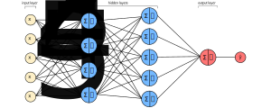

### Defining some Terminology
- `Input Layer:` The leftmost layer in a neural network
- `Input Neurons:` The neurons within the input layer
- `Output Layer:` The rightmost layer in a neural network
- `Output Neurons:` The neurons within the output layer
- `Hidden Layer:` The middle layers in a neural network

### Describing the Terminology
- An input layer is a collection of input neurons
- An input neuron is a single input
- A hidden layer is a collection of hidden neurons
- A hidden neuron is a function
- An output layer is a collection of output neurons
- An output neuron is a function
- A two-layer neural network is the smallest possible neural network
- A two-layer neural network only includes an input layer and output layer

### Overview of the Architecture
- There is only one input layer in a neural network
- The input layer contains one or more neurons
- There is only one output layer in a neural network
- The output layer contains one or more neurons
- The hidden layer is given its name because the neurons within this layer are neither input or output neurons
- There can be one or more hidden layers
- For example, the following four-layer neural network has two hidden layers:

### Example of Architecture
- Let's say we want to determine whether a handwritten image depicts a $9$ or not
- A natural way to design the network is to assign the image pixels as input neurons
- Suppose our images are $64$ by $64$ greyscale images
- Then, we'd have $4096 = 64 \times 64$ input neurons
- These input neurons are scaled appropriately between 0 and 1
- The output layer will contain just a single neuron
- We could decide that an output value less than $0.5$ will indicate the *input image is not a $9$*
- Therefore, values greater than $0.5$ will indicate *input image is a $9$*

---

### tldr
- An input neuron is a single input
- A hidden neuron is a function
- An output neuron is a function

---

### References
- [Architecture of Neural Networks](http://neuralnetworksanddeeplearning.com/chap1.html#the_architecture_of_neural_networks)
