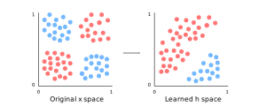
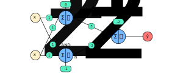

### Introducing the XOR Function
- We can model the XOR function using a feedforward network
- The XOR function takes in two binary values $x_{1}$ and $x_{2}$
- The XOR function returns $1$ when exactly one of its binary inputs is equal to $1$
- Otherwise, the function returns $0$

### Illustrating an XOR Problem
- The most classic example of a linearly inseparable pattern is a logical exclusive-or (XOR) function
- In these situations, there are typically two distinct classes of data points that can't be linearly separated initially
- For example, we may have the following data:

- We can model our data using an XOR gate
- A linear model applied directly to the original input cannot implement the XOR function
- However, a linear model can solve the problem in our transformed space, where the transformed space is represented by the features extracted by a neural network
- In our sample solution, the two points that must have output 1 have been collapsed into overlapping points in feature space

### Representing XOR as a Feedforward Network
- In most cases, the true target function $f^{*}$ is unknown
- However, we know the target function is the XOR function in this case:

$$ f^{*} : \lbrace 0,1 \rbrace^{2} \to \lbrace 0,1 \rbrace $$
$$ (x,y) \mapsto f^{\ast}(x,y) $$
$$ f^{\ast}(x,y) = \begin{cases} 1 &\text{if } x \And y = 1 \cr 0 &\text{if } x \And y \not = 1 \end{cases} $$

- In this example, there are only four possible inputs:

$$ \chi = {(0,0), (0,1), (1,0), (1,1)} $$

- Therefore, we will train the network on all four of these points
- To introduce the concept of loss functions, we'll treat this problem as a regression problem
- Since we're treat this problem as a regression problem, we can use the mean squared error is our loss function
- However, in practical applications, MSE is usually not an appropriate loss function for modeling binary data
- The MSE loss function in our case is the following:

$$ J(\theta) = \frac{1}{4}\sum_{x \in \chi}(f^{*}(x)-f(x;\theta))^{2} $$

- If we assume our model is a linear model, then we could define the form of our model $f(x;\theta)$ as the following:

$$ f(x;\theta) = f(x;w,b) = x^{T}w + b $$

- With respect to $w$ and $b$, we can minimize $J(\theta)$ iteratively using gradient descent or in closed form using the normal equations

### Defining the XOR Architecture
- We may decide to model the XOR function using a three-layer neural network
- Our network could have two inputs, a hidden layers with two nodes, and an output layer with one node
- In this case, we can describe an affine transformation from a vector $x$ to a vector $h$ to a vector $y$
- We need a vector of weights $w_{1}$ for our inputs $x$ and another vector of weights $w_{2}$ for our hidden layer outputs $h$

$$ w_{1} = \begin{bmatrix} 1 \cr 1 \cr 1 \cr 1 \end{bmatrix}; w_{2} = \begin{bmatrix} 3 \cr -2 \end{bmatrix} $$

- We need a vector of biases $b_{1}$ for our hidden layer and another vector of biases $b_{2}$ for our output layer:

$$ b_{1} = \begin{bmatrix} 0 \cr -1 \end{bmatrix}; b_{2} = [-2] $$

- Since we only have four data points, our network, inputs, and output looks like the following:

| $x_{1}$ | $x_{2}$ | $h_{1}$ | $h_{2}$ | $y$ |
| ------- | ------- | ------- | ------- | --- |
| 0       | 0       | 0       | 0       | 0   |
| 0       | 1       | 1       | 0       | 1   |
| 1       | 0       | 1       | 0       | 1   |
| 1       | 1       | 1       | 1       | 0   |

---

### tldr
- Neural networks are good at modeling many types of functions
- These functions include AND, OR, XOR, etc.

---

### References
- [Feedfoward and Multi-Layer Perceptron Networks](http://www.deeplearningbook.org/contents/mlp.html)
- [Lecture Notes about Linear Separability](http://www.ece.utep.edu/research/webfuzzy/docs/kk-thesis/kk-thesis-html/node19.html)
