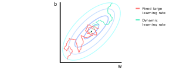

### Motivating Learning Rate Decay
- Sometimes, assigning a large learning rate can cause our optimization algorithm to overshoot the minimum
- On the other hand, assigning a small learning rate can cause our optimization algorithm to never reach the minimum, since our steps become too small
- Meaning, we may never be able to converge to the optimal parameters that minimize our cost function $J$ in either of these situations

### Illustrating Learning Rate Decay
- To illustrate this point, let's say we're implementing mini-batch gradient descent with reasonably small batch sizes and a somewhat large learning rate
- As we iterate, we'll notice our steps drifting towards the minimum in the beginning
- However, we may start to wander around the minimum and never converge to optimal parameters once we start to approach the minimum
- On the other hand, we may never converge to the minimum if we start with a somewhat small learning rate
- Slowly reducing the learning rate overtime can help improve the performance of an optimization algorithm

### Defining Standard Learning Rate Decay
1. Compute $\alpha_{i}$ for the current epoch $i$

$$
\alpha_{i} = \alpha_{0} \frac{1}{1 + \gamma \times i}
$$

2. Repeat step $1$ for each $i^{th}$ epoch

### Describing the Hyperparameters
- The hyperparameter $\alpha_{i}$ represents the learning rate for the $i^{th}$ epoch
- The hyperparameter $\alpha_{0}$ represents an initial learning rate
- The hyperparameter $\gamma$ represents the rate of decay
- The hyperparameters $\alpha_{0}$ and $\gamma$ are fixed for each epoch
- The hyperparameter $\alpha_{i}$ is obviously different for each epoch
- We typically tune the hyperparameters $\alpha_{0}$ and $\gamma$

### Example of the Standard Learning Rate Decay

| epoch | $\alpha_{epoch}$ | $\alpha_{0}$ | $\gamma$ |
| ----- | ---------------- | ------------ | -------- |
| 1     | 0.1              | 0.2          | 1        |
| 2     | 0.67             | 0.2          | 1        |
| 3     | 0.5              | 0.2          | 1        |
| 4     | 0.4              | 0.2          | 1        |
| ...   | ...              | 0.2          | 1        |

### Defining Exponential Learning Rate Decay
1. Compute $\alpha_{i}$ for the current epoch $i$

$$
\alpha_{i} = \alpha_{0} \times \gamma^{i}
$$

2. Repeat step $1$ for each $i^{th}$ epoch
	- Where the hyperparameter $\gamma$ is the exponential rate of decay

### Other Forms of Learning Rate Decay
- There are other forms of learning rate decay
- These are essentially doing the same thing, but use different functions to express different rates of decay applied to the learning rate
- Another example is the discrete staircase decay function
- We could also use the following:

$$
\alpha_{i} = \alpha_{0} \frac{k}{\sqrt{i}}
$$

- Here, the hyperparameter $i$ refers to the $i^{th}$ epoch
- And, the hyperparameter $k$ refers to some constant
- We can also use a similar method using mini-batches:

$$
\alpha_{t} = \alpha_{0} \frac{k}{\sqrt{t}}
$$

- Here, the hyperparameter $t$ refers to the $t^{th}$ mini-batch

---

### tldr
- Slowly reducing the learning rate overtime can help improve the performance of an optimization algorithm
- In other words, we want to start off with a large learning rate in the beginning, since we want to quickly converge to the minimum
- Then, we want to end with a small learning rate as we approach the minimum, so that our steps aren't big enough to overshoot the minimum
- The standard formula for learning rate decay is:

$$
\alpha_{i} = \alpha_{0} \frac{1}{1 + \gamma \times i}
$$

- The hyperparameter $\alpha_{i}$ represents the learning rate for the $i^{th}$ epoch
- The hyperparameter $\alpha_{0}$ represents an initial learning rate
- The hyperparameter $\gamma$ represents the rate of decay

---

### References
- [Learning Rate Decay](https://www.youtube.com/watch?v=QzulmoOg2JE&list=PLkDaE6sCZn6Hn0vK8co82zjQtt3T2Nkqc&index=23)
