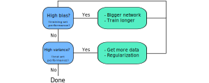

### Motivating Regularization
- A good way to reduce variance in our network is to include more data in our training and test sets
- However, we can't always just go and get more data
- Therefore, we may need to try other approaches in hopes of reducing the variance in our network
- Adding regularization to our network will reduce overfitting

### Defining L2 Regularization
- Up until now, we've defined our cost function as:

$$
J(w,b) = \frac{1}{m} \sum_{i=1}^{m} \mathcal{L}(\hat{y}, y)
$$

- If we add regularization to our cost function, our cost function would look like the following:

$$
J(w,b) = \frac{1}{m} \sum_{i=1}^{m} \mathcal{L}(\hat{y}, y) + \frac{\lambda}{2m} \Vert w \Vert_{2}^{2}
$$

- The additional regularization component can be simplified to:

$$
\Vert w \Vert_{2}^{2} = \sum_{j=1}^{n} w_{j}^{2} = w^{T}w
$$

- This new component can be thought of as a term that shrinks all of the weights so only the largest weights remain
- Consequently, this reduces the amount of overfitting as well
- We can adjust the amount of shrinkage by changing the $\lambda$ term
- This $\lambda$ term is known as the *regularization parameter*
- Increasing $\lambda$ can lead to more shrinkage, meaning there's a better chance we see underfitting
- Decreasing $\lambda$ basically removes this term altogether, meaning the overfitting hasn't been dealt with at all
- Therefore, we typically need to tune our parameter $\lambda$ to find some good medium

### Possibly Adding More Regularized Terms
- Sometimes, we can add a bias term such as the following:

$$
J(w,b) = \frac{1}{m} \sum_{i=1}^{m} \mathcal{L}(\hat{y}, y) + \frac{\lambda}{2m} \Vert w \Vert_{2}^{2} + \frac{\lambda}{2m} \Vert b \Vert_{2}^{2}
$$

- However, this usually doesn't affect our results very much
- This is because $b$ contains a much smaller percentage of parameter values compared to $w$
- For this reason, we usually exclude the bias component $\frac{\lambda}{2m} \Vert b \Vert_{2}^{2}$

### Defining L1 Regularization
- L1 regularization is another form of regularization
- Specifically, L1 regularization is defined as:

$$
J(w,b) = \frac{1}{m} \sum_{i=1}^{m} \mathcal{L}(\hat{y}, y) + \frac{\lambda}{2m} \Vert w \Vert_{1}
$$

- The additional regularization component can be simplified to:

$$
\Vert w \Vert_{1} = \sum_{j=1}^{n} |w_{j}|
$$

- L1 regularization causes $w$ to be sparse
- Meaning, the $w$ vector will include lots of zeroes
- This is because a property of the regularization component $\frac{\lambda}{2m} \Vert w \Vert_{1}$ is the weight values $w$ will shrink all the way to zero
- Some will say this can help with compressing the model
- This is because we may need less memory to store the parameters if they're zero
- However, model compression improves performance only slightly
- Therefore, L2 regularization is typically the most popular regularization technique in practice
- This is only because L1 regularization doesn't have much of an advantage over it

### Using Regularization in Neural Networks
- We're probably wondering how to implement gradient descent using the new cost function
- When we update the weight parameter $w$ during gradient descent, the update with our regularization term will look like:

$$
w = w - \alpha \frac{\partial J}{\partial w}
$$

$$
\frac{\partial J}{\partial w} = (\text{from backprop}) + \frac{\lambda}{m} w
$$

- For each layer, $\frac{\lambda}{m}w$ comes from the derivative of the L2 regularization term $\frac{\lambda}{2m} \Vert w \Vert_{2}^{2}$
- The $(\text{from backprop})$ term represents the $\frac{\partial J}{\partial w}$ term we normally get from performing backpropagation
- In other words, we've calculated the derivative of our cost function $J$ with respect to $w$, then added some regularized term on the end
- We can simplify the above formulas into the following:

$$
w = w - \alpha [(\text{from backprop}) + \frac{\lambda}{m}w]
$$

$$
= w - \frac{\alpha \lambda}{m}w - \alpha(\text{from backprop})
$$

$$
= w(1-\frac{\alpha \lambda}{m}) - \alpha(\text{from backprop})
$$

- We can see $(1-\frac{\alpha \lambda}{m})$ is some constant that is less than $1$
- Essentially, we are updating the weight parameter $w$ using gradient descent as usual
- However, we are multiplying each weight parameter $w$ by some constant $(1-\frac{\alpha \lambda}{m})$ slightly less than $1$
- This prevents the weights from growing too large
- Again, the regularization parameter $\lambda$ determines how we trade off the original cost $J$ with the large weights penalization
- In other words, the $w(1-\frac{\alpha \lambda}{m})$ term causes the weight to decay in proportion to its size
- For this reason, we sometimes refer to L2 normalization as *weight decay*

### Other Ways of Reducing Overfitting
- As we've already mentioned, regularization is a great way of reducing overfitting
- However, we can use other methods to reduce overfitting in our neural network
- Here are a few:
	- Dropout Regularization
		- This is another regularization method
	- Data Augmentation
		- This involves adjusting input images to generate more data
		- Meaning, we could take our input images and flip, zoom, distort, etc.
	- Early Stopping
		- This involves stopping the training of a neural network early
		- Specifically, we're trying to find the optimal number of iterations the provide us with the best parameters

---

### tldr
- An added regularization component can be thought of as a term that shrinks all of the weights so only the largest weights remain
- Consequently, this reduces the amount of overfitting as well
- We can adjust the amount of shrinkage by changing the $\lambda$ term
- This $\lambda$ term is known as the *regularization parameter*
- Increasing $\lambda$ can lead to more shrinkage, meaning there's a better chance we see underfitting
- Decreasing $\lambda$ basically removes this term altogether, meaning the overfitting hasn't been dealt with at all

---

### References
- [Regularizing your Netural Network](https://www.youtube.com/watch?v=6g0t3Phly2M&list=PLkDaE6sCZn6Hn0vK8co82zjQtt3T2Nkqc&index=4)
- [Basic Recipe for Machine Learning](https://www.youtube.com/watch?v=C1N_PDHuJ6Q&list=PLkDaE6sCZn6Hn0vK8co82zjQtt3T2Nkqc&index=3)
- [Difference between Weight Decay and Learning Rate](https://stats.stackexchange.com/questions/29130/difference-between-neural-net-weight-decay-and-learning-rate)
- [Other Ways of Reducing Overfitting](https://www.youtube.com/watch?v=BOCLq2gpcGU&list=PLkDaE6sCZn6Hn0vK8co82zjQtt3T2Nkqc&index=8)
