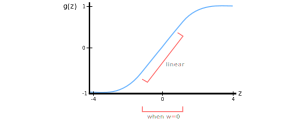

### Motivating Regularization for Overfitting
- Roughly speaking, weights are usually relatively smaller for a model with a large amount of bias (i.e. underfitting)
- Roughly speaking, weights are usually relatively larger for a model with a large amount of variance (i.e. overfitting)
- Regularization attempts to find a happy medium so the weights don't become too large or too small

- We expect our weights to converge to $0$ when there is a lot of noise, and our weights to stray from $0$ when there is signal
- By adding regularization to our model, we are adding some amount of noise that is proportional to our weight
- Since noise makes it harder to pick up on any signal, our data becomes harder to fit as we add more noise
- Therefore, it becomes harder to overfit
- We can control the amount of noise added to our weight by increasing $\lambda$
- Increasing $\lambda$ will shrink the weights to $0$ at a faster rate
- It will take longer for our weight to shrink to zero if our weight is already large, compared to if our weight is small

### Illustrating Effects of Regularization
- Up until this point, we know how our penalty terms $\Vert w \Vert_{1}^{2}$ and $\Vert w \Vert_{2}^{2}$ lead to shrinkage
- However, we're still probably wondering how exactly shrinkage prevents overfitting
- As hinted at previously, if we increase our regularization parameter $\lambda$, our weights start to converge to $0$
- Increasing our regularization parameter will leads to more weights becoming equal to $0$
- This zeroes out the impact of our hidden units
- Meaning, our neural network becomes simplified and smaller

- In practice, these hidden units aren't actually zeroed out
- Instead, they are still used, but have a much smaller effect
- Therefore, we do in fact end up with a simpler network that has the same effect as if we had a smaller network

### Another Illustration of Regularization Effects
- If we increase the regularization parameter $\lambda$, then the weights decrease towards $0$
- This will prevent overfitting, but could cause underfitting if we increase our regularization parameter $\lambda$ too much
- We can notice this issue by taking a closer look at the tanh activation function in our network
- Let's say we're faced with the following:

$$
z^{l} = w^{l}a^{l-1} + b^{l}
$$

$$
a^{l} = tanh(z^{l})
$$

- We know that if $\lambda$ increases by too much, then $w^{l}$ will become very small
- Ignoring the effects of $b^{l}$, we can see that $z^{l}$ will become very small and will take on a small range of values
- Then, the output $a^{l}$ of our tanh function will become relatively linear
- Consequently, linear functions are typically too general and aren't able to fit those complicated, nonlinear decision boundaries we're most likely looking for
- This intuition is true for many other activation functions other than the tanh activation function

---

### tldr
- Roughly speaking, weights are usually relatively smaller for a model with a large amount of bias (i.e. underfitting)
- Roughly speaking, weights are usually relatively larger for a model with a large amount of variance (i.e. overfitting)
- Regularization attempts to find a happy medium so the weights don't become too large or too small

---

### References
- [Why Regularization Reduces Overfitting](https://www.youtube.com/watch?v=NyG-7nRpsW8&list=PLkDaE6sCZn6Hn0vK8co82zjQtt3T2Nkqc&index=5)
- [How Adding Noise Prevents Overfitting](https://stackoverflow.com/questions/59517929/how-does-adding-noise-to-output-avoid-overfitting-on-training-points)
- [Meaning of Weights](https://stats.stackexchange.com/questions/213325/neural-network-meaning-of-weights)
