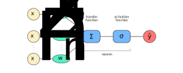
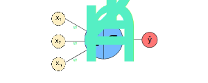

### Introducing Learning Algorithms
- We use *learning algorithms* to tune the weights and biases of a network
- In our case, we could use a learning algorithm to solve for the weights and biases in a perceptron
- To see how learning might work, suppose we make a small change in some weight (or bias) in the network
- What we'd like is for this small change in weight to cause only a small corresponding change in the output from the network
- This property is what makes learning possible

### Motivating Sigmoid Neurons
- If it were true that a small change in a weight (or bias) causes only a small change in output, then we could use this fact to modify the weights and biases to get our network to behave more in the manner we want
- However, perceptrons don't always have this effect
- Specifically, small changes in a weight or bias can can cause large changes in output
- In fact, a small change in the weights or bias of any single perceptron in the network can sometimes cause the output of that perceptron to completely flip (say from 0 to 1)
- We can overcome this problem by introducing a new type of artificial neuron called a *sigmoid* neuron

### Defining Sigmoid Neurons
- Sigmoid neurons are similar to perceptrons, but modified so that small changes in their weights and bias cause only a small change in their output
- A sigmoid neuron takes in several inputs $x_{1}, x_{2}, ..., x_{n}$ 
- A sigmoid neuron returns a single output *between* 0 and 1:

$$
f(z) \in (0,1)
$$

- For example, our output could be $0.685$
- A sigmoid neuron uses a different activation function:

$$
f(z) \equiv \frac{1}{1+e^{-z}}
$$

- Sometimes, we specifically refer to the activation function of a sigmoid neuron as the *sigmoid function*, which can be represented as $\sigma$:

$$
\sigma(z) \equiv \frac{1}{1+e^{-z}}
$$

- Specifically, the output of a sigmoid neuron is the following:
	$$
	\sigma(w \cdot x - b) \equiv \frac{1}{1+e^{-(w \cdot x - b)}}
	$$
	- Where $w$ are our weights
	- Where $b$ is our bias
	- Where $x$ is our input

### Illustrating Sigmoid Neurons
- We can visually represent a sigmoid neuron as the following:
	- Where $w_{i}$ is a weight
	- Where $x_{i}$ is an input
	- Where $\sum$ is the weighted sum function
	- Where the output of this function is $z = w \cdot x - b$
	- Where $\sigma$ is the sigmoid function
	- Where the output of this function is $\sigma(z) = \frac{1}{1+e^{-z}}$
	- Where $y$ is the output

- Then, we can further simplify some of the notation:
	- Where $w_{i}$ is a weight
	- Where $x_{i}$ is an input
	- Where the output of the weighted sum function $\sum$ is the input of the sigmoid function $\sigma$
	- Where $y$ is the output

### The Behavior of Sigmoid Neurons
- The activation function of a perceptron is a step function
- The sigmoid neuron behaves in a similar way to the perceptron
- If $z \equiv w \cdot x + b$ is a large positive number, then $e^{−z} \approx 0$ and so $\sigma(z) \approx 1$
- In other words, when $w \cdot x + b$ is large and positive, the output from the sigmoid neuron is approximately $1$
- On the other hand, if $z \equiv w \cdot x + b$ is very negative, then $e^{−z} \to \infty$ and $\sigma(z) \approx 0$
- In other words, when $w \cdot x + b$ is very negative, the output from the sigmoid neuron is approximately $0$
- This behaviour of a sigmoid neuron closely approximates a perceptron
- It's only when $w \cdot x + b$ is of modest size that there's much deviation from the perceptron model
- This behavior is reflected in the shape of both functions:

### Use-Cases of Sigmoid Neurons
- We can use a sigmoid neuron to represent the average intensity of the pixels of an image
- We can use a sigmoid neuron to represent probabilistic output
- We can also use a sigmoid neuron (with a given threshold) to represent binary output
- In other words, we can set a threshold of $0.5$ to reflect the exact behavior of a perceptron
- Compared to a perceptron, this gives us more flexibility to choose whatever threshold we see fit

---

### tldr
- A neural network without an activation function is just a linear function
- Different activation functions are used if:
	- We want to return outputs in a certain range
	- Use one that is monotonic
	- Use one that has a monotonic derivative
	- Use one that approximates identity near the origin
- A sigmoid neuron is similar to perceptrons, but modified so that small changes in their weights and bias cause only a small change in their output
- A sigmoid neuron returns output in the range of $(0,1)$

---

### References
- [Sigmoid Neurons and Deep Learning](http://neuralnetworksanddeeplearning.com/chap1.html#sigmoid_neurons)
- [Visualizing Partial Derivatives](https://math.stackexchange.com/questions/607942/what-is-the-best-way-to-think-about-partial-derivatives)
