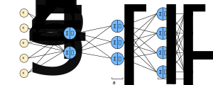

### Motivating Softmax Regression
- Up until now, the only type of classification we've gone over is binary classification
- In other words, we're only able to classify two possible labels
- Sometimes, we may want to classify an observation where multiple classifications exist
- Said another way, we may be interested in multi-classification
- For example, we could predict if an image is a cat, dog, or neither
- We wouldn't use standard regression or binary classification
- Instead, we would want to use *softmax regression*

### Describing Softmax Regression
- Softmax Regression refers to a network where its output layer uses a softmax activation function
- Up until now, our output layer has only included a single neuron
- We do this so we can output a single number, instead of a vector
- For softmax regression, our network's output layer includes $c$ number of neurons
- Here, $c$ represents the number of classes
- For example, we would set $c=3$ if we're trying to predict whether an image is a cat, dog, or neither
- In summary, a network with an output layer that is the softmax activation function will typically return a vector of predictions, instead of a single-number prediction

### Defining Softmax Regression
1. Receive some input
	- Typically, the input of our output layer is the activations from the previous layer $a^{[l-1]}$
	- Here, $a^{[l-1]}$ is a $3 \times 1$ vector
2. Compute our weighted input $z^{[l]}$:
	- Here, $W^{[l]}$ is a $4 \times 3$ matrix
	- And, $b^{[l]}$ is a $4 \times 1$ vector
	- Then, $z^{[l]}$ is a $4 \times 1$ vector

$$
z^{[l]} = W^{[l]} a^{[l-1]} + b^{[l]}
$$

3. Compute the softmax activations $a^{[l]}$:
	- Here, $a^{[l]}$ is a $4 \times 1$ vector

$$
a^{[l]} = \frac{e^{z_{i}^{[l]}}}{\sum_{i=1}^{n}e^{z_{i}^{[l]}}} = \frac{e^{z_{i}^{[l]}}}{\sum_{i=1}^{4}e^{z_{i}^{[l]}}}
$$

### Example of using a Softmax Activation Function
- Let's keep using our example network listed above
- Let's define $z^{[l]}$ as the following:

$$
z^{[l]} = \begin{bmatrix} 5 \cr 2 \cr -1 \cr 3 \end{bmatrix}
$$

- Before computing the softmatrix activations, we should define each individual $e^{z_{i}^{[l]}}$:

$$
e^{z^{[l]}} = \begin{bmatrix} e^{z_{1}^{[l]}} \cr e^{z_{2}^{[l]}} \cr e^{z_{3}^{[l]}} \cr e^{z_{3}^{[l]}} \end{bmatrix} = \begin{bmatrix} e^{5} \cr e^{2} \cr e^{-1} \cr e^{3} \end{bmatrix} = \begin{bmatrix} 148.4 \cr 7.4 \cr 0.4 \cr 20.1 \end{bmatrix}
$$

- We still need to sum those values together:

$$
\sum_{i=1}^{4}e^{z_{i}^{[l]}} = 148.4 + 7.4 + 0.4 + 20.1 = 176.3
$$

- Now, let's compute each individual softmatrix activation $a_{i}^{[l]}$:

$$
a^{[l]} = \begin{bmatrix} \frac{e^{5}}{176.3} \cr \cr \frac{e^{2}}{176.3} \cr \cr \frac{e^{-1}}{176.3} \cr \cr \frac{e^{3}}{176.3} \end{bmatrix} = \begin{bmatrix} 0.842 \cr 0.042 \cr 0.002 \cr 0.114 \end{bmatrix}
$$

### Intuition behind Softmax Learning
- In a network without any hidden layers, an output layer using a softmax activation function creates linear decision boundaries
- There would be $c-1$ number of linear decision boundaries
- As we add hidden layers to our network, we would not have linear decision boundaries anymore
- Instead, our network would use non-linear decision boundaries
- These non-linear decision boundaries are useful for understanding non-linear relationships between the $c$ number of classes
- Also, we should notice that each value in our softmax output vector represents a probability
- Specifically, we could add up these values and they'd add up to $1$
- Essentially, softmax converts the values given by $z^{[l]}$ into probabilities represented by $a^{[l]}$
- Therefore, softmax becomes logistic regression when $c=2$

---

### tldr
- Softmax regression is used when we're interested in multi-classification
- Softmax regression refers to a form of regression on a network with an output layer that is the softmax activation function
- A network with an output layer that is the softmax activation function will typically return a vector of predictions, instead of a single-number prediction
- The number of neurons in the output layer will be equal to the number of classes $c$ that we're predicting on

---

### References
- [Softmax as Clustering](https://arxiv.org/abs/2001.01987)
- [Training Softmax Classifier](https://www.youtube.com/watch?v=ueO_Ph0Pyqk&list=PLkDaE6sCZn6Hn0vK8co82zjQtt3T2Nkqc&index=32)
- [Softmax Regression](https://www.youtube.com/watch?v=LLux1SW--oM&list=PLkDaE6sCZn6Hn0vK8co82zjQtt3T2Nkqc&index=31)
