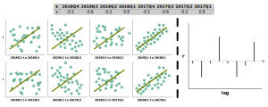

### Describing Time-Series Patterns
- A *trend* exists when there is a long-term change in the data
    - This long-term change can be non-linear or linear
- A *seasonal trend* refers to a trend consisting of seasonal factors
    - E.g. time of the year or the day of the week
    - Seasonality always occurs over a fixed and known time interval and frequency
- A *cycle* refers to a trend that doesn't have a fixed frequency
    - E.g. a business cycle may include fluctuations lasting at least 2 years
    - E.g. a seasonality are cycles repeating regularly over time

### Illustrating Seasonal Plots
- A seasonality chart is similar to a simple time-series chart
- However, the data is grouped into years and plotted against individual *seasons*
- By plotting seasonal plots, we can determine if:
    - A seasonality trend exists in our data
    - Any outliers exist
- The following is an example of this chart:

### Summarizing Autocorrelation in Time-Series Data
- Correlation measures the strength of a linear relationship between two variables
- Autocorrelation measures the strength of a linear relationship between lagged values of a variable
    - Roughly, it determines whether there are trends amongst the values of a particular variable (across an indexed time variable)
- In other words, they can be used for checking randomness in data values across time
- Typically, autocorrelation is measured for lagged values using *autocorrelation coefficients*
    - These are calculated similarly as simple correlation coefficients

$$
r_{k} = \frac{\sum_{t=k+1}^{T} (y_{t} - \bar{y}) (y_{t-k} - \bar{y})}{\sum_{t=1}^{T} (y_{t} - \bar{y})^{2}}
$$

### Illustrating Lag Plots and Autocorrelation
- Lag plots illustrate $y_{t}$ plotted against $y_{t-k}$ for different $k$ time values
- Lag plots help by showing if there is any autocorrelation or not
- Autocorrelation is a measure of the linear relationship between values at a specific time value and its values at previous time values
- The following $8$ autocorrelation coefficients correspond to bars in the correlogram:

### Interpreting Correlogram for Time-Series Data
- A correlogram plots the autocorrelation coefficients on the y-axis
- A correlogram plots lagged time-values $t-k$ with respect to an initial time-value $t$
- A correlogram can have the following applications:
    - Is the data random?
    - Are observations correlated with recent observations?
    - Is there a seasonality trend?
    - Is there white noise?
- Suppose $k=1$, then we may observe the correlation of:
    - October values with November values
    - Or November values with December values
    - Etc.
- Suppose $k=2$, then we may observe the correlation of:
    - September values with November values
    - Or October values with December values
    - Or November values with January values
    - Etc
- In the following chart, there are high positive correlations in the first chart
    - These correlations slowly decline with increasing lags
    - Indicating, these is a high amount of autocorrelation, especially in recent time-points
    - Which, we'll need to account for in modeling
- In the following chart, there are small correlations in the second chart
    - Thus, there aren't any time trends

### Illustrating White Noise in Time-Series Charts
- Time-series values $y_{t}$ without any autocorrelation is known as white noise
- In other words, the values $y_{t}$ are randomly distributed across time
    - Thus, aren't correlated with a time variable
- The second chart in the above image is an example of white noise 

### References
- [Wiki about Correlograms](https://en.wikipedia.org/wiki/Correlogram)
- [Reading a Correlogram Chart](https://stats.stackexchange.com/a/182784/278990)
- [Textbook for Forecasting: Principles and Practices](https://otexts.com/fpp2/graphics.html)