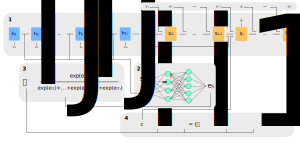

### Introducing an Encoder-Decoder Model
- An encoder-decoder model is a type of RNN
- A popular encode-decode model is know as Seq2Seq
- The Seq2Seq model was introduced by Google in 2014
- The input of a Seq2Seq model is sequence of items
    - E.g. a sequence of words
- Then, it outputs another sequence of items (such as words)
- To do this, it maps variable-length sequences to fixed-length memory
- Meaning, the inputs and outputs don't need to have matching lengths
- This feature is why Seq2Seq models work so well with machine translation and other popular NLP tasks
- In Seq2Seq models, LSTMs and GRUs are typically used to avoid any problem with vanishing and exploding gradients

### Defining Encoder-Decoder Models
- An encoder-decoder is divided into two separate components:
    - An encoder
    - A decoder
- An encoder outputs the context of the input sequence
    - The context is a hidden state vector
    - This vector is the input of the decoder
- Then, the decoder predicts the output sequence
- The typical architecture of a Seq2Seq model is a many-to-many RNN
- The following diagram illustrates this architecture:

### Describing Encoder-Decoder Models
- Since this task is sequence-based, the encoder and decoder tend to use some form of vanilla RNN, LSTM, or GRU
- In most cases, the hidden state vector is set to:
    - A power of $2$
    - A large number (e.g. $256$, $512$, $1024$)
- The size of this hidden state vector represents:
    - The complexity of the complete sequence
    - The domain of the complete sequence

### A Drawback and Solution of Encoder-Decoder Models
- The output of the decoder relies heavily on the output of the encoder
- In other words, the decoder is heavily dependent on the context
- This makes it challenging for the model to deal with long sentences
- Specifically, the probability of losing the context of the initial inputs by the end of the sequence is high for longer input sequences
- However, we can use a technique to maintain more of the context of the initial inputs by the end of the input sequence
- Specifically, a technique called *attention* can help solve this problem
- Attention allows the model to focus on different parts of the input sequence at every stage of the output sequence
- This allows the context to be preserved from beginning to end

### Introducing Alignment and Attention
- Attention is proposed as a method to both align and translate
- Alignment is the process of identifying which parts (e.g. words) of the input sequence are relevant to each part (e.g. word) in the output
- Translation is the process of using the relevant parts (e.g. words) of the input sequence to select the appropriate output
- For a vanilla Encoder-Decoder model, we encoded an input sequence into a single fixed context vector
- For an attention model, we encode an individual context vector for each output at each time step

### Illustrating the Mathematics behind Alignment
- Suppose we have an encoder-decoder model
- The encoder is a bidirectional LSTM, and our decoder is an LSTM
- An illustration of this model is taken from its original paper:

- Each context vector $c_{i}$ depends on:
    - A sequence of annotations $h_{j}$
    - A set of weights for each annotation $\alpha_{ij}$

$$
c = \sum^{T^{y}}_{i=1} \sum^{T^{x}}_{j=1} \alpha_{ij} h_{j}
$$

$$
\alpha_{ij} = \frac{\exp(e_{ij})}{\sum_{j=1}^{T_{x}}\exp(e_{ij})}
$$

$$
e_{ij} = a(s_{i-1}, h_{j})
$$

- Annotations $h_{j}$ and weights $\alpha_{ij}$ have the following notations:
    - $h_{j}$: Encoder hidden state associated with the $j^{th}$ input word
    - $s_{i}$: Decoder hidden state associated with the $i^{th}$ output word
    - $\alpha_{ij}$: Probability that the decoder word $y_{i}$ is aligned to $x_{j}$
    - $T^{x}$: The number of words in the input sequence
    - $T^{y}$: The number of words in the output sequence
    - $a$: An alignment model scoring how well the $j^{th}$ input word matches with the $i^{th}$ output word
- Intuitively, $\alpha_{ij}$ is the importance of the annotation $h_{j}$
- Intuitively, $c_{i}$ is an expected annotation computed as a weighted sum of all the annotations $h_{j}$ and their weights
- Note, $h_{j}$ has a strong focus on the words surrounding the $j^{th}$ word of the
input sequence
    - This explains why our model wouldn't perform well with long input sentences without alignment

### Further Intuition about Learning Attention Scores
- For this example, we'll focus on calculating alignment scores for the $i^{th}$ hidden layer of the decoder $s_{i}$ during forward propagation
    - There are $T_{x}$ encoder hidden states and $T_{y}$ decoder hidden state

$$
s_{i} = f(s_{i-1}, y_{i-1}, c_{i})
$$

- The basic forward propagation steps of the decoder can be summarized as:
- First, we'll get all of the hidden states $h_{1}, ..., h_{T_{x}}$ from the encoder
    - Also, we'll get only the prior hidden state $s_{i-1}$ from the decoder
- Second, train an alignment model designed as a simple perceptron
    - This perceptron outputs alignment scores $e_{ij}$
    - The model should be designed so it can be evaluated a $T_{x} \times T_{y}$ number of times for each sentence pair of lengths $T_{x}$ and $T_{y}$
    - A larger alignment score $e_{ij}$ indicates the $j^{th}$ encoder hidden state has a greater influence on the output $s_{i-1}$

$$
e_{ij} = a(s_{i-1}, h_{j})
$$

- Third, we'll run the alignment scores through a softmax function
    - This softmax function outputs attention scores $\alpha_{ij}$
    - Each attention score is a number between $0$ and $1$
    - $\alpha_{ij}$ represents the amount of *attention* $y_{i}$ should pay to $h_{j}$
    - It can also be interpreted as the importance of the encoder annotation $h_{j}$ w.r.t. the previous decoder hidden state $s{i−1}$

$$
\alpha_{ij} = \frac{\exp(e_{ij})}{\sum_{j=1}^{T_{x}}\exp(e_{ij})}
$$

- Fourth, we'll compute the context vector $c_{i}$ associated with the $i^{th}$ decoder hidden layer
    - This $i^{th}$ context vector is the expected annotation over all the annotations with probabilities $\alpha_{ij}$
    - The context vector $c_{i}$ is fed into the decoder

$$
c_{i} = \sum^{T^{x}}_{j=1} \alpha_{ij} h_{j}
$$

- The specific function $f$ for $s_{i} = f(s_{i-1}, y_{i-1}, c_{i})$ is the following:

$$
s_{i} = (1-z_{i}) \circ s_{i-1} + z_{i} \circ \tilde{s}_{i} \\
\tilde{s}_{i} = \tanh(WEy_{i-1} + U(r_{i} \circ s_{i-1}) + Cc_{i}) \\
z_{i} = \sigma(W_{z}Ey_{i−1} + U_{z}s_{i−1} + C_{z}c_{i}) \\
r_{i} = \sigma(W_{r}Ey_{i−1} + U_{r}s_{i−1} + C_{r}c_{i})
$$

- Where $r$ refers to the reset gate
- WHere $z$ refers to the update gate
- Where $c_{i}$ refers to the context vector

### Summarizing Alignment Modeling and Attention Scores
- Intuitively, the attention scores are the output of another neural network (i.e. perceptron) trained alongside the Seq2Seq model
    - This perceptron is the alignment model
    - $e_{ij}$ are the final activations of the hidden layer of the perceptron
    - Inside the perceptron, $\alpha_{ij}$ is the output of the softmax function
- The alignment model is trained jointly with the Seq2Seq model initially
- The alignment model scores how well an input matches with the previous output represented by $e_{ij}$ alignment scores
    - Here, input is represented by encoder hidden state $h_{j}$
    - Here, output is represented by decoder previous hidden state $s_{i-1}$
    - It does this for every input with the previous output
- Then, a softmax is taken over all these scores
    - The resulting number is the attention score $\alpha_{ij}$ for each input $j$

### Illustrating Attention Weights
- Again, $\alpha_{ij}$ represent the attention weights
- The magnitude of weight $\alpha_{ij}$ can be interpreted as the amount of *attention* $y_{i}$ should pay to $h_{j}$
- We'll find the attention for corresponding input and expected output words tend to be high
- Going forward, we may refer to these terms as the following:
    - `Query:` A word from the input sequence inputted into the encoder
    - `Key:` A translated word outputted from the decoder
    - `Value:` An attention score associated with the query and key
- In a matrix format, these terms can be represented as:
    - A query is an individual column
    - A key is an individual row
    - A value is an individual cell
- Queries, keys, and values are used for information retrieval inside the attention layer
- The following diagram visualizes a matrix of $\alpha_{ij}$ when testing a single observation from the testing set:

### Training Attention Models using Teacher Forcing
- Teacher forcing is a method used in attention models
- It replaces the input $\hat{y}_{i}$ with $y_{i}$ for each layer in the decoder
- Teacher forcing provides the following benefits:
    - More accurate predictions
    - Faster training
- An attention model with teacher forcing looks like this:

### Evaluating NLP Models using BLEU
- Common scores used to evaluate NLP models are the following:
    - Bilingual evaluation understudy (or BLEU)
    - Recall-oriented understudy for gisting evaluation (or ROUGE)
- The BLEU score is an algorithm used to evaluate the quality of machine-translated
- It compares candidate text to one or more reference translations
    - A candidate refers to the predicted output of our model
    - A reference refers to the actual output of our model
- The BLEU score isn't able to account for:
    - Word meaning
    - Grammatical structure
- Usually, a BLEU score closer to $1$ suggests a better NLP model, whereas a BLEU score closer to $0$ suggests a worse NLP model
- A BLEU score is calculated using:
    - Candidates based on an average of n-gram precision
    - References based on an average of n-gram precision
- Usually, the n-gram is uni, bi, tri, or four-gram

### Illustrating the Use of a BLEU Score
- For this example, we'll only use uni-gram candidates and references
- `Source:` Le professeur est arrive en retard
- `Reference:` The teacher arrived late
    - The bleu score is $\frac{}{}$
- `Candidate:` The professor was delayed
    - The bleu score is very small
- `Candidate:` The teacher was late
    - The bleu score is relatively small
- `Candidate:` The teacher arrived late
    - The bleu score is very large

### Evaluating NLP Models using ROGUE
- ROGUE is a recall-oriented score
- Meaning, it places more importance on how much of the reference appears in predictions
- Originally, ROUGE was developed to evaluate the quality of machine summarized texts
- It is also useful for evaluating machine translation as well
- It calculates precision and recall by counting the n-gram overlap between candidates and their references

### Sampling and Decoding using Attention Models
- After performing the calculations for the encoder hidden states, we're ready to predict tokens in the decoder
- To do this, we can do one of the following approaches:
    - Choose the most probable token
    - Take a sample from a distribution
- In particular, we have the following specific methods:
    - Random sampling
    - Greedy decoding
    - Beam decoding
    - Minimum bayes risk (MBR)

### Describing Greedy Decoding
- Greedy decoding is the simplest way to decode predictions
- Specifically, it selects the most probable word at every step
- However, longer sequences can put us in the following situation:

$$
\text{Reference: I am hungry tonight} \\
\text{Candidate: I am am am}
$$

- For shorter sequences, this approach can be fine
- In most cases, knowing upcoming tokens improves predictions

### Describing Random Sampling
- Another option used in decoding is random sampling
- Random sampling includes the following steps:
    - Calculate probabilities for each word
    - Sample words based on probabilities for each output
- This creates a problem: the outputs chosen can become too random
- A solution for this is to assign more weight to the words with a higher probability and less weight to the others

### Including Temperature in Random Sampling
- In sampling, temperature is an adjustable parameter
- It allows for more or less randomness in our predictions
- It's measured on a scale of $0$ to $1$
- Indicating, a low temparture provides less randomness
- Whereas, a high temperature provides more randomness
- A lower temperature indicates more emphasis on the probabilities
- A higher temperature indicates more emphasis on randomness

### Motivating Beam Search
- As a reminder, the greedy decoding algorithm selects a single best candidate as an input sequence for each time stamp
    - The encoded input sequence becomes the input of the decoder
    - Then, attention for each decoded word is calculated by using the actual translations from previous time steps
- Choosing just one best candidate might be suitable for the current time step
- However, when we construct the full sentence, it's maybe a sub-optimal choice
- Thus, beam search can be used to construct more optimal sentences

### Describing Beam Search
- Beam search decoding is a more exploratory alternative for decoding
- It uses a type of restricted breadth-first search to build a search stream
    - This search restriction is the beam width parameter $B$
    - It limits the number of branching paths
- Instead of offering a single best output like in greedy decoding, beam search selects multiple options based on conditional probability
- At each time step, beam search selects a $B$ number of best alternatives with the highest probability as the most likely choice for a time step
- Once these $B$ possibilities are chosen, we can choose the one with the highest probability
- Essentially, beam search doesn't look only at the next output
- Instead, it selects several possible options based on a beam width

### Problems with Beam Search
- However, beam search decoding still runs into issues
- Specifically, beam seach performs poorly when the model learns a distribution that isn't useful or accurate in reality
- It can use single tokens in a problematic way
    - Especially, for unclean corpora
- Suppose our training data represents a speech corpus
- A single filler word (e.g. um) appearing in every sentence throws off an entire translation
    - Since, it would have a probabilitiy of $1 \%$ for each sentence

### Minimum Bayes Risk as an Alternative to Beam Search
- So far, we've used random sampling to select a probable token
- Minimum bayes risk can improve the performance of random sampling
- Roughly, it includes these additional steps:
    - Gather a number of random samples
    - Compare them against each other by assigning a similarity score to each sample (e.g. ROGUE score)
- In the end, we'll be able to determine the best performing sample
- Specifically, MBR can be implemented as the following:
    - Collect several random samples
    - Assign a similarity score (e.g. ROGUE) to each sample
    - Select the sample with the highest similarity score
 - For example, if we had $3$ samples, we'd calculate a similarity score for the following pairs of samples:
    - Sample 1 and sample 2
    - Sample 1 and sample 3
    - Sample 2 and sample 3

### References
- [Stanford Deep Learning Lectures](http://cs224d.stanford.edu/lectures/)
- [Stanford Lecture about LSTMs](http://cs224d.stanford.edu/lectures/CS224d-Lecture9.pdf)
- [Article about Encoder-Decoder Models](https://towardsdatascience.com/day-1-2-attention-seq2seq-models-65df3f49e263)
- [Video about Attention Model Intuition](https://www.youtube.com/watch?v=SysgYptB198)
- [Video about the Details of Attention Models](https://www.youtube.com/watch?v=quoGRI-1l0A)
- [How Attention is Calculated during Trained](https://ai.stackexchange.com/a/20178)
- [Post about Attention Mechanism](https://ai.stackexchange.com/a/21404)
- [Paper about Alignment and Attention Models](https://arxiv.org/pdf/1409.0473.pdf)
- [Post about Attention with Recurrent Neural Networks](https://machinelearningmastery.com/how-does-attention-work-in-encoder-decoder-recurrent-neural-networks/)
- [Using Teacher Forcing in Recurrent Neural Networks](https://machinelearningmastery.com/teacher-forcing-for-recurrent-neural-networks/)