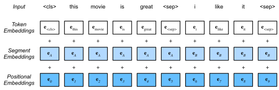
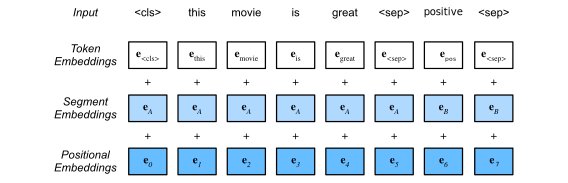

### History of BERT and Other NLP Models
- In the early stages of NLP, we simply wanted to predict the next word in a sentence
- To do this, we used a continuous bag of words (CBOW) model
    - This model is limited to classification based on the input words within a fixed-length sliding window
    - Unfortunately, this model excludes the use of many useful context words and relationships with other words in the sentence
- Then, ELMo was created in 2018 by researchers at the Allen Institute
    - This model is a bidirectional LSTM
    - Implying, words from the left and right are considered
    - This model is able to entirely capture context words and relationships
    - However, it still suffered from capturing context in longer sentences
- Later in 2018, OpenAI introduced the GPT model
    - There are $3$ versions of GPT: GPT-1, GPT-2, and GPT-3
    - All three models are a transformer model
    - This model only includes a decoder (no encoders included)
    - This model only uses causal attention
    - Unfortunately, each GPT model is only unidirectional
    - Thus, we can't capture context both leftward and rightward of our target word in a sentences
- In 2019, Google released the BERT model
    - This model is a bidirectional transformer
    - Implying, words from the left and right are considered
    - This model is able to entirely capture context words and relationships
    - This model only includes an encoder (no decoders included)
    - This model doesn't suffer from capturing context in longer sentences
    - This model can do the following tasks:
        - Next sentence prediction
        - Multi-mask language modeling:

$$
\text{... on the \_ side \_ history ... } \to \boxed{Model} \to \text{ right, of}
$$

- Around the start of 2020, T5 was introduced by Google
    - This model is a bidirectional transformer
    - Implying, words from the left and right are considered
    - This model is able to entirely capture context words and relationships
    - This model includes both an encoder and decoder
    - This model doesn't suffer from capturing context in longer sentences
    - This model can do multi-task learning:
        - This includes doing multiple different tasks on the same model
        - Meaning, we can have a model perform text classification and question answering based on a given label input by the user

### Defining Bidirectional Encoder Representations
- This model is also referred to as BERT
- As stated previous, it is a transformer model
- Specifically, it uses bidirectional attention for its attention mechanism
- It also uses positional embeddings to collect information about the positions between words
- Since it has already been pre-trained by Google, we can use BERT for transfer learning
- At a high-level, the architecture is designed around the following steps:
    1. Input word embeddings into BERT
    2. Pass embeddings through to pre-trained encoder-decoder transformer blocks
    3. Receive output words as predictions
- The default BERT architecture has the following traits:
    - $12$ layers ($12$ transformers blocks)
    - $12$ attention heads
    - $110$ million parameters

### Applications of the BERT Network
- Google pre-trained BERT using the following tasks:
    - Masked language modeling
    - Next sentence prediction
- Thus, if we're only interested in using the pre-trained network, we can do the following:
    - Masked language modeling
    - Next sentence prediction
- However, if we're interested in fine-tuning the pre-trained network, we can also do the following:
    - Text classification (e.g. sentiment analysis)
    - Named-entity recognition (NER)
    - Multi-genre natural language inference (MNLI)
    - Question answering (SQuAD)
    - Sentence paraphrasing
    - Text summarization (e.g. article summaries)
- We can see fine-tuning BERT has the following benefits:
    - Less time required for training the fitted model
    - Can effectively adjust the task using a smaller dataset
    - Only requires minimal task-specific adjustments to use a wider variety of tasks

### Describing the Pre-Training Strategy for BERT
- BERT has been pre-trained on:
    - BooksCorpus data set ($11038$ unpublished books)
        - Containing $800$ million words
    - English Wikipedia data set
        - Containing $2500$ million words
- Pre-training BERT is composed of two tasks:
    - Masked language modeling
        - This encodes bidirectional context for representing words
    - Next sentence prediction
        - This models the logical relationship between text pairs
- By pre-training using the tasks above, the model attains a general sense of the language
- When pre-training, masked language modeling involves the following:
    - Choose $15 \%$ of the tokens at random
        - Mask them $80 \%$ of the time
        - Replace them with a random token $10 \%$ of the time
        - Keep the token as-is $10 \%$ of the time
- There can be multiple masked spans in a sentence

### Describing Input Representations for BERT
- The input of a BERT model depends on the task of interest
    - Tasks like masked language and next sentance modeling were pre-trained on BERT
        - Thus, there isn't any fine-tuning necessary for training or testing our own next-sentance model with our own inputs
    - Tasks like sentiment analysis require some fine-tuning
    - Regardless of task, the embeddings of the input sequence processed by BERT are the sum of the token embeddings, segment embeddings, and positional embeddings
    $$
    e_{\text{bert}}^{<i>} = e_{\text{token}}^{<i>} + e_{\text{segment}}^{<i>} + e_{\text{positional}}^{<i>}
    $$

### Defining Input Representations for BERT
- For tasks like masked language and next sentence modeling:
    - Training can run on the pre-trained model without fine-tuning
    - The input is an array of tokenized words from two different sentences:
        - Starting with a `<cls>` token
        - Sentance $a$ is separated by sentence $b$ using a `<sep>` token
        - Ending with a `<sep>` token
    - The following is an example of this input:
    $$
    \text{<cls> } t_{a1}, t_{a2} \text{ <sep> } t_{b1}, t_{b2} \text{ <sep>}
    $$
    - Here, tokens from sentence $a$ are $t_{ai}$
    - And, tokens from sentence $b$ are $t_{bj}$

- For tasks like text classification and sentiment analysis:
    - Training must run on the pre-trained model with fine-tuning
    - The input is an array of tokenized words from one sentence and its corresponding sentiment:
        - Starting with a `<cls>` token
        - A sentance is separated by its sentiment using a `<sep>` token
        - Ending with a `<sep>` token
    - The following is an example of this input:
    $$
    \text{<cls> } t_{1}, t_{2} \text{ <sep> } s_{1}, s_{2} \text{ <sep>}
    $$
    - Here, tokens from our sentence are $t_{i}$
    - And, sentiments from our sentence are $s_{i}$

### Describing the Objective of BERT
- For the multi-mask language model, a cross entropy loss function is used to predict the masked word or words
- For the next-sentence prediction model, a binary loss function is used to predict whether a given sentence should follow a target sentence
- Both of these loss outputs are added to each other to produce a final loss output

### Defining the GLUE Benchmark
- The GLUE benchmark stands for *general language understanding evaluation*
- The GLUE benchmark is one of the most popular benchmarks in NLP
- It is used to train, test, and analyze NLP tasks
- It is a collection of benchmark tools consisting of:
    - A benchmark of nine different language comprehension tasks
    - An ancillary data set
    - A platform for evaluating and comparing the models
- It is used for various types of NLP tasks:
    - Verifying whether a sentence is grammatical
    - Verifying the accuracy of sentiment predictions
    - Verifying the accuracy of paraphrasing text
    - Verifying the similarity between two texts
    - Verifying whether two questions are duplicates
    - Verifying whether a question is answerable
    - Verifying whether a question is a contradiction
- Usually, it is used with a leaderboard
    - This is so people can see how well their model performs compared to other models on a dataset
- The GLUE benchmark has the following advantages:
    - The GLUE benchmark is model-agnostic
        - Doesn't matter if we're evaluating a transformer or LSTM
    - Makes use of transfer learning
    - Most research uses the GLUE benchmark as a standard

### References
- [Stanford Deep Learning Lectures](http://cs224d.stanford.edu/lectures/)
- [Stanford Lecture about LSTMs](http://cs224d.stanford.edu/lectures/CS224d-Lecture9.pdf)
- [Lecture about Types of Transfer Learning](https://www.coursera.org/learn/attention-models-in-nlp/lecture/qMRXX/transfer-learning-in-nlp)
- [Lecture about the History of Neural Networks in NLP](https://www.coursera.org/learn/attention-models-in-nlp/lecture/iPUp8/elmo-gpt-bert-t5)
- [Lecture about Defining the BERT Model](https://www.coursera.org/learn/attention-models-in-nlp/lecture/lZX7F/bidirectional-encoder-representations-from-transformers-bert)
- [Lecture about Intuition of BERT Tasks](https://www.coursera.org/learn/attention-models-in-nlp/lecture/1g8LM/bert-objective)
- [Lecture about BERT Applications](https://www.coursera.org/learn/attention-models-in-nlp/lecture/EMBvt/fine-tuning-bert)
- [Textbook Chapter about BERT](https://d2l.ai/chapter_natural-language-processing-pretraining/bert.html)
- [Textbook Chapter about Pre-Training BERT](https://d2l.ai/chapter_natural-language-processing-pretraining/bert-pretraining.html)
- [Post about Pre-Training and Fine-Tuning Networks](https://stats.stackexchange.com/a/193451)
- [Paper about Alignment and Attention Models](https://arxiv.org/pdf/1409.0473.pdf)