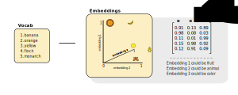
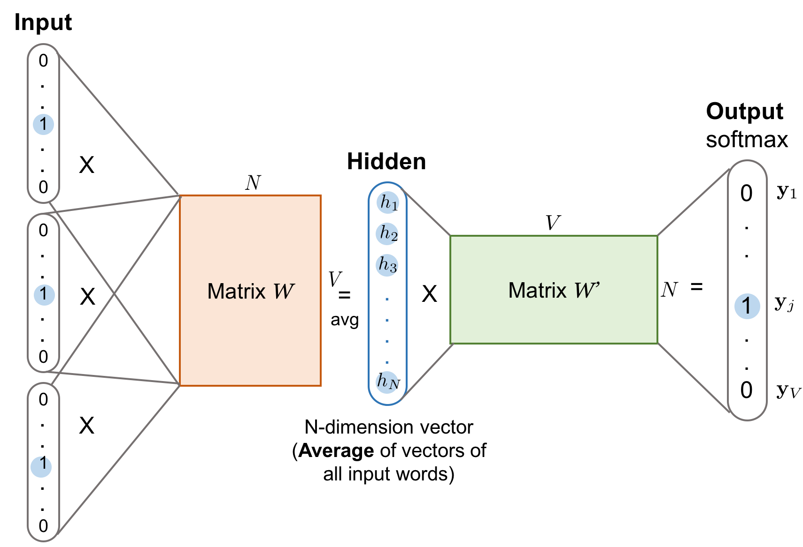

### Introducing Word Embeddings
- A word embedding is a vectorial representation of a word
- A word embedding is made up of trainable similarity values
- The length of a word embedding is the number of words in our vocabulary
- The number of word embeddings is an adjustable hyperparameter
    - It refers to the number of contextual traits we're interested in learning about our words
- In the following example, we only learn $3$ word embeddings:

- A word embedding can have any of the following interpretations:
    - It uncovers a semantic meaning of the words in our vocabulary
    - It approximates the similarity of certain words in our vocabulary
    - It represents a hidden semantic relationship
- For example, a word embedding may have similarly large values for:
    - Kitten and Cat
    - Pizza and Sandwich
    - House and home
- Specifically, a word embedding has the following properties:
    - It is a vector of (non-binary) numeric values
    - It has a size equal to the number of words in the vocabulary

### Motivating Word Embeddings
- Machine learning algorithms require words to be in vector format
- So, we must find a way to convert free-text words into numeric values
- One of the simplest conversion techniques is one-hot encoding:

$$
\text{Corpus} = [\text{banana}, \text{orange}, \text{yellow}]
$$

$$
\text{Vocab} = [\text{banana}, \text{orange}, \text{yellow}]
$$

$$
encode(\text{Vocab}) = \begin{bmatrix} 1 & 0 & 0 \\ 0 & 1 & 0 \\ 0 & 0 & 1 \end{bmatrix}
$$

- The one-hot encoding method is inefficient for two related reasons:
    - The vectors become sparse
    - The number of dimensions grows very large
    - They lack any semantic meaning
- Instead, word embeddings can be learned
- Then, they can maintain the following traits:
    - They aren't sparse
    - The number of dimensions are adjustable
    - They carry some semantic meaning
- Then, a word embedding becomes an efficient representation of the words in a vocabulary
- The following is an example of $2$ word embeddings:

$$
\text{Corpus} = [\text{banana}, \text{orange}, \text{yellow}]
$$

$$
\text{Vocab} = [\text{banana}, \text{orange}, \text{yellow}]
$$

$$
embed(\text{Vocab}) = \begin{bmatrix} 0.9 & 0.7 \\ 0.8 & 0.2 \\ 0.1 & 0.8 \end{bmatrix}
$$

### Describing Word Embeddings
- As stated already, the size of a word embedding equals the number of words in the vocabulary
- The number of word embeddings is an adjustable hyperparameter
- Adding additional word embeddings to a model will capture more context about the words
- However, adding additional word embeddings will slow down training
- Contextual information is useful for learning meaning and relationships of words
- This is because similar words typically appear in similar context
- In general, there are two approaches for learning word embedding:
    - Count-Based Models
    - Context-Based Models

### Describing Count-Based Models
- These models rely on a co-occurrence (or word frequency) matrix
- It assumes that words in the same contexts share similar or related semantic meanings
- The model maps co-occurrences between neighboring words down to small and dense word vectors
- The following are examples of count-based models:
    - PCA
    - Topic models
    - Neural probabilistic language models

### Describing Context-Based Models
- Context-based models predict a word given its neighbors
- The weights in the word vectors are model parameters
- As a result, the best vector representation of each word is learned during the model training process

### Defining a Skip-Gram Context-Based Model
- There is a sliding window of fixed size moving along a sentence
    - Where, the word in the middle is the *target*
    - Where those words on its left and right within the sliding window are the *context words*
- The skip-gram model is trained to predict the probabilities of a word being a context word for a given target
- The following example includes observations with:
    - A target word
    - The associated context words as training samples
    - The associated 5-word sliding window along the sentence

> The man who passes the sentence should swing the sword.

| Sliding Window (n=5)                  | Target   | Context                        |
| ------------------------------------- | -------- | ------------------------------ |
| [the, man, who]                       | [the]    | [man, who]                     |
| [the, man, who, passes]               | [man]    | [the, who, passes]             |
| [the, man, who, passes, the]          | [who]    | [the, man, passes, the]        |
| [man, who, passes, the, sentence]     | [passes] | [the, man, the, sentence]      |
| ...                                   | ...      | ...                            |
| [sentence, should, swing, the, sword] | [swing]  | [sentence, should, the, sword] |
| [should, swing, the, sword]           | [the]    | [should, swing, sword]         |
| [swing, the, sword]                   | [sword]  | [swing, the]                   |

- Each context-target pair is treated as a new observation in the data
- For example, the target word *swing* produces four training samples:
    - (*swing*, *sentence*)
    - (*swing*, *should*)
    - (*swing*, *the*)
    - (*swing*, *sword*)

### Architecture of Skip-Gram Context-Based Model
- We're given a vocabulary size **V**
- We learn word embedding vectors of size **N**
- The model learns to predict one context word (output)
- To do this, the model uses one target word (input) at a time

- Both input word $w_{i}$ and the output word $w_{j}$ are one-hot encoded into binary vectors $x_{i}$ and $y_{j}$ of size **V**
- Here, $W$ represents the word embedding matrix of size $V \times N$
- Multiplying $x_{i}$ and $W$ outputs the embedding vector of the input word $w_{i}$
    - Located in the $i^{th}$ row of $W$
    - The goal of this weight matrix is to squeeze the one-hot encoded vectors into a lower dimensional representation
- This newly discovered embedding vector forms the hidden layer
    - This embedding vector has $N$ dimensions
- Now, we have another word context matrix $W'$ of size $N \times V$
    - This matrix encodes the meanings of words as context
    - The goal of this weight matrix is to provide context to the word embeddings
- Multiplying the hidden layer and $W'$ outputs the one-hot encoded vector $y$
- Note, the $W$ and $W'$ try to achieve different things

### Defining a Continuous Bag-of-Words Context-Based Model
- The Continuous Bag-of-Words (CBOW) also learns word vectors
- Recall, the skip-gram model predicts context words given a target
- Inversely, the CBOW model predicts a target word given context words

- Word vectors of multiple context words are averaged to get a fixed-length vector as in the hidden layer
- In other words, we average the word vectors, since there are multiple contextual words $w$
- Specifically, $w$ is the input vector and the matrix $W$ multiplied together
- Because the averaging stage smoothes over a lot of the distributional information, some people believe the CBOW model is can perform as well on a small dataset

### References
- [Learning Word Embedding Blog Post](https://lilianweng.github.io/lil-log/2017/10/15/learning-word-embedding.html)
- [Paper about Word Representations in Vector Space](https://arxiv.org/pdf/1301.3781.pdf)
- [Difference between Weight Matrices in Word2Vec](https://datascience.stackexchange.com/a/29161/93566)