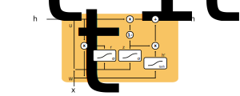

### Introducing Gated Recurrent Units
- A GRU is a type of RNN
- GRUs help preserve information associated with previous nodes
- Said another way, GRUs decide how to update the hidden state
- Vanilla RNNs lose relevant information for long sequences of words
- Whereas, GRUs don't suffer this problem

### Defining the Architecture of Gated Recurrent Units
- In general, a GRU cell consists of $4$ components:
    - **Reset gate:** $r_{t} = \sigma(W_{r}x_{t} + U_{r}h_{t-1})$
        - $x_{t}$ represents the current information
        - $h_{t-1}$ represents the previous information
        - $W_{r}$ represents how much current information is weighted
        - $U_{r}$ represents how much previous information is weighted
    - **Update gate:** $z_{t} = \sigma(W_{z}x_{t} + U_{z}h_{t-1})$
        - $x_{t}$ represents the current information
        - $h_{t-1}$ represents the previous information
        - $W_{z}$ represents how much current information is weighted
        - $U_{z}$ represents how much previous information is weighted
    - **New memory content:** $h'_{t} = \tanh(W_{h}x_{t} + r_{t} \circ U_{h}h_{t-1})$
        - $x_{t}$ represents the current information
        - $h_{t-1}$ represents the previous information
        - $r_{t}$ represents how much previous information should be forgotten
        - $W_{h}$ represents how much current information is weighted
        - $U_{h}$ represents how much previous information is weighted
    - **Final memory content:** $h_{t} = z_{t} \circ h'_{t} + (1-z_{t}) \circ h_{t-1}$
        - $z_{t}$ represents how much the unit updates its information with the current information
        - $h_{t-1}$ represents the previous information
        - $h'_{t}$ represents the current information with some degree of dependency on the previous information




### Defining the Intuition behind Gated Recurrent Units
- The **final memory content** represents the updated information output by the unit
- The **update gate** represents how much the unit will update its information with the new memory content
    - Essentially, this is a weighting of how much the new memory content will have on the larger system
- The **new memory content** represents some balance between the current information and previous information
    - This balance is determined by the reset gate
- The **reset gate** represents how much of previous information should be forgotten

### Describing the Formulas in Gated Recurrent Units
- Note, the formulas for the update and reset gate are nearly structured identically
    - Impying, the difference in behavior between these gates comes from their learned weights
- The $\circ$ operator represents element-wise multiplication between two vectors
- If $r_{t} \to 0$, then the previous information is essentially *forgotten* (or *reset*)
- If $z_{t} \to 0$, then the final update won't rely on the current information as much as the previous information

### Defining a GRU in Trax
- `ShiftRight:` Shifts the tensor to the right by padding on axis $1$
    - The mode refers to the context in which the model is being used
    - Possible values are:
        - train (default)
        - eval
        - predict
- `Embedding:` Maps discrete tokens to vectors
    - It will have shape: $\text{vocabulary length} \times \text{dimension of output vectors}$
    - The dimension of output vectors is the number of elements in the word embedding
- `GRU:` The GRU layer
    - It leverages another Trax layer called GRUCell
    - The number of GRU units should match the number of elements in the word embedding
    - If you want to stack two consecutive GRU layers, it can be done by using python's list comprehension
- `Dense:` Vanilla Dense layer
- `LogSoftMax:` Log Softmax function

```python
mode = 'train'
vocab_size = 256
model_dimension = 512
n_layers = 2

GRU = tl.Serial(
    tl.ShiftRight(mode=mode), # Do remember to pass the mode parameter if you are using it for interence/test as default is train 
    tl.Embedding(vocab_size=vocab_size, d_feature=model_dimension),
    [tl.GRU(n_units=model_dimension) for _ in range(n_layers)], # You can play around n_layers if you want to stack more GRU layers together
    tl.Dense(n_units=vocab_size),
    tl.LogSoftmax()
    )
```

### References
- [Stanford Deep Learning Lectures](http://cs224d.stanford.edu/lectures/)
- [Stanford Lecture about Gated Recurrent Units](http://cs224d.stanford.edu/lectures/CS224d-Lecture9.pdf)
- [Article Describing the Components of GRUs](https://towardsdatascience.com/understanding-gru-networks-2ef37df6c9be)
- [Illustrating the Architecture of GRUs](https://towardsdatascience.com/illustrated-guide-to-lstms-and-gru-s-a-step-by-step-explanation-44e9eb85bf21)
- [Paper about Gated Recurrent Units](https://arxiv.org/pdf/1412.3555.pdf)