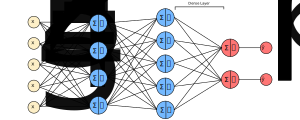

### Describing a Serial Layer
- Combinators are used for composing sub-layers together
- In other words, they represent our neural network
- They can include the following layers as arguments:
    - A ReLU activation layer
    - A LogSoftmax activation layer
    - An Embedding layer
- Specifically, a Serial combinator uses stack semantics to manage data for its sublayers
- Each sublayer sees only the inputs it needs and returns only the outputs it has generated
- The sublayers interact via the data stack

### Describing a Dense Layer
- A dense layer refers to a fully-connected layer in a neural network
- Dense layers are the prototypical example of a trainable layer
- Meaning, it is a layer with trainable weights
- Each node in a dense layer computes a weighted sum of all node values from the preceding layer and adds a bias term:

$$
z^{[i]} = W^{[i]} a^{[i-1]} + b^{[i]}
$$

### Describing Activation Layers
- An activation layer computes an element-wise, nonlinear function on the preceding layer’s output
- Trax follows the current practice of separating the activation function into its own layer
- Trax supports the following activation functions (and more):
    - ReLU
    - Elu
    - Sigmoid
    - Tanh
    - LogSoftmax
- In the following example, we're using a logsoftmax layer:

### Describing an Embedding Layer
- An embedding layer is a trainable layer
- Generally, it is used to map discrete data into vectors
- Typically, this discrete data refers to words in NLP
- Specifically, it takes an index assigned to each word from your vocabulary and maps it to a representation of that word with a determined dimension:

| Vocabulary | Index | $embedding_{1}$ | $embedding_{2}$ |
| ---------- | ----- | --------------- | --------------- |
| i          | $1$   | $0.020$         | $0.006$         |
| am         | $2$   | $-0.003$        | $0.010$         |
| happy      | $3$   | $0.009$         | $0.010$         |
| because    | $4$   | $-0.011$        | $-0.018$        |
| learning   | $5$   | $-0.040$        | $-0.047$        |
| nlp        | $6$   | $-0.009$        | $0.050$         |
| sad        | $7$   | $-0.044$        | $0.001$         |
| not        | $8$   | $0.011$         | $-0.022$        |

- Every value from our embeddings are trainable
- The number of weights in our embedding layer equals the number of words in our vocabulary multiplied by the number of embeddings
- The embedding layer usually feeds into a mean activation layer to reduce the size of the embeddings

### References
- [Trax Quick Intro](https://colab.research.google.com/github/google/trax/blob/master/trax/intro.ipynb#scrollTo=djTiSLcaNFGa)
- [Trax Layers](https://trax-ml.readthedocs.io/en/latest/notebooks/layers_intro.html)
- [Course on Trax](https://www.coursera.org/learn/sequence-models-in-nlp/lecture/CT6YH/other-layers)