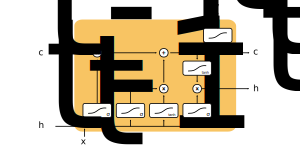
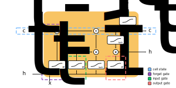
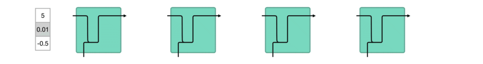

### Describing the LSTM Model
- An LSTM is a type of RNN
- An LSTM mitigates the issue with vanishing and exploding gradients by ensuring back-propagated gradients are unchanged
- It is designed to handle entire sequences of data by learning when to remember and forget previous information
- An LSTM consists of $4$ components:
    - A cell state (sometimes called memory)
    - A forget gate
    - An input gate
    - An output gate

### Summarizing the Four Components of an LSTM
- Cell states
    - They represent previous information
    - Roughly, the hidden state represents *short-term memory*, whereas the cell state represents *long-term memory*
    - More accurately, the **hidden state** is used for making predictions, whereas the **cell state** is used as memory
- Forget gates
    - They decide what is relevant to keep from previous information
    - Specifically, they represent the process of filtering out any unrelated information from the previous information
- Input gates
    - They decide what is relevant to add from the new information
    - Specifically, they represent the process of computing new information based on current and previous information
- Output gates
    - They decide what the next hidden state should be
    - Specifically, they represent the process of outputting the filtered and calculated current information

### Illustrating the Components of an LSTM
- Suppose we received a phone call from a friend
- When our phone rings, we may be thinking about any number of thoughts already
- These thoughts could be related or unrelated to our friend
- This state of thinking represents our **cell state**
- In other words, the cell state represents our previous thoughts
- When we answer the call, we'll put aside any unrelated thoughts while retaining anything we meant to talk to our friend about
- This process represents the **forget gate**
- In other words, the forget gate represents filtering out only relevant thoughts at the beginning of the conversation
- As the conversation progresses, we'll take in and interpret all of the new information from our friend
- As our friend speaks, we'll be thinking of an appropriate response
- This process represents the **input gate**
- In other words, the input gate represents thinking of a response
- Once we decide what to say next, we'll begin to speak to our friend
- This process represents the **output gate**
- In other words, the output gate represents our actual response

### Defining the Architecture of an LSTM
- The general architecture for an LSTM is depicted below:

- Again, the general architecture consists of the $4$ components:
    - A cell state
    - A forget gate
    - An input gate
    - An output gate

### Illustrating the Use of Gates in an LSTM
- Here, the $\tanh$ activation function is used to regulate (or standardize) values flowing through the network
    - Specifically, it squishes values between $-1$ and $1$
    - The frequent use of $\tanh$ functions throughout the cell helps reduce the problem with vanishing and exploding gradients

- A vanilla RNN uses much fewer computational resources compared to an LSTM and a GRU
- The cell state acts as a pathway used for transporting relevant information between cells
    - It can be thought of as the memory between previous cells
    - Implying, it can carry relevant information from previous cells
    - This is where its *long-term memory* comes from
- Gates learn what information is relevant to keep or forget at different points in the network
- Specifically, gates are used for
    - Adding information to the cell state of previous cells
    - Removing information from the cell state of previous cells
- A gate contains a $\sigma$ activation functions
    - Sigmoid functions squish values between $0$ and $1$
    - This function is useful for keeping and forgetting data
    - If the output is $0$, then values will be *forgotten*
    - Conversely, if the output is $1$, then values are kept

### Illustrating the Forget Gate in an LSTM
- A forget gate decides what information should be kept or forgotten
    - Here, a sigmoid function receives information from the previous hidden state and information from the current input
    - The output values are between $0$ and $1$
    - Meaning, values closer to $0$ are forgotten, whereas values closer to $1$ are kept
    - This is where its *short-term memory* comes from

### Illustrating the Input Gate in an LSTM
- The input gate is used for updating the cell state
    - Here, a sigmoid function receives information from the previous hidden state and information from the current input
    - The output values are between $0$ and $1$
    - If the output is $0$, then values will be *forgotten*
    - Conversely, if the output is $1$, then values are kept
    - Essentially, the sigmoid function determines which information to keep from the output of the $\tanh$ function

### Illustrating the Cell State Update in an LSTM
- The cell state is updated based on the output of the forget gate and the output of the input gate
    - The forget gate determines whether values should be forgotten
    - The input gate determines what values should be updated
    - The forget gate can forget values from the cell state if the output is $0$
    - Similarly, the input gate can forget values from the current input if the output is $0$

### Illustrating the Output Gate in an LSTM
- The output gate decides what the next hidden state should be
    - Recall, a hidden state contains information from previous inputs
    - The hidden state is also used for making predictions
    - Here, a $\sigma$ function receives information from the previous hidden state and the current input
    - Then, a $\tanh$ function receives information from the newly modified cell state
    - The output from the $\tanh$ and $\sigma$ functions are multiplied to decide what information the hidden state should carry
    - The output of this multiplication becomes the hidden state
    - The new cell state and the new hidden is then carried over to the next time cell

### Applications of an LSTM
- Next-character predictions
- Chatbots
- Image captioning
- Music composition
- Speech recognition

### References
- [Stanford Deep Learning Lectures](http://cs224d.stanford.edu/lectures/)
- [Stanford Lecture about LSTMs](http://cs224d.stanford.edu/lectures/CS224d-Lecture9.pdf)
- [Article Describing the Components of LSTMs](https://towardsdatascience.com/understanding-gru-networks-2ef37df6c9be)
- [Illustrating the Architecture of LSTMs](https://towardsdatascience.com/illustrated-guide-to-lstms-and-gru-s-a-step-by-step-explanation-44e9eb85bf21)
- [Paper about an LSTM](https://arxiv.org/pdf/1412.3555.pdf)