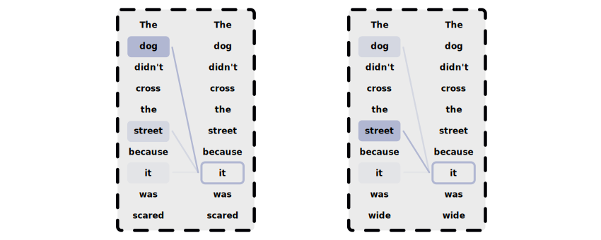
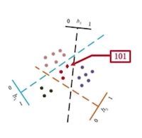
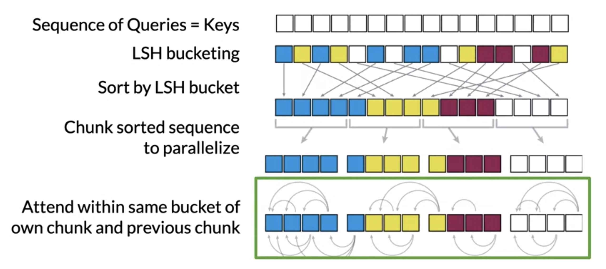

### Motivating Tasks with Long Sequences
- Transformers work well on fairly long sequences
- However, if sequences grow extremely long, the transformer must be tweaked to receive the necessary performance improvements
- There are a growing number of NLP tasks requiring longer sequences:
    - Writing books
    - Storytelling
    - Building chatbots
- The transformer models behind these tasks become slow for training
    - Due to the increased size of inputs
    - Thus, slowing the training of these very long sequences
- Many are based on the GPT-3 transformer model
    - This is just a larger version of GPT-2 
- Unfortunately, training these models can require:
    - Industrial compute resources
    - Industrial cost
- Processing long text sequences is at the core of building chatbots
    - A chatbot must use every previous piece of the conversation as inputs for the next reply
    - This leads to very large context windows

### How Chatbots Differ from Question and Answering
- Recall, contextual question and answering models require both a question and a relevant answer during testing and evaluation
- Whereas, closed-loop question and answering models don't require a relevant answer during testing and evaluation
    - The relevant answers have already been learned during training
    - All the knowledge is stored in the weights of the model itself during training
- This is how a chatbot functions

### Describing the Complexity of a Transformer
- Training transformers on larger sequences becomes slow
    - The number of parameters required for an accurate enough model grows to be a very large number
    - Consequently, modern GPUs will run out of memory when trying to load all of these parameters
- The two primary causes of this memory inefficiency are:
    - Increasingly longer input sequences
        - Mathematically, this correlates with more attention computations
    - Larger hidden layers
        - Mathematically, this correlates with more saved 
- Calculating attention scores on an input and output sequence of length $L$ takes $L^{2}$ time and memory
    - Suppose $L=100$
        - $L^{2}=10,000$
        - Then $10$ operations is computed per $1$ second
    - Suppose $L=10,000$
        - $L^{2}=10,000,000$
        - Then $1$ operation is computed per $10$ seconds
    - Modern GPUs perform around $10,000,000$ operations per second
- Having $N$ layers of attention takes $N$ times as much memory
    - GPT-3 already has $96$ layers
    - Even modern GPUs can struggle with this kind of dimensionality
- Recall, an attention score is the $\text{softmax}(Q \times K^{T}) \times V$
    - Where $Q$ is a query
    - Where $K$ is a key
    - Where $V$ is a value
- $Q$, $K$ and $V$ are all of dimension $L \times d_{model}$
    - Where $L$ is the length of a sequence
    - Where $d_{model}$ is the depth of attention
- Thus, $Q \times K^{T}$ will $L^{2}$ in length

### Summarizing the Problems Causing Transformer Complexity
- Again, the two primary causes of memory inefficiency are:
    - Longer sequences leading to more attention computations
    - Larger hidden layers leading to more saved forward-pass activations used in backward propagation
- *LHS attention* layers solve our first problem
    - Keep in mind, when handling long sequences, we usually don't need to consider all $L$ positions
    - Instead, we can just focus on an area of interest instead
    - For example, suppose we're translating long English text to German
        - We don't need to consider every English word at once
        - Instead, we can use attention and focus on the following:
            - A single English word being translated
            - Those words immediately around that English word
- *Reversible residual* layers solve our second problem
    - Generally, the more layers a model has, the more memory it needs
    - Since, we must store the forward pass activations for backprop
    - We can overcome this memory requirement by recomputing activations
    - However, it needs to be done efficiently to minimize taking too much extra time
    - For example, GPT-3 would take a very long time to recompute activations
        - Thus, we need a way to speed up this re-computation, such that it's efficient to use less memory

### Motivating LHS Attention
- To motivate LHS attention, we'll map words to other potentially relative words based on its attention scores
- Notice, the attention scores of *it* only focuses on certain words 
    - On the left panel, *it* refers to *animal* instead of *street*
    - On the right panel, *it* refers to *street* instead of *animal*
- For both sentences, there are only a few relevant attention scores
    - Specifically, we're only really interested in the nouns
- Thus, we only should be interested in keeping the relevant attention scores for each word
    - To do this, we can use KNN with locality sensitive hashing

### Illustrating LSH Attention
- We can use locality sensitive hashing (LSH) to reduce the computational costs of finding $K$ nearest neighbors
    - The same approach can be applied for computing attention
- Using LSH, we can hash both the query $q$ and key $k$
    - This helps group similar query and key vectors together
    - In other words, this helps us group nouns with pronouns
- Then, we'll only need to run attention on keys that are in the same hash buckets as the query
- When choosing the hash, the bucket roughly must be the same sizes
- Here, the hash of x equals the following:
    $$
    \text{hash}(x) = \text{sign}(x \times R)
    $$
    - $R$ is a random coefficient
    - The size of $R$ is $d$ for dimension $\times$ the number of hash bins
    - The $\text{sign}$ value determines the side of the plane the hash lands on
- This process is repeated for each hash value
- LSH is a probabilistic, not a deterministic model
    - This is because of the inherent randomness $R$ within the LSH algorithm
    - Meaning, that the hash can change along with the buckets a vector finds itself mapped to

### Defining the Steps of LSH Attention
- These are the LSH steps applied to attention scores:
    1. Modify the model so it outputs a single vector at each position
        - Each vector is mapped to the relationship between a $q$ and $k$
        - This is referred to as $QK$ attention
    2. Hash $Q$ and $K$ to map each vector to a bucket with LSH
    3. Sort the vectors by LSH bucket
    4. Perform standard attention $\text{softmax}(QK^{T})V$ within the same hash bins (LSH buckets)
        - This reduces the search space for each $K$ to the same LSH bucket as $Q$
        - Take advantage of hardware parallelism by performing batch computation
            1. Split the sorted sequence into fixed size chunks
                - This allows for some parallel computation
            2. Let each chunk attend within itself and the adjacent chunks
                - This covers the case of a hash bucket that is split over more than one chunk
                    - E.g. the blue, yellow, and magenta buckets

### Introducing a Reversible Residual Layer
- Suppose we're interested in learning the text of an entire book
- We could input the tokenized words into a transformer
- Meaning, possibly $1$ million tokenized words would be processed
- Each token has an associated feature vector of some size
- Meaning, just the input for the model could be $2\text{GB}$ in size
    - On a $16\text{GB}$ GPU, this is $\frac{1}{8}$ of the total memory budget
    - Notice, we haven't even touched the layers yet
- The size of the inputs and outputs for each layer will also be $2\text{GB}$
- To do backpropagation through this model, the forward path will need to store some intermediate quantities in memory
    - These are the forward-pass activations for each layer
- Saving these activations would use around $50\text{GB}$ of memory
    - This won't fit on a single device
- Keep in mind, the latest transformers are much deeper than $12$ layers
- Fortunately, *reversible residual* layers can mitigate this problem
- To do this, they efficiently save activations for the backward path

### Defining a Reversible Residual Layer
- This transformer repeatedly adds residuals to the hidden states
    - There are only two hidden states used in transformers:
        - Feed forward layers
        - Attention layes
- To run it in reverse, you can subtract the residuals in the opposite order
    - Starting with the outputs of the model
- In order to save memory used to store the residuals, we must recompute them quickly
    - This is where reversible a residual layer (RRL) comes in
- The general process of RRL is the following:
    1. An RRC must start with two copies of the model inputs
        - This enables reversible residual blocks
    2. Each layer only computes one of the copies
    3. The activations unused in updates will be used to compute the residuals
        - Now, we can run the network in reverse
- The activations in the model are now twice as big
    - However, we don't need to cache for the backwards pass now
- The standard transformer represents the normal residual connections
- The standard transformer uses the following formulas:
    - `Attention Layer:` $y_{a} = x + \text{attention}(x)$
    - `Feed-forward Layer:` $y_{b} = y_{a} + \text{feedforward}(y_{a})$
- The RRL uses the following formulas:
    - `Attention Layer:` $y_{1} = x_{1} + \text{attention}(x_{2})$
    - `Feed-forward Layer:` $y_{2} = x_{2} + \text{feedforward}(y_{1})$
- To save memory, we reconstruct the inputs $x_{1}$ and $x_{2}$:

$$
x_{1} = y_{1} - \text{attention}(x_{2}) \\
x_{2} = y_{2} - \text{feedforward}(y_{1})
$$

- Essentially, we're computing using one side of the network plus feedforward of the other side to compute $y_{2}$
- Similarly, one side of the network $+$ attention of the other side to compute $y_{1}$
- By doing this, we can recompute $x_{1}$ and $x_{2}$ efficiently

### Defining a Reformer Model
- Week 4: Video: Reformers

### References
- [Stanford Deep Learning Lectures](http://cs224d.stanford.edu/lectures/)
- [Stanford Lecture about LSTMs](http://cs224d.stanford.edu/lectures/CS224d-Lecture9.pdf)
- [Lecture about the Complexity of Transformers](https://www.coursera.org/learn/attention-models-in-nlp/lecture/oGXK3/transformer-complexity)
- [Lecture about LHS Attention](https://www.coursera.org/learn/attention-models-in-nlp/lecture/d83Kc/lsh-attention)
- [Lecture about Reversible Residual Layers](https://www.coursera.org/learn/attention-models-in-nlp/lecture/olql3/reversible-residual-layers)
- [Lecture about the Reformer Model](https://www.coursera.org/learn/attention-models-in-nlp/lecture/RbvAB/reformer)
- [Paper about the Efficient Reformer Model](https://arxiv.org/pdf/2001.04451.pdf)
- [Google AI Article about Attention Scores](https://ai.googleblog.com/2017/08/transformer-novel-neural-network.html)
- [Paper about Alignment and Attention Models](https://arxiv.org/pdf/1409.0473.pdf)
- [Post about Attention with Recurrent Neural Networks](https://machinelearningmastery.com/how-does-attention-work-in-encoder-decoder-recurrent-neural-networks/)