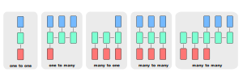

### The Problem with Traditional Language Models
- Recall, traditional language models refer to:
    - Vector space models
    - N-gram models
    - Other probabilistic models
- Many traditional language models make predictions based on the probabilities of the $n$ previous words
- These sequences of words are called *n-grams*
- As we extend the number of previous words in our sequences, the probabilities become more accurate
- However, collecting a higher degree of n-grams becomes very computationally expensive
- Consequently, we typically limit our n-grams to tri-grams

### Motivating Recurrent Neural Networks in NLP
- A recurrent neural network (RNN) can look at every previous word, whereas traditional language models are only limitied to a few previous words
- Again, this is because it would be too computationally expensive to calculate the probabilities of dozens of previous words in traditional language models
- Although RNNs are still computationally expensive, they aren't as slow as traditional language models if they were to include all of the context
    - For n-gram models, RAM requirement scales with degree of n-grams
    - For RNNs, RAM requirement only scales with number of words
- The main benefits of RNNs can be summarized by the following:
    - They propagate relationships between distant words well
    - Their computations share previously computed parameters

### Types of Neural Networks
- There are $4$ basic types of recurrent neural networks
- The following diagram illustrates these types of RNNs:

1. One-to-one
    - These networks can be used for image classification
    - They mimic a conventional neural network or CNN
    - Thus, they aren't very useful, since we can just use conventional neural networks or CNNs
2. One-to-many
    - These networks can be used for caption generation
    - They receive a single input (e.g. image)
    - Then, they return a single output for each of the many cells within the network
3. Many-to-one
    - These networks can be used for sentiment analysis
    - They take in a single input for each of the many cells within the network (e.g. words in a tweet)
    - Then, they return a single output for each of the many cells within the network (e.g. a sentiment)
4. Many-to-many
    - These networks can be used for language translation
        - They take in a single input for each of the earlier cells within the network (e.g. English words)
        - Then, they return a single output for each of the later cells within the network (e.g. Spanish words)
        - This architecture is separated into two components: encoders and decoders
        - Encoders refer to the earlier layers that don't return output, but receive the inputs
        - Decoders refer to the later layers that return output, but don't receive the inputs
        - In other words, encoders encode words in a single representation capturing overall meaning of the sentence
        - Then, decorders decode these meanings later to a sequence of words in the other language
    - These networks can be used for synced sequence input and output
        - For example, they can be used for video classification
        - They take in a single input for each of the many cells within the network
        - Then, they return a single output for each of those same cells within the network

### Illustrating the Basic Architecture of an RNN
- Let's take a closer look at a many-to-one neural network
- This will help us understand how words get propagated
- Suppose we have the following tweet in our training set:

$$
\text{I called her but she did not } \_ \_ \_ \_ \text{.}
$$

- Let's say we're interested in predicting the underlined missing word
- A plain RNN propagates information from the beginning of the sentence to the end of the sentence
- The basic architecture of a many-to-one recurrent neural network looks like the following:

$$
h_{t} = g(W_{x}x_{t} + W_{h}h_{t-1} + b_{h})
$$

$$
y_{t} = g(W_{y}h_{t} + b_{y})
$$

- An RNN is *recurrent* since it uses the same weights for each step
- A vanilla RNN uses the same $3$ sets of weights in all of its cells:
    - $W_{x}$ is used for all $x_{t} \to h_{t}$ links
    - $W_{h}$ is used for all $h_{t-1} \to h_{t}$ links
    - $W_{y}$ is used for all $h_{t} \to y_{t}$ links
- They also use the same $2$ sets of biases in all of its cells:
    - $b_{h​}$ is added when calculating $h_{t}$
    - $b_{y​}$ is added when calculating $y_{t}$
- Biases are represented as vectors, whereas weights are represented as matrices
- Notice, basic RNNs have two inputs for each cell: $h_{t-1}$ and $x_{t}$

### Illustrating a Basic Use-Case of an RNN
- Suppose we predict the next letter given a sequence of letters
- For this example, let's say we only have $4$ letters in our vocabulary
- Specifically, these $4$ letters are $\text{h}$, $\text{e}$, $\text{l}$, and $\text{o}$
- Each character is encoded into a vector using one-hot encoding
    - Meaning, each value in the vector is $0$ except for a single $1$ at the index of the character in the vocabulary
- These characters are inputted into an RNN one at a time
- We will then observe a sequence of $4$-dimensional output vectors (one dimension per character)
- These are interpreted as the confidence the RNN currently assigns to each character coming next in the sequence
- The following diagram illustrates our model:

- This diagram shows the activations in the forward pass when the RNN is fed the characters $[\text{h}$, $\text{e}$, $\text{l}$, $\text{l}]$ as input
- The output layer contains confidences for the next character
- We want the green numbers to be high and red numbers to be low
    - Thus, we can run the backpropagation algorithm to determine what direction we should adjust every one of its weights to increase the scores of the correct targets (green bold numbers)
    - We can then perform a parameter update, which nudges every weight a tiny amount in this gradient direction
    - After repeating this process many time, we'll eventually find weights that will recommend *hello*
- Notice, the first time the character *l* is input, the target is *l*
    - However, the second time the target is *o*
    - Indicating, RNNs can't rely on any input alone
    - Instead, they also must rely on recurrent connections to track the context of previous input

### Defining the Cost Function for RNNs
- The cross-entropy cost function for a vanilla neural network is defined as the following:

$$
J = -\sum_{j=1}^{K} y_{j} \log(\hat{y}_{j})
$$

- The variables represent the following:
    - $K$ is the number of classes associated with $y$
    - $j$ is the index of the $k^{th}$ class
    - $y_{j}$ is the actual data value for the $j^{th}$ class
    - $\hat{y_{j}}$ is the predicted value for the $j^{th}$ class
- For an RNN, the cross-entropy cost function is defined as the following:

$$
J = -\frac{1}{T} \sum_{t=1}^{T} \sum_{j=1}^{K} y_{j}^{<t>} \log(\hat{y}_{j}^{<t>})
$$

- The variables represent the following:
    - $K$ is the number of classes associated with $y$
    - $j$ is the index of the $K^{th}$ class
    - $y_{j}$ is the actual data value for the $j^{th}$ class
    - $\hat{y_{j}}$ is the predicted value for the $j^{th}$ class
    - $T$ is the number of cells within an RNN
    - $t$ is the index of the $T^{th}$ cell within an RNN
- In other words, the cross-entropy cost in an RNN is just the average of the costs calculated for each cell

### Advantages and Disadvantages of an RNN
- The following are some advantages of an RNN:
    - They capture dependencies within a short range
    - They take up less RAM than other n-gram models
- The following are some disadvantages of an RNN:
    - They struggle with longer sequences
    - They're prone to vanishing and exploding gradients
        - They can solve this problem by doing the following:
            - Using ReLU activations
            - Gradient clipping
            - Skipping connections

### References
- [Article about Recurrent Neural Networks](https://towardsdatascience.com/an-introduction-to-recurrent-neural-networks-for-beginners-664d717adbd)
- [Stanford Deep Learning Lectures](http://cs224d.stanford.edu/lectures/)
- [Illustrating the Math Behind Recurrent Neural Networks](https://explained.ai/rnn/index.html)
- [Advantages of Recurrent Neural Networks](http://cs224d.stanford.edu/lectures/CS224d-Lecture8.pdf)
- [Understanding Recurrent Neural Networks](https://kevinzakka.github.io/2017/07/20/rnn/)
- [Types of Recurrent Neural Networks](http://karpathy.github.io/2015/05/21/rnn-effectiveness/)
- [Sequence Models](https://archive.org/details/jiqixuexi/C5w1l01WhySequenceModels.mp4)
- [Recurrent and Recursive Neural Nets](http://www.deeplearningbook.org/contents/rnn.html)
- [Cheatsheat RNN](https://stanford.edu/~shervine/teaching/cs-230/cheatsheet-recurrent-neural-networks)
- [Handling Out-of-Vocabulary Words](https://stats.stackexchange.com/questions/202544/handling-unknown-words-in-language-modeling-tasks-using-lstm)
- [Recurrent Neural Networks Cheatsheet](https://stanford.edu/~shervine/teaching/cs-230/cheatsheet-recurrent-neural-networks)